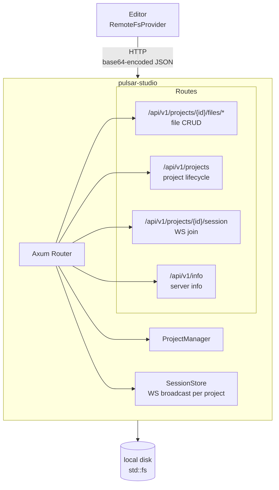

# Pulsar Studio

Self-hosted HTTP + WebSocket server that enables remote file access and hosted multiplayer sessions.

## Who This Is For

Pulsar Studio is designed for teams and individuals who want a **centralized, self-hosted** source of truth for their Pulsar projects. It is the right choice when you need multiple collaborators to edit the same project files without requiring direct peer-to-peer connectivity.

Typical users include:

- **Game studios** with a dedicated build server or NAS that stores project files
- **Remote teams** working across different networks where NAT traversal would be unreliable
- **Organizations** that require a single machine to own the authoritative copy of project data
- **Anyone** who prefers the simplicity of a client-server model over P2P networking

In hosted mode, one machine runs pulsar-studio and holds the actual files on disk. All other peers connect to it over HTTP — they never touch the filesystem directly. File changes are broadcast in real-time via WebSocket so every connected editor sees updates instantly.

## How It Works

You run pulsar-studio as a long-lived server process. When you open a Pulsar project in the editor, the editor detects that the project is hosted (via the `cloud+pulsar://` URL scheme) and automatically switches its filesystem provider from `LocalFsProvider` to `RemoteFsProvider`. From that point on, every file read, write, list, and manifest request is routed through HTTP to the studio server, which performs the actual `std::fs` operations on the host machine.

The server also manages WebSocket sessions per project. When a user joins a project session, they receive the current list of participants and begin receiving real-time file change notifications. When the last user leaves, the server marks the project idle so it can be stopped later to free resources.

## Setup

### 1. Install

```bash
cargo install --path crates/pulsar-studio
```

### 2. Configure

Set environment variables or use defaults. No configuration is required to get started:

```bash
export STUDIO_BIND=0.0.0.0       # Listen on all interfaces (default: 127.0.0.1)
export STUDIO_PORT=7700            # HTTP port (default: 7700)
export STUDIO_DATA_DIR=/data/pulsar-studio  # Where projects are stored
export STUDIO_SERVER_NAME="my-studio"       # Display name for collaborators
export STUDIO_AUTH_TOKEN=secret-token-here  # Optional: enable auth
export STUDIO_AUTH_REQUIRED=true            # Optional: enforce auth on writes
export STUDIO_MAX_PROJECTS=20               # Optional: limit project count
export STUDIO_LOG=debug                     # Optional: log level
```

### 3. Start the server

```bash
cargo run --bin pulsar-studio
# or if installed:
pulsar-studio
```

The server will print its bind address and data directory on startup. By default it listens on `http://127.0.0.1:7700`.

### 4. Connect from the editor

In the Pulsar editor, open a project using the cloud path scheme:

```
cloud+pulsar://localhost:7700/{project_id}
```

The editor will automatically create a `RemoteConfig`, swap to `RemoteFsProvider`, and begin routing all file I/O through the studio server. To join a multiplayer session, append `?user={username}` to the WebSocket session URL.

### 5. (Optional) Enable authentication

Set `STUDIO_AUTH_TOKEN` and `STUDIO_AUTH_REQUIRED=true`. When enabled:

- **Read endpoints** (`GET /files`, `/files/list`, `/files/manifest`, `/files/exists`, `/files/stat`) remain **public** — remote editors need to list and read files without auth
- **Write endpoints** (`PUT`, `DELETE`, `POST` on `/files`) and **project mutations** require a valid Bearer token
- WebSocket sessions accept the token either as a query parameter (`?token=...`) or as the `Authorization: Bearer ...` header

## Quick Start

```bash
cargo run --bin pulsar-studio
# Defaults: bind=127.0.0.1, port=7700
```

## Ports

| Port | Protocol | Purpose |
|------|----------|---------|
| 7700 | HTTP/WS | REST API + WebSocket session endpoint |

## Architecture



## REST API

### File Operations

All file paths are relative to the project root, URL-encoded as query parameters.

| Method | Endpoint | Auth | Description |
|--------|----------|------|-------------|
| `GET` | `/api/v1/projects/{id}/files?path={rel}` | No | Read file (base64 response) |
| `GET` | `/api/v1/projects/{id}/files/list?path={rel}` | No | List directory children |
| `GET` | `/api/v1/projects/{id}/files/manifest?path={rel}` | No | Full recursive file tree |
| `GET` | `/api/v1/projects/{id}/files/exists?path={rel}` | No | Check path existence |
| `GET` | `/api/v1/projects/{id}/files/stat?path={rel}` | No | Get file metadata |
| `PUT` | `/api/v1/projects/{id}/files?path={rel}[&create=true]` | Yes | Write/create file (base64 body) |
| `DELETE` | `/api/v1/projects/{id}/files?path={rel}` | Yes | Delete file or directory |
| `POST` | `/api/v1/projects/{id}/files/mkdir?path={rel}` | Yes | Create directory recursively |
| `POST` | `/api/v1/projects/{id}/files/rename` | Yes | Rename/move a path (JSON body) |

### Project Lifecycle

| Method | Endpoint | Auth | Description |
|--------|----------|------|-------------|
| `GET` | `/api/v1/projects` | No | List all projects |
| `GET` | `/api/v1/projects/{id}` | No | Get project details |
| `POST` | `/api/v1/projects` | Yes | Create a new project |
| `POST` | `/api/v1/projects/{id}/prepare` | Yes | Prepare/start a project |
| `POST` | `/api/v1/projects/{id}/stop` | Yes | Stop a project |
| `DELETE` | `/api/v1/projects/{id}` | Yes | Delete a project |

### Session

| Method | Endpoint | Auth | Description |
|--------|----------|------|-------------|
| `GET` | `/api/v1/projects/{id}/session?user={name}[&token=...]` | Yes* | Upgrade to WebSocket |

*Required only if `auth_required` is enabled.

### Info

| Method | Endpoint | Auth | Description |
|--------|----------|------|-------------|
| `GET` | `/api/v1/info` | No | Server version and config |

## Authentication

Optional Bearer token authentication. When enabled, **read endpoints are public** (so remote editors can list and read without a token), while **write endpoints require a valid token**.

Configuration:
- `STUDIO_AUTH_TOKEN` — the expected bearer token value
- `STUDIO_AUTH_REQUIRED` — whether to enforce auth on write endpoints

## WebSocket Session Protocol

### Joining

```
GET /api/v1/projects/{id}/session?user={username}[&token=...]
Upgrade: websocket
```

On join, the server sends an initial `UserList` message with all current participants.

### Client → Server Messages

| Type | Fields | Description |
|------|--------|-------------|
| `ping` | — | Keepalive |
| `chat` | `user`, `text` | Chat message (broadcast to all peers) |
| `state_patch` | `patch` | State update (broadcast to all peers) |

### Server → Client Messages

| Type | Fields | Description |
|------|--------|-------------|
| `user_list` | `users: [string]` | Initial participant list on join |
| `user_joined` | `user: string` | New peer connected |
| `user_left` | `user: string` | Peer disconnected |
| `chat` | `user: string`, `text: string` | Chat message (relay) |
| `state_patch` | `patch` | State update (relay) |
| `ping` | — | Keepalive response |
| `pong` | — | Keepalive response |

## Project Management

- Projects are persisted to disk in the `data_dir` (default: `./pulsar-studio-data/`)
- Each project has a lifecycle: `Created → Prepared → Running → Stopped → Deleted`
- When users join a project, it is automatically prepared/started
- When the last user leaves, the project is marked idle (can be stopped later)
- `ProjectManager::load()` restores all projects from disk on startup

## RemoteFsProvider Integration

The `engine_fs::RemoteFsProvider` crate connects to pulsar-studio as a remote filesystem backend.

### Cloud Path Scheme

```
cloud+pulsar://{host}/{project_id}[/optional/subpath]
```

Example: `cloud+pulsar://localhost:7700/abc-123/my_folder/file.txt`

### Wire Format

- File contents are base64-encoded in JSON
- Path components are URL-encoded
- 30-second HTTP timeout
- Path traversal (`..`) is rejected

### RemoteFsProvider Endpoints Used

| operation | HTTP method | endpoint |
|-----------|-------------|----------|
| `read_file` | GET | `/api/v1/projects/{id}/files?path=...` |
| `write_file` | PUT | `/api/v1/projects/{id}/files?path=...` |
| `create_file` | PUT | `/api/v1/projects/{id}/files?path=...&create=true` |
| `delete_path` | DELETE | `/api/v1/projects/{id}/files?path=...` |
| `rename` | POST | `/api/v1/projects/{id}/files/rename` |
| `list_dir` | GET | `/api/v1/projects/{id}/files/list?path=...` |
| `create_dir_all` | POST | `/api/v1/projects/{id}/files/mkdir?path=...` |
| `exists` | GET | `/api/v1/projects/{id}/files/exists?path=...` |
| `metadata` | GET | `/api/v1/projects/{id}/files/stat?path=...` |
| `manifest` | GET | `/api/v1/projects/{id}/files/manifest?path=...` |

## Configuration

| Env Var | Default | Description |
|---------|---------|-------------|
| `STUDIO_BIND` | `127.0.0.1` | Bind address |
| `STUDIO_PORT` | `7700` | HTTP port |
| `STUDIO_DATA_DIR` | `./pulsar-studio-data` | Project data directory |
| `STUDIO_SERVER_NAME` | `pulsar-studio` | Display name |
| `STUDIO_AUTH_TOKEN` | — | Bearer token for auth |
| `STUDIO_AUTH_REQUIRED` | `false` | Enforce auth on writes |
| `STUDIO_MAX_PROJECTS` | `10` | Maximum projects |
| `STUDIO_LOG` | `info` | Log level (tracing filter) |

## Key Files

| File | Purpose |
|------|---------|
| `src/main.rs` | CLI entry point, Axum server bootstrap |
| `src/api/mod.rs` | HTTP router assembly (public + protected routes) |
| `src/api/files.rs` | File CRUD endpoint handlers |
| `src/api/projects.rs` | Project lifecycle endpoint handlers |
| `src/api/sessions.rs` | WebSocket join and message handling |
| `src/api/info.rs` | Server info endpoint |
| `src/auth.rs` | Bearer token extraction and verification |
| `src/config.rs` | CLI args + env var configuration |
| `src/state.rs` | Shared `AppState` (config + ProjectManager + SessionStore) |
| `src/projects/manager.rs` | Project persistence and lifecycle |
| `src/sessions/manager.rs` | WebSocket session management per project |
