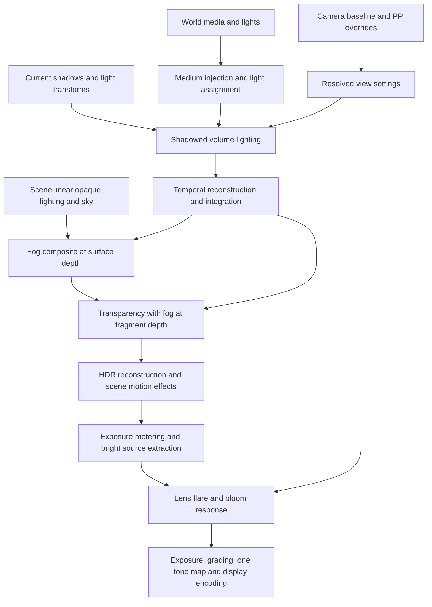

# Physical light effects: audit and implementation design

Source audit: 26 September 2026. Pulsar `6340e7c8c`, Helio `1d4a5e9e`.

This document maps the current implementation and proposes its replacement boundaries. It does not claim that the proposed rendering paths have been implemented or benchmarked. The audit inspected Rust, WGSL, graph construction, editor adapters, and existing tests; it did not capture a running scene.

## Recommendation

Put lens effects in a shared post-process settings block, available on cameras and post-process volumes. Keep light emission and shadow participation on lights. Author participating media in world space. Visible shafts should emerge from illuminating that medium and integrating its scattered light toward the camera.

Build two quality tiers from the same scattering model. The economical tier reduces spatial resolution and lighting work; the high tier adds detail, shadow accuracy, and better medium self-shadowing. Both must obey the same zero-medium and occlusion rules.

There is already useful volumetric infrastructure to build on. The main work is correcting ownership, wiring, scheduling, and radiometric behavior, then improving sampling and performance.

## Implementation status (27 September 2026)

Implemented in Helio (uncommitted working tree on `1d4a5e9e`):

- **Settings ownership.** `Camera.postprocess_settings` and the renderer-owned PP buffer are gone. Cameras carry only a `view_id`; the per-view baseline is the SceneDB `CameraPostProcessComponent`, resolved with PP volumes on the GPU by `PostProcessVolumeBlendPass` (stable priority order, per-property override masks, inward boundary fade, full weight = full replacement). Lens settings are a 64-byte block at byte 464 of the shared `GpuPostProcessUniforms`, so camera and volumes use one schema. Editor: `CameraPostProcessComponent`, `PostProcessVolumeComponent` with per-group override toggles (lens defaults off), `GlobalFogComponent`, `LocalFogVolumeComponent`.
- **Lens.** The light-driven sprite flare is replaced by `LensFlarePass`, an image-based scene-linear response (glare, reflected ghosts with area-Jacobian energy, halo, streaks, spherical/anamorphic, two tiers, GPU indirect gating). See `helio-pass-flare/README.md`. Per-light `flare_*` fields are inert.
- **Media.** World-space global/local media with physical units, clustered light assignment, point-light cube shadows, medium transmittance on light paths, reactive history, aspect-correct economical/high grids. Light `god_rays_*` fields now mean participation, scattering gain and volumetric shadow strength. See `helio-pass-volumetric-fog/README.md`.
- **Ordering.** Every default graph shares one chain: resolve settings → integrate medium → `FogCompositePass` (fog at each opaque depth, FP16) → transparency fogged per fragment → TSR/FXAA → lens from the AA output → PP (metering, bloom, lens, one exposure, tone map once). Bloom and metering now see shafts; flare cannot feed exposure. Auto exposure is applied with frame-rate-independent adaptation.

- **HDR contract and bloom.** Deferred and forward graphs now light into FP16 (they previously clamped emitters at 1.0 in the display format, so nothing could bloom or flare). Bloom mips follow the analysed input size (they were sized from the output and scaled the glow about the image corner), use a 13-tap downsample and tent reconstruction (no square blooms), and `bloom_intensity` is now the fraction of extracted energy scattered. `PostProcessPass` creates its DOF hand-off target on the first frame instead of only after a resize.
- **Scan cost.** The PP resolver and fog resolve/classify kernels scanned entity-indexed SceneDB buffers on one GPU thread; they now compact live rows with 256 threads and rank-sort for determinism. Fog integration is GPU-gated and costs nothing when no medium exists.

Not yet done: lens overscan/offscreen sources and baked lens prescriptions; sky/indirect in-scattering and IES/gobo in fog; migration of the water pass's radial shaft blur; dedicated slatted-window/moving-blocker reference captures and the performance gates in §7; per-view (XR) fog/lens resources.

## 1. Where settings are, and where they belong

| Setting / concept | Current location and behavior | Proposed owner |
|---|---|---|
| Flare enabled, type, intensity, scale, tint | `GpuLight` and its packed SceneDB component. Query consumes enabled/intensity/tint; type and scale do not affect the flare shaders. | `LensFlareSettings` inside shared camera/volume `PostProcessSettings`. A lens profile supplies optical response. |
| Camera post-processing | `helio::Camera.postprocess_settings` already exists. The editor viewport constructs a new camera with default settings. | Retain renderer API; expose a reflected camera settings component and bind the selected camera or editor viewport profile to it. |
| Post-process overrides | Reflected `PostProcessVolumeComponent` maps a flat set of fields into `PostProcessSettings`; no flare fields or per-property override mask. | Same lens settings schema as the camera, with explicit override masks, priority, blend weight, and boundary falloff. |
| `god_rays_enabled` | GPU light opt-in to fog lighting. | Rename semantically to `affects_volumetric_fog`; default true for new physical lights, with an explicit artistic/performance opt-out. |
| `god_rays_density`, `weight`, `exposure`, `decay` | Legacy GPU light fields. Fog multiplies the first three; decay is unused. | Density belongs to the medium, exposure to camera post-processing. Keep at most one documented artistic volumetric scattering multiplier on the light, default 1. |
| Editor volumetric light properties | `affects_volumetric_fog`, scattering intensity, shadow intensity, and fog in-scattering intensity are exposed but absent from the GPU mirror mapping. `cast_volumetric_shadow` is also exposed separately. | Wire actual fog participation and volumetric shadow policy through the mirror. Consolidate duplicate gains; migrate rather than silently discard authored values. |
| Uniform/height/smoke density, albedo, emission, anisotropy | Camera PP settings and PP volume fog blocks. Bounded PP volumes are already sampled spatially by the fog shader. | `GlobalFogComponent` and `LocalFogVolumeComponent` as world data. Retain existing PP fog authoring as a compatibility adapter during migration. |
| Fog integration distance, grid resolution, history policy | Distance in PP settings; grid fixed in Rust; history weight mostly pass configuration. | Per-view volumetric render settings, constrained by renderer scalability. These affect how the medium is rendered, not whether it exists. |
| Underwater shaft intensity | Water volume `god_rays_intensity`; separate radial depth blur. | Water medium scattering and transmittance, with water surface/refraction and caustic lighting handled by the water renderer. |
| World-settings fog UI | Separate editor `enable_fog`, mode/color/density/start/end controls. No connection to the inspected camera construction was found. | Route world fog authoring to the global medium component; remove or migrate redundant settings once their persistence path is verified. |

Sources: [light ABI], [editor volumetrics], [light mapping], [camera], [viewport camera], [PP settings], [PP authoring], [world fog UI], [water shader].

Lens flare does not require fog: it forms inside the camera optics. Shafts require a scattering medium, which can be fog, smoke, dust, atmosphere, or water. An offscreen light can illuminate visible fog. Camera entry into a PP volume may change lens settings, but camera entry must not create or erase a local cloud of fog viewed across the room. This distinction follows the separate optics and participating-media models in [Hullin et al.](https://resources.mpi-inf.mpg.de/lensflareRendering/) and [PBRT](https://www.pbr-book.org/4ed/Volume_Scattering).

## 2. Findings that explain the current appearance

### Lens flare

1. **Appearance is largely hardcoded.** Every visible source gets horizontal/vertical streaks, six aperture spikes, six ghosts, a halo, and glare. A small procedural atlas supplies fixed colored shapes. There is no lens profile or camera aperture response. The streak function has no attenuation along its length, so it spans the image. [Flare render], [flare pass].
2. **Some equations are spatially wrong.** Ghost bounds use pixels, while atlas offsets divide normalized UV deltas by a pixel-sized radius. This samples a very small area of the sprite instead of its intended extent. The veiling-glare term depends on source-to-screen-center distance, so it adds the same value at every output pixel. [Flare render].
3. **Source visibility and energy are incomplete.** Directional lights project their stored position and bypass depth occlusion. Local lights compare projected depth with an average of nine depths, giving a binary visibility decision. Intensity uses the light's raw intensity times a flare gain, without received-source energy, distance, cone, apparent size, or fog transmittance. Emissive meshes and specular highlights cannot generate this effect. [Flare query].
4. **The pass compresses its own radiance.** It applies arbitrary channel thresholds and `1 - exp(-result * 2)` before the main post-process tone mapping. This removes predictable exposure behavior and limits highlight energy. [Flare render].
5. **Capacity handling is incomplete.** The query increments the count before checking the 64-entry limit; rendering loops over the uncapped count. The write guard prevents extra writes but does not bound the subsequent loop or reads. Require a bounded count and deterministic overflow handling. [Flare query], [flare render], [flare pass].

### Volumetric lighting

6. **The core air-fog shader already uses a physical structure.** It evaluates uniform/height/smoke media, combines overlapping local density, samples lights and shadows, reprojects a scattering history, and integrates Beer-Lambert transmittance over depth slices. Its light contribution is multiplied by actual density. This is worth retaining. [Fog shader].
7. **Light settings are disconnected and misleading.** The editor mapping populates basic light fields and takes `GpuLight::default()` for the rest, leaving volumetric participation off. The fog shader retains three legacy gains and a fixed ambient term `albedo * 0.1`. Its point-light shadow function explicitly returns fully lit; IES/gobo fields are not evaluated there. These produce inconsistent authoring and lighting through blockers. [Light mapping], [light ABI], [fog shader].
8. **Physical units need an explicit conversion contract.** The editor defaults to lumens and mirrors only the numeric intensity. `GpuLight` documents candela for point/spot lights and lux for directional lights. The inspected mapper performs no unit conversion. Calibrate the common surface/volume light evaluation before tuning brightness. [Intensity authoring], [light mapping], [light ABI].
9. **History reacts poorly to lighting-only changes.** Default current-frame weight is 0.05. Density-change rejection exists, but moving shadows or a light switching off in unchanged fog do not trigger it. The shader checks range compatibility; the pass exposes `reset_history`, but no external call to that fog reset was found in the inspected Rust tree. Camera cuts, fog disable/re-enable, and lighting changes need explicit handling. [Fog pass], [fog shader].
10. **Work scales poorly with content.** The fixed grid contains 2,654,208 froxels and three RGBA16F grids use about 60.75 MiB. Classification serially scans sparse storage capacity and takes the first 64 volumes/256 participating lights. Every occupied froxel loops over that global light list; volume evaluation also loops over the global media list. A PP volume with only color grading still keeps the fog pass eligible. [Fog pass], [fog shader], [renderer settings].

### Post-processing and graph integration

11. **Fog arrives too late for bloom and exposure metering.** Exposure and bloom extraction read the input before `fs_uber` adds fog. Bright shafts therefore do not contribute their scattered energy to those calculations, despite the composite comment saying they should. Where flare is present, it is drawn before fog; the later fog composite also attenuates the already-generated lens image using scene depth at each ghost pixel. [PP execution], [PP shader], [default graph].
12. **Pass list order is not GPU dependency order.** Fog samples the shadow atlas and flare queries sample depth on the `ctx.compute_cmds()` stream (formerly `compute_encoder_ptr`). The ordinary graph submission submits that stream before the graphics encoder, where shadow/depth rasterization occurs. This is a source-level dependency defect: current-frame occlusion cannot be assumed. Verify with moving blockers and a GPU capture; add explicit producer/consumer scheduling. [Fog pass], [flare pass], [graph execution].
13. **Volume blending cannot support predictable lens overrides yet.** The bounded-volume branch first requires the camera inside the AABB, then measures its distance to the clamped AABB point. That distance is always zero inside, so there is no boundary fade. A single full-weight volume blends with `t = 1 / (1 + 1)`, yielding half camera/half volume. Continuous values become normalized averages regardless of priority; discrete switches are order dependent. Every field is blended, so a lens-only volume could also change unrelated settings. CPU and GPU paths need the same corrected rules; their fog treatment currently differs. [PP shader], [CPU blender].
14. **Rendering paths differ.** Default deferred and forward graphs add flare; the inspected HLFS graphs do not. Fog is constructed before AA but composited after it. The shaders use `cameras[0]`, and flare selects layer-0 depth for XR. Multi-view support and target/depth resolution matching must be explicit, not inferred from graph placement. [Default graph], [flare pass], [fog shader], [PP shader].
15. **Water still contains an arbitrary shaft effect.** Its 24-tap radial depth blur is added after the underwater medium composite. It is gated by submersion and an intensity, but the shaft function does not integrate scattering density or world-space light visibility. Include it in migration so the old appearance does not survive through another medium. [Water shader].
16. **HDR and automatic exposure need completion checks.** The default deferred graph passes the display `surface_format` into its lighting target, so a normalized display format can clamp radiance before post-processing; HLFS explicitly chooses a separate HDR lighting format. Also, the PP shader writes `avg_luminance` but never reads it to apply automatic exposure; `exposure_mode` is blended but not used by its image processing. Establish a floating-point scene-color contract across graphs and finish exposure adaptation before claiming physical camera behavior. [Default graph], [deferred target], [PP shader], [PP execution].

The existing [spatial fog test] validates outside-volume density queries, edits/removal, and production pipeline construction. It does not establish final image quality, shadow correctness, temporal behavior, or performance of the complete renderer.

## 3. Physical rendering contract

Use a documented world-length unit and convert extinction/scattering coefficients to inverse metres. For a point along a camera ray:

```text
sigma_t = sigma_a + sigma_s                 absorption + scattering
T(a,b)  = exp(-integral_a^b sigma_t(s) ds)    fraction of light transmitted
q(s)    = sigma_s(s) * sum_l[phase_l * Li_l * V_l * T_light_l] + emission(s)
Lcamera = T(0,d) * Lsurface + integral_0^d[T(0,s) * q(s)] ds
```

`V_l` is geometric visibility from the sample to the light; `T_light_l` is attenuation through media on that light path. `Li_l` uses the same emission, distance/cone attenuation, and light profiles as surface lighting. The phase function controls scattering direction. See [PBRT transmittance](https://pbr-book.org/4ed/Volume_Scattering/Transmittance) and [phase functions](https://www.pbr-book.org/4ed/Volume_Scattering/Phase_Functions).

For constant coefficients across a segment of length `ds`, accumulate `T_before * q * (1 - exp(-sigma_t * ds)) / sigma_t`, using its `q * ds` limit near zero. Keep this numerically stable rather than dividing by an arbitrary floor that suppresses thin fog. The current integrator is a useful starting point.

Required behavior:

- With no medium and no emission, integrated scattering is exactly zero and transmittance is one. Reject residual history when medium is removed.
- A blocker changes light arriving at fog samples; it does not merely hide a projected light icon. A blocked sun can still illuminate other visible portions of fog.
- A black scene with no direct, sky, indirect, or emissive illumination stays black. Replace the constant ambient term with sampled sky/irradiance data.
- Media viewed from outside retain their physical bounds. Overlaps add absorption/scattering; PP priority does not determine which cloud exists.
- Camera-to-sample and light-to-sample attenuation are distinct. Thin fog may approximate the latter as one; dense smoke needs medium shadows.
- Both tiers use the same light units, phase convention, integration, and scene-linear exposure contract. Artistic multipliers are labeled and default to unity.

## 4. Settings resolution and render order

### Shared camera/volume settings

Introduce a reflected `LensFlareSettings` block with enabled, intensity, optional extraction threshold/soft knee, lens profile reference, ghost/halo/glare weights, and tint. Keep aperture, focal length, and sensor data authoritative in the camera's optics; DOF and flare consume the same values. A profile contains optical ghost placement, transmission/color, aperture response, and any anamorphic behavior.

Use project defaults, then camera baseline, then matching PP volumes from low to high priority. Apply only properties explicitly overridden by each volume. Clamp effective weights to [0,1]; full weight fully replaces an overridden scalar. For bounded PP volumes, define an inward boundary fade from zero at the boundary to one at `blend_radius`; unbound volumes use their authored weight. Resolve equal priorities using a stable serialized identifier. Keep an optional final camera override layer for cinematics, explicitly named so its precedence is visible.

Blend continuous values linearly, or in a documented perceptual space where appropriate. Blend effect enable/disable through an effective intensity so boundaries do not pop. Profile IDs and quality enums need a discrete policy: stable selection with hysteresis, or a bounded two-profile crossfade. Never interpolate resource IDs. Render quality comes from scalability; crossing a volume should not repeatedly resize large GPU resources.

Use a dedicated resolved settings buffer per view. Keep one shared schema for camera and volume reflection/serialization, and conformance tests between CPU resolution and WGSL. Adding a field must not require independent hand-maintained UI defaults that drift apart.

### Proposed dependencies



This specifies dependencies, not a requirement to allocate a texture for every box. Reuse transient targets and fuse compatible work after correctness is established.

Opaque surfaces sample the integrated volume at their depth. Transparent surfaces need their own depth-aware volumetric composition; fogging an already-combined transparent/opaque pixel using only opaque depth is wrong. Preserve premultiplied-alpha conventions and avoid counting the same fog twice. Water and clouds need defined ownership of their scattering segments so they are not integrated twice either.

Generate lens response from light that reaches the camera, after scene attenuation. Meter the scene before adding lens artifacts to avoid flare/exposure feedback. Use a common exposure or pre-exposure convention throughout; do not bake a tone curve into flare. Screen-space optical artifacts should not inherit world motion vectors or be attenuated again at ghost-pixel scene depths.

## 5. Two quality tiers

These are proposed starting configurations, not measured performance claims. A lower sample count can remain plausible in broad haze, but cannot preserve every narrow beam or moving smoke detail.

| Area | Economical | High quality |
|---|---|---|
| Volume grid starting point, 16:9 | 96 x 54 x 64 = 331,776 froxels | 192 x 108 x 128 = 2,654,208 froxels |
| Three RGBA16F grid storage | About 7.59 MiB | About 60.75 MiB |
| Lighting | Directional lights plus budgeted local lights assigned to occupied clusters | More local lights per cluster; better filtering and sampling |
| Geometric shadows | Shared current-frame shadow maps, one jittered comparison where viable; correct point cube face | Better cascade transitions and additional taps; optional ray-query refinement where justified |
| Medium shadows | Unity light-path transmittance for optically thin haze; inexpensive cached shadow data when needed | Cached volumetric shadow/transmittance representation for dense media; higher fidelity updates |
| Temporal reconstruction | Reprojection with reactive rejection for light/shadow changes and camera cuts | Same rejection rules, additional spatial detail and sample quality |
| Medium detail | Uniform/height fog and cheap local density textures | More detailed density fields, animated media; optional calibrated multiple-scattering approximation |
| Lens response | Reuse a reduced-resolution bright-source pyramid; precomputed compact lens kernels/profiles | More accurate optical profiles, angular/aperture/focal-length dependence, optional sparse-source ghost evaluation |
| Main compromise | Softer thin shafts, less dense-media detail, bounded local-light coverage | More GPU time and memory; single scattering still has limits in thick media |

Adapt XY grid dimensions to viewport aspect ratio, and choose depth range tightly around useful media. Do not stretch a fixed 16:9 grid across every viewport. A range of hundreds of metres and a close interior need different sampling distributions.

The economical volumetric path has one eighth the nominal froxels and grid memory of the high starting point. That is not an eightfold frame-time promise: classification, shadows, reconstruction, and composition have separate costs.

For an even cheaper hardware floor, analytic height fog can provide extinction and broad haze. It cannot reproduce spatially shadowed shafts, so expose that limitation explicitly rather than substituting radial streaks for physical lighting.

### Optimizations to implement in both tiers

1. Classify live media and light rows with parallel compaction; avoid serial scans of large sparse storage when SceneDB can supply live ranges. Preserve SceneDB ownership instead of creating a second authoritative CPU scene.
2. Build occupied tiles/clusters and light lists. Test density and light bounds before noise, IES, or shadow work. Do not loop over 256 lights in every froxel.
3. Use GPU indirect dispatch or reliable scene change metadata to skip expensive work when no contributing media exist. Bind a neutral scattering/transmittance result and invalidate history; merely leaving last frame's grid published is unsafe.
4. Cache stable density and medium shadow data when their inputs permit it. Reuse existing shadow maps; assign incremental shadow-update costs to volumetrics when the feature causes those updates.
5. Bound memory and overflow deliberately. Rank light contributions stably, report overflow in debug views, and avoid selecting whichever row happened to occupy an early storage slot.
6. Schedule dependent compute after its producers. Independent medium classification can run early; lighting cannot sample a future shadow map. Validate actual command-buffer submission, including parallel recording.
7. Add fog-specific temporal reactive information for changing lights/shadows and medium motion. Use per-view history and invalidate it on cuts, projection/range/grid changes, and reactivation.

### Lens flare quality without excessive cost

Use visible HDR emissive geometry, sun disks, and specular highlights as the default source signal. This naturally includes scene attenuation and many occlusion cases. If analytic lights have no visible emitter representation, add a physically sized source proxy or a separate source record with proper visibility and received-energy calibration. Avoid double-counting a lamp's proxy and emissive mesh.

The cheap lens path should use a calibrated, energy-bounded precomputed response at reduced resolution. The high path can use ghost meshes or lookup tables baked from lens prescriptions over source angle, aperture, focal length, and wavelength. Full lens ray tracing every frame is unnecessary for the initial production target. This is a proposed engineering use of the optical modeling described by [Hullin et al.](https://resources.mpi-inf.mpg.de/lensflareRendering/), not a claim that a fixed sprite atlas is physically accurate.

Handle bright sources near/offscreen with an overscan region or analytic source visibility. A purely onscreen HDR extraction has that known limitation. Stabilize sparse source selection and partial occlusion; limit ghost work to affected bounds rather than running every source over every full-resolution pixel.

## 6. Implementation sequence and migration

1. **Establish references and dependencies.** Capture current demos with fixed cameras/exposure. Add a slatted-window fog scene, a moving blocker, a point light behind a wall, an emissive lamp, and clear-air optics. Correct current shadow/depth scheduling, floating-point scene targets, fog-before-bloom/exposure composition, and exposure adaptation first.
2. **Repair settings resolution.** Fix volume weight/priority/boundary rules, add override masks, and define CPU/GPU parity. Add the shared lens settings schema, camera authoring, and editor viewport persistence. Wire live changes and scene serialization through the existing reflection/SceneDB paths.
3. **Correct light and medium semantics.** Wire the volumetric mirror properties; add unit conversion, cube shadows, and shared light evaluation. Replace ambient magic numbers. Introduce global/local media components with adapters for existing fog blocks. Keep world medium bounds independent of camera PP selection.
4. **Deliver the economical renderer.** Configurable small grid, clustered occupied lighting, reliable inactive bypass, temporal rejection, and reduced-resolution lens profiles. This establishes the production baseline and profiling harness.
5. **Add the high tier.** Increase sampling where references show error, improve dense-medium shadows and indirect scattering, and expand lens profile fidelity. Keep both tiers comparable under identical camera/light/media settings.
6. **Finish integration.** Migrate water shafts, validate transparent composition, graph parity, dynamic resolution, XR/per-view resources, and editor/runtime round trips. Remove deprecated GPU fields only after compatibility coverage is in place.

Migration rules:

- Version serialized settings. New physical defaults should not silently reinterpret old content.
- Map legacy volumetric enable to light participation. Preserve the old product of density/weight/exposure as a clearly labeled legacy artistic gain when compatibility is required; never turn it into physical medium density. Record that decay was unused.
- Per-light flare type/scale/tint cannot be losslessly collapsed into one camera lens when lights disagree. Preserve a temporary explicit legacy profile, provide a migration report, and let authors select the intended shared lens. Do not arbitrarily promote the first light's settings.
- Split old bounded PP volume fog into a medium component with the same bounds, while keeping its camera effects as PP settings. Preserve the existing inward fog edge fade. Global fog becomes global world data.
- Review `GpuLight`'s 128-byte mirrors, `GpuPostProcessUniforms`' 464-byte layout, 528-byte PP rows, and the fog block at byte 304 together. The fog shader embeds the PP row using opaque prefix/suffix blocks; appending lens settings changes that stride. Update all shader mirrors and layout assertions, examples, asset compatibility, and snapshot callers in the same migration.

## 7. Acceptance tests and performance gates

| Test | Required result |
|---|---|
| Zero density / remove last medium | Zero scattering, T=1, no historical shaft residue; expensive fog work skipped. |
| Fog outside camera volume | Local fog visible from outside, no density outside its bounds, continuous camera movement through the boundary. |
| Slatted window with sun onscreen/offscreen | Shafts follow geometry and phase angle, persist where light reaches fog, and disappear when the light path is blocked. |
| Point and spot lights behind walls | Correct cube/spot occlusion; intensity/range/cone edits match surface illumination. |
| No illumination in nonemissive fog | No arbitrary ambient glow. |
| Homogeneous slab | Transmittance and single-scattering integral match an analytic reference across density and view angle; convergence improves with grid quality. |
| Light switches, moving shadows, camera cuts | No stale atlas/depth lag or long history trails; stable results at multiple frame rates. |
| Exposure sweep and HDR values above one | Predictable shared exposure; bright fog contributes to bloom/metering; one tone map; flare is not clipped internally. |
| Clear-air bright emitter | Lens response exists without fog and responds smoothly to occlusion, distance/apparent area, and aperture/profile changes. |
| PP camera/volume overrides | Full weight reaches authored values, boundaries fade, priority wins, unrelated fields remain unchanged, CPU and GPU agree. |
| Overlap, sparse rows, removal, overflow | Stable media/light selection and bounded work; no stale rows or uncapped flare count. |
| Transparency, water, dynamic resolution, XR | Correct depth/sample coordinates, no duplicated medium, per-view visibility/history, defined behavior across graph variants. |

Measure warm GPU median and p95 for classification, injection, shadow work, integration, history, composition, and lens stages separately. Record GPU, backend, power state, internal/output resolution, grid, light counts, occupied volume fraction, and memory. Include incremental shadow cost and avoid CPU readback stalls in normal frames.

Suggested initial engineering targets at 1080p on the documented RTX 4060 Laptop class: economical fog <=0.75 ms and lens response <=0.25 ms; high fog <=2.0 ms and lens response <=0.75 ms at p95 in an agreed representative scene. These are budget proposals, not results or guarantees. Dense smoke, many moving shadowed lights, and different power limits require separate measurements. The repository's existing ~0.003 ms inactive-fog report is not an active-quality benchmark.

Require numerical correctness tests plus image/motion comparisons. Use an offline single-scattering reference for controlled scenes; judge dense multiple-scattering media separately. Performance gains only count when the same scenes meet the visual acceptance criteria.

## Research basis

The implementation choices above are proposals for this repository. Relevant primary references are:

- [Hillaire, SIGGRAPH 2015 volumetric rendering course](https://advances.realtimerendering.com/s2015/): unified world media, extinction, and volumetric shadows.
- [Wronski, SIGGRAPH 2014 volumetric fog](https://www.advances.realtimerendering.com/s2014/wronski/bwronski_volumetric_fog_siggraph2014.pdf): practical real-time volume sampling and reconstruction.
- [PBRT volume scattering](https://www.pbr-book.org/4ed/Volume_Scattering): transport, transmittance, and phase-function conventions.
- [Hullin et al., SIGGRAPH 2011](https://resources.mpi-inf.mpg.de/lensflareRendering/): physically based lens ghosts and optical response.

## Source links

[light ABI]: C:/Users/redst/OneDrive/Documents/GitHub/Pulsar-Native/crates/renderer/helio/crates/passes/3d/helio-pass-forward-lit/src/gpu_types.rs:67
[editor volumetrics]: C:/Users/redst/OneDrive/Documents/GitHub/Pulsar-Native/crates/renderer/helio/crates/helio-component/src/components/light_component/sub_props/volumetrics.rs:7
[light mapping]: C:/Users/redst/OneDrive/Documents/GitHub/Pulsar-Native/crates/renderer/helio/crates/helio-component/src/components/light_component/mapping.rs:40
[intensity authoring]: C:/Users/redst/OneDrive/Documents/GitHub/Pulsar-Native/crates/renderer/helio/crates/helio-component/src/components/light_component/sub_props/intensity.rs:9
[camera]: C:/Users/redst/OneDrive/Documents/GitHub/Pulsar-Native/crates/renderer/helio/crates/helio/src/camera.rs:8
[viewport camera]: C:/Users/redst/OneDrive/Documents/GitHub/Pulsar-Native/crates/core/engine_backend/src/subsystems/render/helio_renderer/renderer.rs:658
[PP settings]: C:/Users/redst/OneDrive/Documents/GitHub/Pulsar-Native/crates/renderer/helio/crates/passes/3d/helio-pass-postprocess/src/gpu_types.rs:377
[PP authoring]: C:/Users/redst/OneDrive/Documents/GitHub/Pulsar-Native/crates/renderer/helio/crates/helio-component/src/components/post_process_volume_component.rs:119
[world fog UI]: C:/Users/redst/OneDrive/Documents/GitHub/Pulsar-Native/crates/editor/ui_level_editor/src/level_editor/core/world_settings_data.rs:28
[flare query]: C:/Users/redst/OneDrive/Documents/GitHub/Pulsar-Native/crates/renderer/helio/crates/passes/3d/helio-pass-flare/shaders/flare_query.wgsl:67
[flare render]: C:/Users/redst/OneDrive/Documents/GitHub/Pulsar-Native/crates/renderer/helio/crates/passes/3d/helio-pass-flare/shaders/flare_render.wgsl:93
[flare pass]: C:/Users/redst/OneDrive/Documents/GitHub/Pulsar-Native/crates/renderer/helio/crates/passes/3d/helio-pass-flare/src/lib.rs:638
[fog shader]: C:/Users/redst/OneDrive/Documents/GitHub/Pulsar-Native/crates/renderer/helio/crates/passes/3d/helio-pass-volumetric-fog/shaders/volumetric_fog.wgsl:144
[fog pass]: C:/Users/redst/OneDrive/Documents/GitHub/Pulsar-Native/crates/renderer/helio/crates/passes/3d/helio-pass-volumetric-fog/src/lib.rs:42
[renderer settings]: C:/Users/redst/OneDrive/Documents/GitHub/Pulsar-Native/crates/renderer/helio/crates/helio/src/renderer/render.rs:274
[PP execution]: C:/Users/redst/OneDrive/Documents/GitHub/Pulsar-Native/crates/renderer/helio/crates/passes/3d/helio-pass-postprocess/src/lib.rs:1326
[PP shader]: C:/Users/redst/OneDrive/Documents/GitHub/Pulsar-Native/crates/renderer/helio/crates/passes/3d/helio-pass-postprocess/shaders/postprocess.wgsl:338
[CPU blender]: C:/Users/redst/OneDrive/Documents/GitHub/Pulsar-Native/crates/renderer/helio/crates/passes/3d/helio-pass-postprocess/src/gpu_types.rs:798
[default graph]: C:/Users/redst/OneDrive/Documents/GitHub/Pulsar-Native/crates/renderer/helio/crates/helio-default-graphs/src/lib.rs:732
[deferred target]: C:/Users/redst/OneDrive/Documents/GitHub/Pulsar-Native/crates/renderer/helio/crates/passes/3d/helio-pass-deferred-light/src/lib.rs:888
[graph execution]: C:/Users/redst/OneDrive/Documents/GitHub/Pulsar-Native/crates/renderer/helio/crates/helio-core/src/graph/execution.rs:1690
[water shader]: C:/Users/redst/OneDrive/Documents/GitHub/Pulsar-Native/crates/renderer/helio/crates/passes/3d/helio-pass-water-sim/shaders/underwater_fog.wgsl:141
[spatial fog test]: C:/Users/redst/OneDrive/Documents/GitHub/Pulsar-Native/crates/renderer/helio/crates/passes/3d/helio-pass-volumetric-fog/tests/spatial_fog.rs:29
