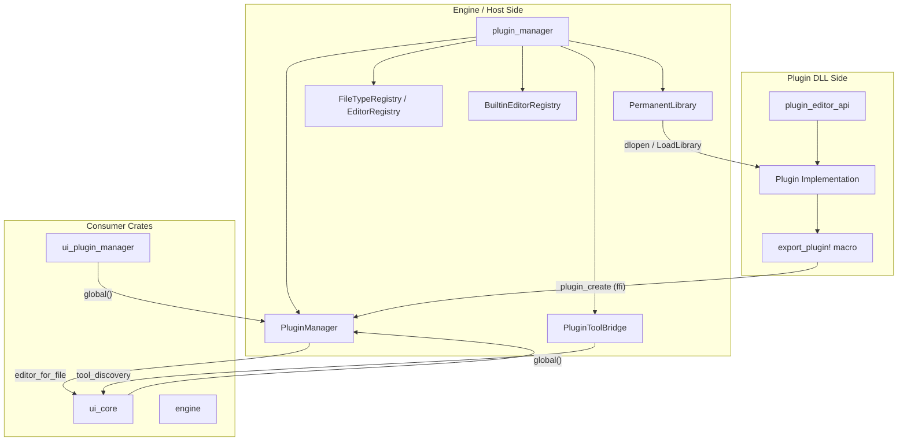
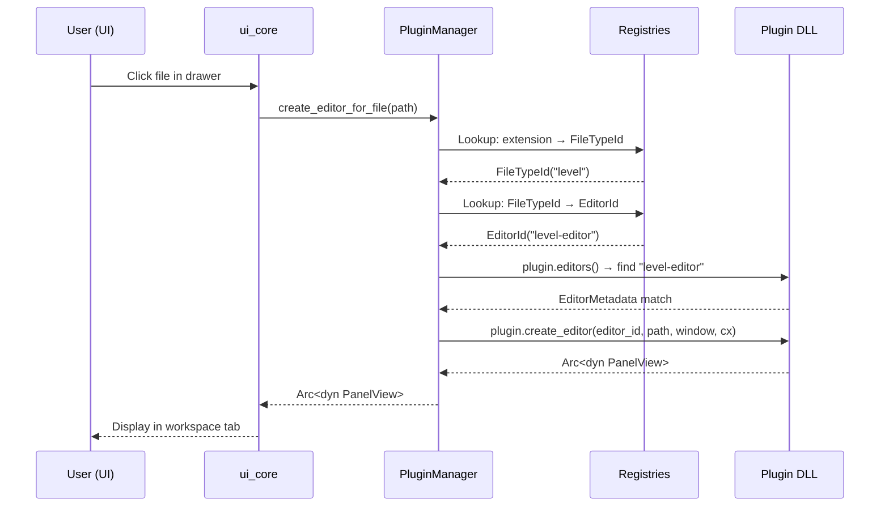
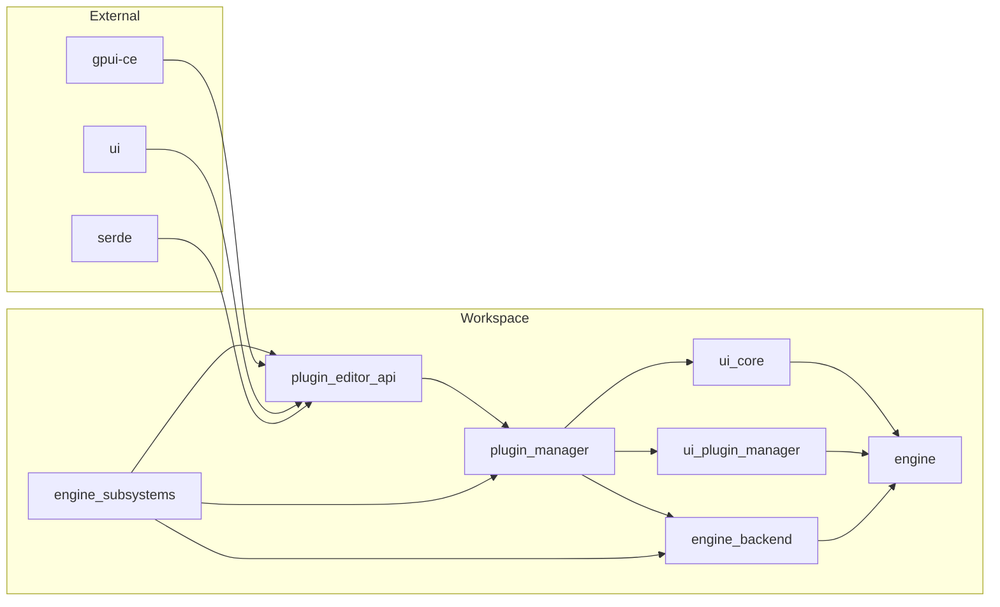
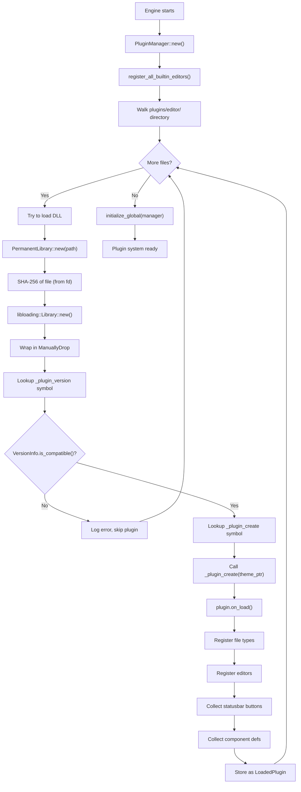
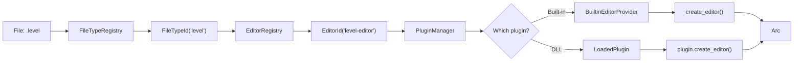
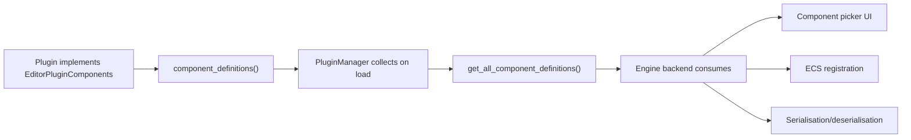

# Pulsar Plugin Architecture

> [!IMPORTANT]
> This document describes the plugin system as implemented. It is a living document
> and should be updated whenever the plugin API or infrastructure changes.

---

## Table of Contents

1. [Design Philosophy](#1-design-philosophy)
2. [Architecture Overview](#2-architecture-overview)
3. [Safety Model](#3-safety-model)
4. [Crate Map](#4-crate-map)
5. [`plugin_editor_api` — The Plugin SDK](#5-plugin_editor_api--the-plugin-sdk)
6. [`plugin_manager` — The Host Runtime](#6-plugin_manager--the-host-runtime)
7. [`PermanentLibrary` — Never-Unload Wrapper](#7-permanentlibrary--never-unload-wrapper)
8. [Plugin Loading Lifecycle](#8-plugin-loading-lifecycle)
9. [Version Compatibility System](#9-version-compatibility-system)
10. [The `export_plugin!` Macro](#10-the-export_plugin-macro)
11. [Registry System](#11-registry-system)
12. [Statusbar System](#12-statusbar-system)
13. [AI Tool System](#13-ai-tool-system)
14. [Built-in Editors](#14-built-in-editors)
15. [Engine Component Registration](#15-engine-component-registration)
16. [Creating a Plugin](#16-creating-a-plugin)
17. [Security Model](#17-security-model)
18. [Platform-Specific Behaviour](#18-platform-specific-behaviour)
19. [Debugging and Troubleshooting](#19-debugging-and-troubleshooting)
20. [Future Extension Points](#20-future-extension-points)

---

## 1. Design Philosophy

The Pulsar plugin system is built on a single insight that separates it from nearly every other Rust plugin framework: **if we never unload a dynamic library, then none of the usual FFI safety concerns apply**.

> [!NOTE]
> Most FFI plugin systems (e.g., browser extensions, media player plugins) must
> support dynamic loading and unloading. This forces them into complex patterns:
> reference counting across boundaries, weak-pointer registries, callback
> unsubscription, and careful drop-ordering. Pulsar avoids all of this.

The trade-off is deliberate: plugins occupy virtual memory for the entire process
lifetime. In practice this is negligible — a typical editor plugin DLL is 2–10 MB
and the virtual memory overhead is reclaimed by the OS when the process exits.

### Why Not Wasm / Sandboxed Scripting?

> [!TIP]
> The permanent-DLL model is for **editor-level plugins** written in Rust.
> Script-level extensibility (e.g., Lua, Python) or WebAssembly-based plugins
> would be a separate system on top.

Rust plugins share complex types (trait objects, `Arc`, `gpui::Window`, internal
engine types) with the host. A sandboxed runtime cannot provide this level of
integration. The permanent-DLL model gives full native performance and zero-cost
abstraction sharing at the cost of lifetime management simplicity.

### Guiding Principles

1. **Safety over flexibility** — If supporting an operation would introduce UB
   (e.g., unloading), that operation is simply disallowed.
2. **Compile-time checking** — Where possible, ABI compatibility is enforced
   at compile time via shared dependency versions. Runtime checks are a fallback.
3. **Built-in parity** — Built-in editors and DLL-loaded editors use the same
   trait interfaces, so migration between the two is seamless.
4. **Forward compatibility** — The `EditorPlugin` trait has default implementations
   for all optional methods. Adding new methods defaults to no-op, so existing
   plugins continue to work after an API bump.

---

## 2. Architecture Overview

The plugin system spans two primary crates and several consumer crates in the
`ui-crates/` tree. The diagram below shows how the pieces fit together at the
module level.



### How Data Flows

The typical path from a file being opened to an editor being displayed goes
through several layers:



> [!NOTE]
> For built-in editors the sequence is identical except that the `Arc<dyn
> BuiltinEditorProvider>` is already in process — no DLL loading is involved.

---

## 3. Safety Model

The safety model is the most important concept to understand. It drives every
design decision in the system.

### The Fundamental Problem with Dynamic Library Unloading

When a Rust dynamic library is loaded, several things live in its memory pages:

| Section | Contents | What Happens on Unload |
|---|---|---|
| `.text` | Machine code for all functions, including `Drop` implementations and closures | Mapped out → calls jump to unmapped memory → SIGSEGV |
| `.rodata` | Constant data, **vtables** for trait objects, static strings | Vtable pointers dangle → trait method dispatch is UB |
| `.data` / `.bss` | Mutable/zero-initialised statics (e.g., `OnceLock`, `static mut`) | References become dangling |
| GOT/PLT | Global Offset Table / Procedure Linkage Table | Indirect calls go through unmapped entries |

> [!CAUTION]
> A single `Arc<T>` whose `T::drop` is in an unloaded library will segfault
> when the last reference is released. This is not a theoretical concern — it
> is the most common crash in naive plugin systems.

### How Pulsar Eliminates These Problems

```rust
// PermanentLibrary wraps ManuallyDrop<Library> and provides NO way to
// call dlclose / FreeLibrary. The library handle leaks intentionally.
pub struct PermanentLibrary {
    library: ManuallyDrop<Library>,  // Never dropped
    path: PathBuf,
    sha256: [u8; 32],
}

// No Drop implementation — this is the safety guarantee.
// The OS reclaims the memory when the process exits.
```

> [!IMPORTANT]
> The `PermanentLibrary` type intentionally does **not** implement `Drop`.
> If it did, and a `Drop` impl called `dlclose`, all plugin-derived pointers
> would become dangling. The `ManuallyDrop` wrapper prevents the compiler
> from generating a `Drop` impl even if one were added later.

### What This Enables

Because the plugin code is permanently resident:

- **`Arc<T>` is safe across the boundary.** The drop glue for `T` lives in the
  never-unloaded library. The engine can hold `Arc<dyn PanelView>` where the
  concrete type is defined in the plugin DLL. When the engine drops its `Arc`,
  the plugin's `Drop` code is called safely.

- **Trait objects work normally.** `Box<dyn EditorPluginFull>` is leaked and
  the engine gets a `&'static mut dyn EditorPluginFull`. The vtable pointer
  points into the DLL's `.rodata` which is never unmapped.

- **Function pointers are valid forever.** `StatusbarButtonDefinition` stores
  `Option<fn(&mut Window, &mut App)>`. The callback code stays resident.

- **No weak-reference bureaucracy.** In reloadable plugin systems, every
  cross-boundary reference must be a weak reference with a fallback. Here,
  ordinary `Arc` and `&` references work.

### What Remains Unsafe

Despite the permanent-loading model, some things still need care:

1. **`Arc` cycles still leak memory.** If Plugin A holds `Arc<Widget>` and
   Widget holds `Arc<PluginA>` back, neither will ever be dropped. Use
   `Weak<T>` to break cycles, just as in single-binary Rust.

2. **Plugin code must be trusted.** There is no sandbox. A plugin can read
   any file, make network calls, call `std::process::exit`, or corrupt memory.
   Users should only load plugins from sources they trust.

3. **Thread safety.** Every plugin method is called through a `parking_lot::RwLock`
   that wraps the global `PluginManager`. Within the plugin, the implementor
   is responsible for their own thread safety (all required traits are
   `Send + Sync`).

4. **The theme pointer.** The engine passes a raw `*const c_void` theme pointer
   to the plugin. The engine guarantees this pointer remains valid for the
   process lifetime. If the engine were to reallocate its theme storage, the
   plugin's cached pointer would dangle.

### Comparison With Other Approaches

| Approach | Safety | Complexity | Performance | Reloadable |
|---|---|---|---|---|
| Permanent DLL (Pulsar) | ✅ Full | Low | Native | ❌ |
| Wasm sandbox | ✅ Full | High | Near-native (JIT) | ✅ |
| IPC/separate process | ✅ Full | Very High | Slow (serialisation) | ✅ |
| Reloadable DLL with weak-refs | ⚠️ Subtle UB | High | Native | ✅ |
| Scripting language (Lua) | ✅ Full | Medium | Interpreted | ✅ |

---

## 4. Crate Map

The plugin system spans these crates in the workspace:

### Primary Crates

| Crate | Path | Role |
|---|---|---|
| `plugin_editor_api` | `crates/plugin_editor_api/` | SDK that every plugin DLL links against. Defines traits, types, the `export_plugin!` macro. |
| `engine_subsystems` | `crates/engine_subsystems/` | Shared `Subsystem` trait and `SubsystemRegistry`. No engine/UI deps — only `tokio`. |
| `plugin_manager` | `crates/plugin_manager/` | Host-side runtime. Loads DLLs, manages registries, provides global access. |

### Supporting Crates

| Crate | Path | Role |
|---|---|---|
| `ui_core` | `ui-crates/ui_core/` | Initialises `PluginManager` at startup, wires up built-in editors, uses tool bridge. |
| `ui_plugin_manager` | `ui-crates/ui_plugin_manager/` | Debug/management UI window showing loaded plugins. |

### Perma-dependencies (same version required across host and plugins)

These crates cross the DLL boundary as types:

- `gpui-ce` (GPUI fork — `Window`, `App`, `EntityId`, etc.)
- `ui` (component library — `PanelView`, `IconName`, `Theme`)
- `serde`, `serde_json` (serialisation for metadata)
- `parking_lot` (locks — only used host-side, not in API)

> [!WARNING]
> All of the above must be compiled with the **exact same Rust compiler version**
> across all plugin DLLs and the engine binary. Even a patch version mismatch in
> rustc can produce incompatible ABIs for types like `Arc<T>` and trait objects.
> This is enforced by the runtime version check (see §9).

### Dependency Graph



---

## 5. `plugin_editor_api` — The Plugin SDK

This crate is the only dependency a plugin author needs in their `Cargo.toml`.
It provides all the types, traits, and the export macro.

### 5.1 Core Identifier Types

Every plugin, file type, and editor has a unique string identifier. These are
newtyped strings with `Display`, `Debug`, `Hash`, `Eq`, and (de)serialisation:

```rust
/// Reverse-domain notation, e.g. "com.pulsar.blueprint-editor"
pub struct PluginId(String);

/// e.g. "rust_script", "level", "pif"
pub struct FileTypeId(String);

/// e.g. "script-editor", "level-editor"
pub struct EditorId(String);
```

> [!TIP]
> Use reverse-domain notation for `PluginId` to avoid collisions between
> different authors. File type and editor IDs use kebab-case within the
> plugin's namespace — prefix them with the plugin ID for uniqueness.

### 5.2 `VersionInfo` — ABI Compatibility

```rust
#[repr(C)]
pub struct VersionInfo {
    pub engine_version: (u32, u32, u32),  // major.minor.patch from Cargo.toml
    pub rustc_version_hash: u64,           // FNV-1a hash of semver-only portion
}
```

The `rustc_version_hash` is computed at compile time from the `RUSTC_VERSION`
environment variable. The hash is computed from the **semver portion only**
(e.g., `"1.83.0"` from `"rustc 1.83.0 (90b35a623 2024-11-26)"`), ignoring
the date/build-metadata suffix. This means:

- Two plugins compiled with different nightly builds of the same rustc version
  will produce the same hash and are compatible.
- Two plugins compiled with rustc 1.83.0 and 1.84.0 (different semver) produce
  different hashes and are rejected.

The compatibility check in `VersionInfo::is_compatible()`:

```rust
pub fn is_compatible(&self, other: &Self) -> bool {
    // Engine major version must match exactly
    if self.engine_version.0 != other.engine_version.0 {
        return false;
    }
    // Rustc version must match exactly (FNV-1a hash of semver)
    if self.rustc_version_hash != other.rustc_version_hash {
        return false;
    }
    true
}
```

> [!CAUTION]
> The `#[repr(C)]` attribute on `VersionInfo` is critical. Without it, the
> Rust compiler is free to reorder fields or use different padding. The host
> and plugin must agree on the exact memory layout of this struct.

### 5.3 `PluginMetadata`

```rust
pub struct PluginMetadata {
    pub id: PluginId,
    pub name: String,
    pub version: String,
    pub author: String,
    pub description: String,
}
```

This is displayed in the Plugin Manager window (`ui_plugin_manager`) and used
for debugging. There is no semantic version checking on this field — the
`version` is informational only; ABI checking is done via `VersionInfo`.

### 5.4 `FileStructure` and `FileTypeDefinition`

Pulsar supports two kinds of file types:

**Standalone files** are single files identified by their extension (e.g.,
`.rs` for Rust scripts, `.level` for levels).

**Folder-based files** are directories that appear as a single file in the file
drawer. They are identified by a marker file inside the directory. The canonical
example is the Blueprint editor: `MyClass.class/` is a folder containing
`graph_save.json` as its marker file.

```rust
pub enum FileStructure {
    /// A single file (e.g., script.rs)
    Standalone,
    /// A directory with a marker file (e.g., MyClass.class/graph_save.json)
    FolderBased {
        marker_file: String,
        template_structure: Vec<PathTemplate>,
    },
}

pub enum PathTemplate {
    File { path: String, content: String },
    Folder { path: String },
}
```

The `template_structure` field lets plugins define what files/folders should
be created when a user creates a new instance of this file type (e.g., a new
Blueprint class might create `graph_save.json`, `MyClass.script`, and a
`Subgraphs/` folder).

The full `FileTypeDefinition`:

```rust
pub struct FileTypeDefinition {
    pub id: FileTypeId,
    pub extension: String,
    pub display_name: String,
    pub icon: ui::IconName,
    pub color: gpui::Hsla,
    pub structure: FileStructure,
    pub default_content: serde_json::Value,
    pub categories: Vec<String>,
}
```

The `categories` field controls where the file type appears in the "New File"
menu. For example, `vec!["Data", "SQLite"]` would create a menu path
`New → Data → SQLite → MyFileType`.

> [!TIP]
> Use the helper functions `standalone_file_type()` and `folder_file_type()`
> to construct `FileTypeDefinition` values concisely. They fill in reasonable
> defaults for the less common fields.

### 5.5 `EditorMetadata`

```rust
pub struct EditorMetadata {
    pub id: EditorId,
    pub display_name: String,
    pub supported_file_types: Vec<FileTypeId>,
}
```

Each plugin can provide multiple editors. A single plugin might provide a
"Source Editor" for text files, a "Data Editor" for JSON files, and a
"Visual Editor" for level files — each as a separate `EditorMetadata` entry.

The engine uses the `supported_file_types` list to determine which editor
to open for a given file. When multiple editors support the same file type,
the user can choose (or the engine uses the first registered).

> [!NOTE]
> The `EditorMetadata` struct is intentionally minimal. AI tool configuration
> per editor is planned as a future extension (see §20).

### 5.6 `PluginError`

```rust
pub enum PluginError {
    FileLoadError { path: PathBuf, message: String },
    FileSaveError { path: PathBuf, message: String },
    InvalidFormat { expected: String, message: String },
    EditorNotFound { editor_id: EditorId },
    UnsupportedFileType { file_type_id: FileTypeId },
    VersionMismatch { expected: VersionInfo, actual: VersionInfo },
    Other { message: String },
    AccessDenied(String),
}
```

This enum implements `std::error::Error` and `Display`, so it can be used with
`anyhow`, `thiserror`, or returned directly. The `AccessDenied` variant is used
by the filesystem sandbox in the tool bridge (see §13).

### 5.7 `OpenAsset` Action

```rust
#[derive(gpui::Action)]
#[action(namespace = pulsar_app)]
pub struct OpenAsset {
    pub path: PathBuf,
}
```

This cross-crate action allows any crate with `plugin_editor_api` as a dependency
to request that a file be opened in its default editor. The application layer
(`ui_core`) registers the handler that routes it to the correct in-engine editor
or falls back to the OS default.

### 5.8 `EditorPlugin` Trait

This is the core trait that all plugin implementations must satisfy:

```rust
pub trait EditorPlugin: Send + Sync {
    // -- Required methods --

    /// Unique metadata identifying this plugin.
    fn metadata(&self) -> PluginMetadata;

    /// File types this plugin supports.
    fn file_types(&self) -> Vec<FileTypeDefinition>;

    /// Editor types this plugin provides.
    fn editors(&self) -> Vec<EditorMetadata>;

    /// Create a new editor instance for the given file.
    fn create_editor(
        &self,
        editor_id: EditorId,
        file_path: PathBuf,
        window: &mut Window,
        cx: &mut App,
    ) -> Result<Arc<dyn PanelView>, PluginError>;

    // -- Optional methods (all have defaults) --

    /// Version information for ABI checking. Defaults to current build's version.
    fn version_info(&self) -> VersionInfo { VersionInfo::current() }

    /// Called when the plugin is loaded. Use for one-time initialisation.
    fn on_load(&mut self) {}

    /// Statusbar buttons to register.
    fn statusbar_buttons(&self) -> Vec<StatusbarButtonDefinition> { Vec::new() }

    /// Asset kinds this plugin's editors accept for drag-and-drop.
    fn accepted_drop_kinds(&self) -> Vec<AssetKind> { Vec::new() }

    /// AI-accessible tools this plugin provides.
    fn ai_tools(&self) -> Vec<AiToolDefinition> { Vec::new() }

    /// Execute an AI tool by name.
    fn execute_ai_tool(
        &self,
        file_path: &Path,
        tool_name: &str,
        tool_args: JsonValue,
    ) -> Result<JsonValue, PluginError> { Err(PluginError::Other { ... }) }

    /// Tool capabilities for a specific file.
    fn capabilities_for_file(&self, file_path: &Path) -> Vec<String> { Vec::new() }
}
```

> [!IMPORTANT]
> Every optional method has a default implementation that returns an empty
> result or a no-op. This is by design: when new optional methods are added
> to `EditorPlugin` in future API versions, existing compiled plugins will
> continue to work because their vtable will point to the default
> implementation (which was compiled into `plugin_editor_api` at the time the
> plugin was built).

### 5.9 `EditorPluginComponents` Trait

This is an extension trait for plugins that want to register custom engine
components:

```rust
pub trait EditorPluginComponents: EditorPlugin {
    /// Returns all ComponentDefinitions for this plugin.
    fn component_definitions(&self) -> Vec<ComponentDefinition>;
}
```

It is a **separate trait** from `EditorPlugin` so that the majority of plugins
that do not provide engine components are not burdened with implementing it.
The two traits are combined by `EditorPluginFull`.

### 5.10 `EditorPluginFull` Combined Trait

```rust
pub trait EditorPluginFull: EditorPlugin + EditorPluginComponents {}
```

This is the single trait object that the DLL exports. It ensures the engine can
query both basic and extended capabilities through a single vtable pointer.

> [!NOTE]
> There is no blanket `impl<T: EditorPlugin + EditorPluginComponents>
> EditorPluginFull for T` in the crate. The `export_plugin!` macro handles
> this with an explicit `impl` on the wrapper struct. This avoids conflicting
> implementations when the macro is expanded in downstream crates.

### 5.11 `ComponentDefinition`

```rust
pub struct ComponentDefinition {
    pub id: String,
    pub display_name: String,
    pub category: String,
    pub description: String,
    pub icon: Option<ui::IconName>,
}
```

Component definitions describe custom engine components that a plugin provides.
These are the building blocks of game objects in the Pulsar engine. For example,
a scripting plugin might provide `ScriptComponent` and `EventDispatcherComponent`.
The engine uses these definitions to populate component pickers in the editor UI.

### 5.11.1 `component_registrations()`

In addition to metadata, plugins can provide factory functions and default
serialized data for their components via `EditorPluginComponents::component_registrations()`:

```rust
pub type ComponentFactory = Box<dyn Fn() -> Box<dyn Any + Send + Sync> + Send + Sync>;
pub type DefaultComponentData = serde_json::Value;

fn component_registrations(
    &self,
) -> Vec<(String, ComponentFactory, DefaultComponentData)> { Vec::new() }
```

Each entry maps a component class name (matching `ComponentDefinition.id`) to:
- A **factory closure** that creates a default instance
- **Default serialized data** (`serde_json::Value`) stored in the scene database
  when a user adds this component to an object

The factory closure lives in the plugin DLL. Because plugins are never unloaded,
the function pointer remains valid for the process lifetime. See [Safety Model](#6-safety-model).

### 5.12 `StatusbarBadgeDefinition`

```rust
pub struct StatusbarBadgeDefinition {
    pub id: String,
    pub text: String,
    pub color: Option<gpui::Hsla>,
    pub tooltip: Option<String>,
    pub priority: i32,
}
```

Badges are lightweight text labels that can appear on statusbar buttons to
convey state information (e.g., error count, build status, connection state).

### 5.13 Re-exports

The crate re-exports several types from `gpui` and `ui` for plugin convenience:

```rust
pub use gpui::{App, Window};
pub use ui::dock::{Panel, PanelView};
pub use serde_json::Value as JsonValue;
pub use ui_types_common::AssetKind;
```

> [!TIP]
> When writing a plugin, you can use `plugin_editor_api::Window` instead of
> adding a direct dependency on `gpui` for these types.

---

## 6. `plugin_manager` — The Host Runtime

This crate operates on the host (engine) side. It is responsible for loading
plugin DLLs, maintaining registries, creating editor instances, and managing
AI tools.

### 6.1 `PluginManager` Struct

```rust
pub struct PluginManager {
    plugins: HashMap<PluginId, LoadedPlugin>,
    file_type_registry: FileTypeRegistry,
    editor_registry: EditorRegistry,
    builtin_registry: BuiltinEditorRegistry,
    engine_version: VersionInfo,
    project_root: Option<PathBuf>,
    statusbar_buttons: Vec<(PluginId, StatusbarButtonDefinition)>,
}
```

> [!IMPORTANT]
> `PluginManager` implements `Send` and `Sync` manually (via `unsafe impl`).
> This is safe because all fields are either:
> - `&'static dyn EditorPluginFull` (the plugin is never unloaded)
> - `PermanentLibrary` (wraps `ManuallyDrop<Library>`, which is `Send + Sync`)
> - Standard Rust collections (inherently `Send + Sync` when their contents are)

### 6.2 `LoadedPlugin`

```rust
struct LoadedPlugin {
    plugin: &'static dyn EditorPluginFull,
    library: PermanentLibrary,
    metadata: PluginMetadata,
}
```

The `&'static` reference is obtained by:
1. Calling the plugin's `_plugin_create` FFI function, which returns
   `&'static mut dyn EditorPluginFull`
2. The plugin internally leaks a `Box<dyn EditorPluginFull>` — intentional
   for safety

### 6.3 Global Access Pattern

```rust
static GLOBAL_PLUGIN_MANAGER: OnceCell<RwLock<PluginManager>> = OnceCell::new();

pub fn initialize_global(manager: PluginManager) {
    GLOBAL_PLUGIN_MANAGER.set(RwLock::new(manager)).ok();
}

pub fn global() -> Option<&'static RwLock<PluginManager>> {
    GLOBAL_PLUGIN_MANAGER.get()
}
```

> [!NOTE]
> The `parking_lot::RwLock` is used (not `std::sync::RwLock`). This means:
> - No `poisoning` — if a thread panics while holding the lock, other threads
>   are not affected
> - Faster on most platforms
> - Methods return guards directly (no `.unwrap()` needed)

Example usage throughout the codebase:

```rust
// In tab_management.rs — opening a file
if let Some(pm_lock) = plugin_manager::global() {
    let pm = pm_lock.read();
    if let Some(editor) = pm.create_editor_for_file(&file_path, window, cx).ok() {
        workspace.add_tab(editor, window, cx);
    }
}

// In render.rs — building statusbar
let buttons = if let Some(pm_lock) = plugin_manager::global() {
    let pm = pm_lock.read();
    pm.get_statusbar_buttons()
} else {
    Vec::new()
};
```

### 6.4 `BuiltinEditorRegistry`

```rust
pub struct BuiltinEditorRegistry {
    providers: Vec<Arc<dyn BuiltinEditorProvider>>,
}
```

Built-in editors live entirely in process and implement the `BuiltinEditorProvider`
trait. This trait mirrors `EditorPlugin` but without DLL loading:

```rust
pub trait BuiltinEditorProvider: Send + Sync {
    fn provider_id(&self) -> &str;
    fn file_types(&self) -> Vec<FileTypeDefinition>;
    fn editors(&self) -> Vec<EditorMetadata>;
    fn can_handle(&self, editor_id: &EditorId) -> bool;

    // Optional:
    fn ai_tools(&self) -> Vec<AiToolDefinition> { Vec::new() }
    fn capabilities_for_file(&self, file_path: &Path) -> Vec<String> { Vec::new() }
    fn execute_ai_tool(&self, ...) -> Result<JsonValue, PluginError> { Err(...) }
    fn component_definitions(&self) -> Vec<ComponentDefinition> { Vec::new() }

    // Required:
    fn create_editor(&self, ...) -> Result<Arc<dyn PanelView>, PluginError>;
}
```

> [!TIP]
> When adding a new built-in editor, you only need to implement
> `BuiltinEditorProvider`. The registry automatically handles registration
> with the file type and editor registries, statusbar button collection,
> and tool discovery.

### 6.5 `EditorContext`

```rust
pub struct EditorContext {
    pub project_root: Option<PathBuf>,
}
```

This is passed to built-in editors during creation. It carries engine-level
context that editors may need (currently just the project root; extensible
in the future).

### 6.6 Public API Surface

Key methods on `PluginManager`:

```rust
impl PluginManager {
    /// Create an empty plugin manager.
    pub fn new() -> Self;

    /// Load all plugin DLLs from a directory.
    pub fn load_plugins_from_dir(
        &mut self,
        dir: &Path,
        cx: &App,
    ) -> Result<(), Vec<PluginError>>;

    /// Register built-in editors in the registries.
    pub fn register_builtin_editors(&mut self);

    /// Get mutable reference to the built-in editor registry.
    pub fn builtin_registry_mut(&mut self) -> &mut BuiltinEditorRegistry;

    /// Create an editor for a file (looks up type → editor → plugin).
    pub fn create_editor_for_file(
        &self,
        path: &Path,
        window: &mut Window,
        cx: &mut App,
    ) -> Result<Arc<dyn PanelView>, PluginError>;

    /// Get the file type registry.
    pub fn file_type_registry(&self) -> &FileTypeRegistry;

    /// Get the editor registry.
    pub fn editor_registry(&self) -> &EditorRegistry;

    /// Get all statusbar buttons (sorted by position and priority).
    pub fn get_statusbar_buttons(&self) -> Vec<&StatusbarButtonDefinition>;

    /// Get statusbar buttons for a specific position.
    pub fn get_statusbar_buttons_for_position(
        &self,
        position: StatusbarPosition,
    ) -> Vec<&StatusbarButtonDefinition>;

    /// Get all component definitions from all plugins and built-in providers.
    pub fn get_all_component_definitions(&self) -> Vec<ComponentDefinition>;

    /// Get all loaded plugins (for debugging).
    pub fn get_plugins(&self) -> Vec<&PluginMetadata>;
}
```

---

## 7. `PermanentLibrary` — Never-Unload Wrapper

This is the heart of the safety model. It wraps `libloading::Library` in
`ManuallyDrop` and provides **no** way to unload it.

### 7.1 Why `ManuallyDrop`?

`ManuallyDrop<T>` is a Rust wrapper that inhibits the compiler from running
`T`'s `Drop` implementation. By wrapping the `Library` in `ManuallyDrop`:

- The `Library` handle is never closed
- `dlclose` / `FreeLibrary` is never called
- The library's code sections remain mapped for the process lifetime

```rust
pub struct PermanentLibrary {
    // ManuallyDrop prevents library.Drop from being called,
    // which prevents dlclose/FreeLibrary from being invoked.
    library: ManuallyDrop<Library>,
    path: PathBuf,
    sha256: [u8; 32],
}

// NOTE: No Drop implementation for PermanentLibrary.
// This is intentional and critical for safety.
```

### 7.2 TOCTOU Protection

`PermanentLibrary` protects against time-of-check-time-of-use attacks by
computing the SHA-256 hash from the **same open file handle** that is later
used for loading:

```rust
// On Linux:
// 1. Open the file, get a fd
// 2. Hash from the fd
// 3. Load from /proc/self/fd/{fd} — kernel guarantees same inode
//
// On other platforms:
// 1. Open the file, get a handle
// 2. Hash from the handle
// 3. Drop the handle, load from path (weaker, but still deterministic)
```

On Linux this guarantees that the bytes loaded are exactly the bytes that were
hashed. On macOS and Windows, dropping the file handle and loading from the
path opens a small race window, but this is mitigated by:

- The plugin being loaded once at startup (attack window is brief)
- The `verify_integrity()` method being available for runtime checks

### 7.3 Integrity Verification

```rust
pub fn verify_integrity(&self) -> Result<(), IntegrityError> {
    let current = Self::compute_file_hash(&self.path)?;
    if current != self.sha256 {
        return Err(IntegrityError::HashMismatch { ... });
    }
    Ok(())
}
```

> [!TIP]
> Call `verify_integrity()` periodically on long-running servers or in
> security-critical contexts to detect on-disk tampering after load.

### 7.4 Symbol Resolution

```rust
pub unsafe fn get<T>(&self, symbol: &[u8]) -> Result<Symbol<'_, T>, libloading::Error>
```

Because the library is never unloaded, the returned `Symbol` reference is valid
for the entire process lifetime. The engine uses this to look up:

- `b"_plugin_create"` → `PluginCreate` function pointer
- `b"_plugin_version"` → `VersionInfo` function pointer

> [!CAUTION]
> The `get` method is `unsafe` because the caller must ensure the symbol type
> `T` matches the actual symbol type in the library. The engine does this by
> compiling both sides against the same `plugin_editor_api` — the types are
> guaranteed to match because they are the same Rust type.

### 7.5 Platform-Specific Loading Details

**Windows:** `SetDefaultDllDirectories` is called before `LoadLibraryW` to
restrict DLL search to the application directory and `System32`, preventing
DLL hijacking via `PATH` or the current working directory.

**Linux:** The library is loaded from `/proc/self/fd/<N>` so that the kernel
maps the same file that was hashed. This provides the strongest TOCTOU
guarantees.

**macOS:** The library is loaded from the original path. macOS's System
Integrity Protection (SIP) reduces the attack surface for TOCTOU.

---

## 8. Plugin Loading Lifecycle

The following Mermaid diagram shows the complete startup sequence:



### Step-by-Step Walkthrough

#### Step 1: `PluginManager::new()`

Creates empty registries (`FileTypeRegistry`, `EditorRegistry`,
`BuiltinEditorRegistry`) and captures the engine's `VersionInfo::current()`.
No plugins are loaded yet.

#### Step 2: `register_all_builtin_editors()`

Called by `ui_core` during its constructor. Each built-in editor provider
(e.g., `LevelEditorBuiltinProvider`) is registered with the
`BuiltinEditorRegistry`. Then `register_builtin_editors()` is called on
`PluginManager` to populate the `FileTypeRegistry` and `EditorRegistry`
from the built-in providers.

> [!NOTE]
> Built-in editors are registered first so that if a DLL plugin provides
> the same file type, the DLL plugin's registration **overwrites** the
> built-in entry. This allows DLL plugins to replace built-in behaviour.

#### Step 3: Directory Walk

`load_plugins_from_dir("plugins/editor/", cx)` walks the directory tree
looking for files with extensions `.so` (Linux), `.dylib` (macOS), or
`.dll` (Windows). Each candidate file is attempted in turn.

#### Step 4: `PermanentLibrary::new()`

For each candidate DLL:
1. The file is opened and its SHA-256 hash is computed from the open handle
2. The library is loaded via `libloading::Library::new()`
3. The `Library` is wrapped in `ManuallyDrop` and stored in `PermanentLibrary`
4. On Linux, loading uses `/proc/self/fd/<N>` to prevent TOCTOU

#### Step 5: Version Check

The `_plugin_version` symbol is looked up and called:

```rust
type PluginVersionFn = unsafe extern "C" fn() -> VersionInfo;
```

The returned `VersionInfo` is compared with the engine's `VersionInfo` using
`is_compatible()`. If the check fails, the plugin is skipped with a log
message. The `PluginError::VersionMismatch` variant captures both the
expected and actual versions for debugging.

#### Step 6: Plugin Construction

The `_plugin_create` symbol is looked up and called with the theme pointer.
This triggers the macro-generated code inside the plugin DLL:

1. Store the theme pointer in a `OnceLock`
2. Register a theme accessor with the `ui` crate
3. Create the plugin instance (via `Default` trait)
4. Wrap it in `__PluginExport`
5. Box it as `Box<dyn EditorPluginFull>`
6. Leak the box → returns `&'static mut dyn EditorPluginFull`

#### Step 7: Initialisation and Registration

The engine calls `plugin.on_load()` on the returned reference, then registers
the plugin's file types and editors in the respective registries.

> [!TIP]
> The `on_load()` method is the place for one-time initialisation that
> doesn't fit in `Default::default()`. It is called once, before any
> editor is created.

#### Step 8: Statusbar and Component Collection

After registration, the engine calls `plugin.statusbar_buttons()` and
`plugin.component_definitions()` to collect metadata. Statusbar buttons
are stored in the `statusbar_buttons` vector. Component definitions are
available via `get_all_component_definitions()`.

#### Step 9: Global Initialisation

Once all plugins are loaded (including zero), `initialize_global(manager)`
stores the manager in the global `OnceCell`. From this point on, any code
can access the plugin system via `plugin_manager::global()`.

### Error Recovery During Loading

The `load_plugins_from_dir` method collects **all** errors and returns them
as a `Vec<PluginError>` rather than stopping at the first failure. This
ensures that one corrupt or incompatible plugin does not prevent other
valid plugins from loading:

```rust
// Simplified — actual code accumulates errors
let mut errors = Vec::new();
for entry in walkdir::WalkDir::new(dir) {
    match try_load_plugin(entry) {
        Ok(plugin) => { self.plugins.insert(id, plugin); }
        Err(e) => { errors.push(e); }
    }
}
if errors.is_empty() { Ok(()) } else { Err(errors) }
```

---

## 9. Version Compatibility System

The version compatibility check is the gatekeeper for ABI safety. It runs
every time a plugin DLL is loaded.

### What Is Checked

```rust
pub fn is_compatible(&self, other: &Self) -> bool {
    // 1. Engine major version must match
    if self.engine_version.0 != other.engine_version.0 {
        return false;
    }
    // 2. Rustc version must match exactly
    if self.rustc_version_hash != other.rustc_version_hash {
        return false;
    }
    true
}
```

### Why Major Version Only?

Within the same major version, the engine guarantees that the plugin API is
backward compatible. Adding new default-implemented methods to `EditorPlugin`
does not break existing compiled plugins (because their vtable already has a
slot for the method pointing to the old default from the `plugin_editor_api`
they were linked against).

> [!WARNING]
> Minor and patch version differences within the same major version are
> allowed through the API check. However, if the engine is rebuilt with a
> newer `gpui` or `ui` crate that has different type layouts, the ABI may
> break even though the API is compatible. This is why the rustc version
> check is also required — a full rebuild with mismatched dependencies
> would typically require a different rustc version.

### Why Rustc Version Matters

The Rust compiler does not guarantee a stable ABI across versions. Changes
that can affect plugin compatibility:

- **Enum discriminant layout** — The compiler may choose different sizes
- **`#[repr(Rust)]` struct layout** — Field reordering is allowed
- **`Arc<T>` internal structure** — While currently stable, it could change
- **Trait object vtable layout** — Not specified, could vary
- **`Box<T>` representation** — Currently a pointer, could become `(ptr, alloc)`

By requiring the exact same rustc version (semver only — nightly metadata is
stripped), the system ensures that all shared types have identical layouts.

### The Hash Function

The `rustc_version_hash` is computed with a compile-time FNV-1a implementation:

```rust
const fn hash_semver_only(version: &str) -> u64 {
    // Extracts e.g. "1.83.0" from "rustc 1.83.0 (90b35a623 2024-11-26)"
    // and computes FNV-1a hash of just the semver bytes.
}
```

FNV-1a is chosen because it is:
- Simple to implement as a `const fn` (no dependencies needed)
- Fast to compute at compile time
- Collision-resistant enough for this use case (64-bit)

> [!IMPORTANT]
> The hash is only of the semver portion. Two releases of rustc with the
> same semver but different build metadata (e.g., `1.83.0-nightly` vs
> `1.83.0`) will produce the same hash. This is intentional — the semver
> portion is what determines ABI compatibility.

---

## 10. The `export_plugin!` Macro

The `export_plugin!` macro is the entry point for every plugin DLL. It
generates approximately 80 lines of boilerplate per invocation.

### What It Generates

```rust
// In the plugin's crate:
export_plugin!(MyPlugin);

// Expands to (simplified):

// 1. Static theme pointer storage
static SYNCED_THEME: std::sync::OnceLock<usize> = std::sync::OnceLock::new();

// 2. Wrapper struct that implements all traits
struct __PluginExport(MyPlugin);

impl EditorPlugin for __PluginExport { /* delegates to self.0 */ }
impl EditorPluginComponents for __PluginExport {
    fn component_definitions(&self) -> Vec<ComponentDefinition> {
        Vec::new()  // override by implementing on MyPlugin directly
    }
}
impl EditorPluginFull for __PluginExport {}

// 3. Main FFI entry point
#[no_mangle]
pub unsafe extern "C" fn _plugin_create(
    theme_ptr: *const std::ffi::c_void,
) -> &'static mut dyn EditorPluginFull {
    // Validate pointer
    // Store theme
    // Register theme accessor
    // Build __PluginExport(MyPlugin::default())
    // Box::leak(Box::new(wrapper))
}

// 4. Version query
#[no_mangle]
pub extern "C" fn _plugin_version() -> VersionInfo {
    VersionInfo::current()
}

// 5. Theme initialisation helper
#[no_mangle]
pub unsafe extern "C" fn _plugin_init_globals(theme_ptr: *const std::ffi::c_void) {
    // Store theme pointer (if not already set)
}
```

### The Wrapper Pattern

The `__PluginExport` wrapper exists to solve a Rust trait-object limitation:
when you upcast `&dyn EditorPlugin` to `&dyn EditorPluginFull`, Rust requires
that the concrete type implements `EditorPluginFull` explicitly. The wrapper:

1. Implements `EditorPlugin` by delegating every method to `self.0`
2. Implements `EditorPluginComponents` — returns empty vec by default
3. Explicitly implements `EditorPluginFull`

This means the plugin author only needs to implement `EditorPlugin` on their
type. The `EditorPluginComponents` methods return empty by default, and
`EditorPluginFull` is blanket-implemented by the macro.

> [!TIP]
> If your plugin provides engine components, implement `EditorPluginComponents`
> on your type directly:
> ```rust
> impl EditorPluginComponents for MyPlugin {
>     fn component_definitions(&self) -> Vec<ComponentDefinition> {
>         vec![/* ... */]
>     }
> }
> ```
> The macro's `impl EditorPluginComponents for __PluginExport` delegates to
> `self.0`, so your implementation will be found.

### The Box Leak

```rust
let plugin = <$plugin_type>::default();
let wrapper = __PluginExport(plugin);
let boxed: Box<dyn EditorPluginFull> = Box::new(wrapper);
Box::leak(boxed)  // Returns &'static mut dyn EditorPluginFull
```

`Box::leak` converts the `Box` into a `&'static mut` reference. The memory
is intentionally never freed. This is safe because:

- The plugin is never unloaded (so the memory is needed forever)
- The OS reclaims the memory when the process exits
- The `'static` lifetime correctly reflects that the reference is valid
  for the remaining process execution

### Theme Pointer Propagation

The `SYNCED_THEME` `OnceLock` stores the raw theme pointer. When the UI
crate needs to resolve theme colours inside plugin code, it calls the
`plugin_theme_unsafe` accessor which reads from this `OnceLock`.

```rust
unsafe fn plugin_theme_unsafe() -> Option<&'static ui::theme::Theme> {
    let ptr = SYNCED_THEME.get().copied()? as *const std::ffi::c_void;
    if ptr.is_null() { return None; }
    Some(&*(ptr as *const ui::theme::Theme))
}
```

> [!IMPORTANT]
> The theme pointer is guaranteed by the engine to remain valid for the
> process lifetime. The engine keeps its `Theme` in stable, pinned storage.

---

## 11. Registry System

The registry system maps file extensions to editors through two layers:

### 11.1 `FileTypeRegistry`

```rust
pub struct FileTypeRegistry {
    file_types: HashMap<FileTypeId, FileTypeDefinition>,
    extension_to_type: HashMap<String, FileTypeId>,
    type_to_plugin: HashMap<FileTypeId, PluginId>,
}
```

Key operations:

```rust
// Register a new file type from a plugin
registry.register(file_type_def, plugin_id);

// Lookup by extension → FileTypeId
let file_type_id = registry.get_file_type_for_extension("level")?;

// Lookup by FileTypeId → FileTypeDefinition
let file_type_def = registry.get_file_type(&file_type_id)?;

// Lookup by FileTypeId → PluginId
let plugin_id = registry.get_plugin_for_file_type(&file_type_id)?;

// List all registered types
let all_types = registry.get_all_file_types();
```

The `extension_to_type` map handles the case where multiple file types share
an extension (fallback to first registered). The `type_to_plugin` map enables
routing back to the correct plugin for editor creation.

### 11.2 `EditorRegistry`

```rust
pub struct EditorRegistry {
    // EditorId → EditorMetadata
    editors: HashMap<EditorId, EditorMetadata>,
    // FileTypeId → EditorId (primary editor for each file type)
    default_editor_for_type: HashMap<FileTypeId, EditorId>,
    // EditorId → PluginId
    editor_to_plugin: HashMap<EditorId, PluginId>,
}
```

Key operations:

```rust
// Register an editor
registry.register(editor_metadata, plugin_id);

// Get the default editor for a file type
let editor_id = registry.get_editor_for_file_type(&file_type_id)?;

// Get all editors supporting a file type
let editors = registry.get_editors_for_file_type(&file_type_id);

// Get metadata for an editor
let meta = registry.get_editor(&editor_id)?;

// Get the plugin that provides an editor
let plugin_id = registry.get_plugin_for_editor(&editor_id)?;
```

### 11.3 Resolution Flow



> [!NOTE]
> The editor registry stores the **first** editor registered for each file
> type as the default. If a DLL plugin registers an editor for `"level"`
> after the built-in Level editor has already registered, the DLL's editor
> becomes the new default. This allows DLL plugins to override built-in
> behaviour.

### 11.4 Thread Safety

Both registries are owned by `PluginManager` and accessed through its
`parking_lot::RwLock`. Reads are lock-free and wait-free (parking_lot uses
a fair lock with no spinning on uncontended reads). Writes (registration)
are infrequent (once at startup), so contention is negligible.

---

## 12. Statusbar System

The statusbar is the horizontal bar at the bottom of the Pulsar window.
Plugins can register buttons that appear on either side.

### 12.1 `StatusbarPosition`

```rust
pub enum StatusbarPosition {
    Left,   // With drawer/file-tree buttons
    Right,  // With build/analyzer status
}
```

### 12.2 `StatusbarAction`

```rust
pub enum StatusbarAction {
    /// Open an editor by its EditorId in the tab system.
    OpenEditor {
        editor_id: EditorId,
        file_path: Option<PathBuf>,
    },
    /// Toggle visibility of a drawer/panel by ID.
    ToggleDrawer {
        drawer_id: String,
    },
    /// Execute a custom function pointer.
    Custom,
}
```

> [!CAUTION]
> The `Custom` action type uses a raw function pointer stored in
> `StatusbarButtonDefinition.custom_callback`. This is safe because
> plugins are never unloaded, but it means the callback is permanently
> registered. There is no way to remove a custom callback button at
> runtime.

### 12.3 `StatusbarButtonDefinition`

```rust
pub struct StatusbarButtonDefinition {
    pub id: StatusbarButtonId,
    pub icon: ui::IconName,
    pub tooltip: String,
    pub position: StatusbarPosition,
    pub badge_count: Option<u32>,
    pub badge_color: Option<gpui::Hsla>,
    pub action: StatusbarAction,
    pub custom_callback: Option<fn(&mut Window, &mut App)>,
    pub priority: i32,
    pub active: bool,
    pub icon_color: Option<gpui::Hsla>,
}
```

Builder methods for ergonomic construction:

```rust
StatusbarButtonDefinition::new("id", icon, "Tooltip", StatusbarPosition::Right, action)
    .with_badge(5)                          // Show count badge
    .with_badge_color(gpui::red())          // Red badge
    .with_priority(10)                      // Ordering
    .with_callback(my_handler_fn)           // Custom action callback
    .with_active(true)                       // Initially active
    .with_icon_color(gpui::blue())          // Custom icon tint
```

### 12.4 Registration and Display

Plugins return buttons from `EditorPlugin::statusbar_buttons()`. The plugin
manager collects all buttons and sorts them:

1. Grouped by `position` (Left first, then Right)
2. Within each group, sorted by `priority` descending (higher = more prominent)

The `ui_core` crate's `render.rs` reads buttons from the global plugin manager
and renders them in the statusbar. The `active` field controls visual state
(toggled/untoggled).

### 12.5 Badges

Badges (via `StatusbarBadgeDefinition`) are lightweight text labels. They are
not yet wired into the statusbar rendering in the UI layer but the definition
exists in the API for future use. Planned use cases:

- Error/warning counts for language servers
- Build status (compiling, succeeded, failed)
- Connection state for multiplayer/remote editors
- Notification counts

---

## 13. AI Tool System

The AI tool system bridges between the plugin system and the agent chat UI.
It allows LLM-based agents to discover and execute tools provided by plugins.

### 13.1 `PluginToolBridge`

```rust
pub struct PluginToolBridge {
    tools: HashMap<String, AvailableTool>,
    tool_to_plugin: HashMap<String, (PluginId, String)>,
    fs_context: Option<FsContext>,
}
```

The bridge is built during startup and populated by iterating all loaded
plugins and built-in providers:

```rust
// In agent_chat_panel/mod.rs — building the bridge during init:
let plugin_bridge = plugin_manager::global()
    .map(|pm_lock| {
        let pm = pm_lock.read();
        let mut bridge = PluginToolBridge::new();
        // Set up filesystem sandbox
        if let Some(root) = pm.project_root().cloned() {
            let ctx = FsContext::read_only(root)
                .with_extensions(vec!["rs".into(), "toml".into(), /* ... */]);
            bridge.set_fs_context(ctx);
        }
        // Discover tools from all loaded plugins
        for (plugin_id, plugin) in pm.get_plugins_with_refs() {
            bridge.discover_plugin_tools(plugin_id.clone(), plugin);
        }
        // Discover tools from built-in providers
        for (plugin_id, provider) in pm.builtin_registry.providers_with_ids() {
            bridge.discover_builtin_tools(plugin_id.clone(), provider);
        }
        bridge
    });
```

### 13.2 `AvailableTool`

```rust
pub struct AvailableTool {
    pub definition: AiToolDefinition,
    pub plugin_id: PluginId,
    pub file_types: Vec<String>,  // Empty = applies to all files
    pub execute: Option<ToolExecFn>,
}

type ToolExecFn =
    Arc<dyn Fn(&Path, serde_json::Value) -> Result<serde_json::Value, PluginError>
        + Send + Sync>;
```

The `execute` closure is captured at bridge-build time. It wraps the plugin's
`execute_ai_tool` method with the tool name baked in, so the bridge does not
need to carry a reference to the plugin at execution time.

### 13.3 Tool Discovery Strategies

**Plugin-level discovery:** Calls `plugin.ai_tools()` and registers all
returned tools. These tools apply to all file types unless filtered later.

**File-specific discovery:** Calls `plugin.capabilities_for_file(path)`,
which returns a list of tool names applicable to the given file. Only those
tools are registered. This is used when the bridge is built with knowledge
of which files are currently open.

**Built-in tool discovery:** Same as plugin-level but for
`BuiltinEditorProvider` instances. The `discover_builtin_tools_for_file`
method additionally checks capabilities before registering.

### 13.4 Tool Execution

```rust
// Direct execution via captured closure (preferred):
pub fn execute_tool_direct(
    &self,
    tool_name: &str,
    file_path: &Path,
    tool_args: serde_json::Value,
) -> Option<Result<serde_json::Value, PluginError>> {
    let tool = self.tools.get(tool_name)?;
    let exec = tool.execute.as_ref()?;

    // Check filesystem access if sandbox is configured
    if let Some(ctx) = &self.fs_context {
        if !ctx.is_allowed(file_path) {
            return Some(Err(PluginError::AccessDenied(...)));
        }
    }

    let result = exec(file_path, tool_args);
    Some(result)
}

// Execution via plugin reference (requires caller to have plugin):
pub fn execute_tool_with_plugin(
    &self,
    tool_name: &str,
    tool_args: serde_json::Value,
    plugin: &dyn EditorPluginFull,
    file_path: &Path,
) -> Result<serde_json::Value, PluginError> {
    plugin.execute_ai_tool(file_path, tool_name, tool_args)
}
```

### 13.5 `FsContext` — Filesystem Sandbox

```rust
pub struct FsContext {
    pub allowed_root: PathBuf,
    pub allow_create: bool,
    pub allow_modify: bool,
    pub allow_delete: bool,
    pub allowed_extensions: Vec<String>,  // Empty = all extensions
}
```

Construction helpers:

```rust
// Full access to everything under the project root
FsContext::unrestricted(project_root);

// Read-only access to .rs and .toml files
FsContext::read_only(project_root)
    .with_extensions(vec!["rs".into(), "toml".into()]);
```

The `is_allowed` check:

```rust
pub fn is_allowed(&self, path: &Path) -> bool {
    // Path must be within allowed_root
    if !path.starts_with(&self.allowed_root) {
        return false;
    }
    // Extension must be in allowed list (if restricted)
    if !self.allowed_extensions.is_empty() {
        if let Some(ext) = path.extension().and_then(|e| e.to_str()) {
            return self.allowed_extensions.iter().any(|e| e == ext);
        }
        return false;
    }
    true
}
```

> [!WARNING]
> The `FsContext` sandbox only applies to tools executed **through the bridge
> API**. A plugin that calls `std::fs::read_to_string(path)` directly can
> bypass the sandbox entirely. The sandbox is a defence-in-depth measure, not
> a security boundary. Only load plugins from trusted sources.

### 13.6 Tool Definition Format

```rust
pub struct AiToolDefinition {
    pub name: String,
    pub description: String,
    pub parameters_json_schema: JsonValue,
    pub category: Option<String>,
}
```

The `parameters_json_schema` follows the JSON Schema specification and is
used by the LLM to understand what arguments the tool expects:

```json
{
    "type": "object",
    "properties": {
        "path": {
            "type": "string",
            "description": "Path to the file to refactor"
        },
        "pattern": {
            "type": "string",
            "description": "Regex pattern to match"
        }
    },
    "required": ["path"]
}
```

> [!TIP]
> Tools can be generated using the `#[ai_tool]` proc macro from the
> `tool_registry_macros` crate (part of the ToolbeltRS project). This macro
> generates both the definition and the JSON-based dispatch wrapper
> automatically.

---

## 14. Built-in Editors

Pulsar ships with six built-in editor providers. These use `BuiltinEditorProvider`
which provides the same interface as `EditorPlugin` but without DLL loading.

### 14.1 Provider List

| Provider ID | Editors | Implementation | Status |
|---|---|---|---|
| `"level-editor"` | Level Editor | Direct in `ui_core/src/builtin_editors.rs` | Native |
| `"blueprint-editor"` | Blueprint Editor | Delegates to `blueprint_editor_plugin` DLL | Wrapper |
| `"script-editor"` | Script Editor | Delegates to `plugin_codeeditor` DLL | Wrapper |
| `"shader-editor"` | Shader Editor | Delegates to `shader_editor_plugin` DLL | Wrapper |
| `"table-editor"` | Table Editor | Delegates to `editor_table_plugin` DLL | Wrapper |
| `"matter-editor"` | Matter Editor | Direct in `ui_core/src/builtin_editors.rs` | Native |

### 14.2 Wrapper Pattern

Providers that delegate to DLLs use a pattern like this:

```rust
impl BuiltinEditorProvider for ShaderEditorBuiltinProvider {
    fn provider_id(&self) -> &str { "shader-editor" }

    fn file_types(&self) -> Vec<FileTypeDefinition> {
        shader_editor_plugin::ShaderEditorPlugin::default().file_types()
    }

    fn editors(&self) -> Vec<EditorMetadata> {
        shader_editor_plugin::ShaderEditorPlugin::default().editors()
    }

    fn create_editor(&self, file_path, editor_context, window, cx) -> Result<...> {
        // Construct the editor using the DLL plugin (which is already loaded)
        shader_editor_plugin::ShaderEditorPlugin::default()
            .create_editor(EditorId::new("shader-editor"), file_path, window, cx)
    }

    // AI tools and capabilities also delegate
    fn ai_tools(&self) -> Vec<AiToolDefinition> {
        shader_editor_plugin::ShaderEditorPlugin::default().ai_tools()
    }

    fn capabilities_for_file(&self, file_path: &Path) -> Vec<String> {
        shader_editor_plugin::ShaderEditorPlugin::default()
            .capabilities_for_file(file_path)
    }
}
```

> [!NOTE]
> The wrapper DLLs are loaded as normal Rust crate dependencies, not via
> `libloading`. They are statically linked into the engine binary. The
> `BuiltinEditorProvider` wrapper simply makes them look like plugin editors
> to the rest of the system. This allows them to be migrated to true DLLs
> later without changing any consuming code.

### 14.3 Adding a New Built-in Editor

```rust
struct MyBuiltinEditor;

impl BuiltinEditorProvider for MyBuiltinEditor {
    fn provider_id(&self) -> &str { "my-editor" }
    fn file_types(&self) -> Vec<FileTypeDefinition> { /* ... */ }
    fn editors(&self) -> Vec<EditorMetadata> { /* ... */ }
    fn can_handle(&self, editor_id: &EditorId) -> bool {
        editor_id.as_str() == "my-editor"
    }
    fn create_editor(&self, file_path, editor_context, window, cx) -> Result<...> {
        let ctx = editor_context; // Access project_root, etc.
        Ok(Arc::new(MyEditorView::new(file_path, window, cx)?))
    }
}

// Then register in register_all_builtin_editors():
pub fn register_all_builtin_editors(registry: &mut BuiltinEditorRegistry) {
    registry.register_provider(Arc::new(MyBuiltinEditor));
    // ... existing providers ...
}
```

### 14.4 Why Both Built-in and DLL?
- **Built-in providers** have zero startup cost, no filesystem dependencies,
  and are always available. They are ideal for core editor types that must
  work even if no plugin directory exists.
- **DLL plugins** can be developed independently, updated without rebuilding
  the engine, and shared with the community.
- **Wrapper providers** (built-in wrapper → DLL) give the best of both:
  the editor implementation lives in a separable crate, but its presence
  is guaranteed by the engine build.

---

## 15. Engine Component Registration

Plugins can register custom engine components via the `EditorPluginComponents`
trait. This is the foundation for a fully extensible component system.

### 15.1 What Are Engine Components?

Engine components are typed data containers attached to entities in the ECS
(Entity Component System). Built-in examples include `Transform`, `Mesh`,
`Light`, and `Material`. Plugin-provided components extend this with custom
behaviour such as:

- Gameplay scripts (`ScriptComponent`)
- Network synchronisation (`NetworkTransform`)
- Custom rendering (`DecalComponent`)
- Editor metadata (`EditorOnlyComponent`)

### 15.2 Registration Flow



### 15.3 Consuming the Definitions

Component definitions are consumed at startup through a two-phase pipeline:

**Phase 1 — Metadata collection** (done by `PluginManager` at load time):

```rust
// Called on each loaded plugin:
let defs = plugin.component_definitions();   // Vec<ComponentDefinition>
let regs = plugin.component_registrations(); // Vec<(String, ComponentFactory, DefaultComponentData)>

// PluginManager stores metadata and factories separately:
self.plugin_component_registrations.extend(regs);
```

**Phase 2 — Factory injection** (done by `ui_core` after all plugins load):

```rust
// In ui_core/src/app/constructors.rs:
let registrations = plugin_manager.drain_component_registrations();
engine_backend.update(|b| b.inject_plugin_components(registrations));
```

The `PluginComponentRegistry` in `engine_backend` stores factories by class name:

```rust
pub struct PluginComponentRegistry {
    factories: HashMap<
        String,
        (Box<dyn Fn() -> Box<dyn Any + Send + Sync> + Send + Sync>, serde_json::Value),
    >,
}
```

**UI consumption** happens in `AddComponentDialog`:

1. Queries `PluginManager::global().get_all_component_definitions()` for names
2. Shows plugin components alongside built-in `EngineClass` components
3. On selection, looks up default data from `EngineBackend::plugin_components()`
4. Stores the opaque JSON in the scene database as a `ComponentInstance`

> [!NOTE]
> Plugin components do not use `EngineClass` or `pulsar_reflection`. They are
> stored as opaque JSON blobs in the scene database. The plugin is responsible
> for deserializing the JSON when it needs to read or modify the component at
> runtime. This mirrors how the scene system stores built-in components as
> `ComponentInstance { class_name, data }`.  Built-in components use
> `EngineClass::get_properties()` + `RUNTIME_TYPE_REGISTRY` for serialization;
> plugin components have their structure defined entirely by the plugin author.

---

## 16. Creating a Plugin

This section is a complete tutorial for creating a new editor plugin.

### 16.1 Project Setup

```bash
cargo new --lib my-editor-plugin
cd my-editor-plugin
```

Edit `Cargo.toml`:

```toml
[package]
name = "my-editor-plugin"
version = "0.1.0"
edition = "2021"

[lib]
crate-type = ["cdylib"]

[dependencies]
plugin_editor_api = { git = "https://github.com/Far-Beyond-Pulsar/Pulsar-Native" }
gpui = { git = "https://github.com/j4flmao/wgpui-fork-27957.git" }
ui = { git = "https://github.com/Far-Beyond-Pulsar/WGPUI-Component" }
serde = { version = "1", features = ["derive"] }
serde_json = "1"
```

> [!WARNING]
> All dependency versions must match the engine's dependency versions
> exactly. The easiest way to ensure this is to use the same git revisions
> as the engine's `Cargo.lock` or workspace `Cargo.toml`.

### 16.2 Implementing the Plugin

```rust
// src/lib.rs
use plugin_editor_api::*;
use gpui::{App, Window};
use std::path::PathBuf;
use std::sync::Arc;

/// A plugin that provides a custom Markdown editor.
#[derive(Default)]
struct MarkdownEditorPlugin;

impl EditorPlugin for MarkdownEditorPlugin {
    fn metadata(&self) -> PluginMetadata {
        PluginMetadata {
            id: PluginId::new("com.example.markdown-editor"),
            name: "Markdown Editor".into(),
            version: "1.0.0".into(),
            author: "Example Corp".into(),
            description: "A rich Markdown editor with preview".into(),
        }
    }

    fn file_types(&self) -> Vec<FileTypeDefinition> {
        vec![
            standalone_file_type(
                "markdown",
                "md",
                "Markdown",
                ui::IconName::File,
                gpui::rgb(0x4CAF50),
                serde_json::json!("# New Document\n\nStart writing here..."),
            ),
        ]
    }

    fn editors(&self) -> Vec<EditorMetadata> {
        vec![EditorMetadata {
            id: EditorId::new("markdown-editor"),
            display_name: "Markdown Editor".into(),
            supported_file_types: vec![FileTypeId::new("markdown")],
        }]
    }

    fn create_editor(
        &self,
        editor_id: EditorId,
        file_path: PathBuf,
        window: &mut Window,
        cx: &mut App,
    ) -> Result<Arc<dyn PanelView>, PluginError> {
        // Create your editor view here
        // The Arc<dyn PanelView> is safe because the plugin is never unloaded
        Ok(Arc::new(MarkdownEditor::new(file_path, window, cx)?))
    }

    // Optional: Register a statusbar button
    fn statusbar_buttons(&self) -> Vec<StatusbarButtonDefinition> {
        vec![
            StatusbarButtonDefinition::new(
                "markdown-toggle-preview",
                ui::IconName::Eye,
                "Toggle Preview",
                StatusbarPosition::Right,
                StatusbarAction::ToggleDrawer {
                    drawer_id: "markdown-preview".into(),
                },
            )
            .with_priority(100),
        ]
    }

    // Optional: Provide AI tools
    fn ai_tools(&self) -> Vec<AiToolDefinition> {
        vec![
            AiToolDefinition::new(
                "format_markdown",
                "Format Markdown content with proper heading hierarchy and list indentation",
                serde_json::json!({
                    "type": "object",
                    "properties": {
                        "file_path": {
                            "type": "string",
                            "description": "Path to the .md file"
                        }
                    },
                    "required": ["file_path"]
                }),
            ),
        ]
    }

    fn execute_ai_tool(
        &self,
        file_path: &Path,
        tool_name: &str,
        tool_args: JsonValue,
    ) -> Result<JsonValue, PluginError> {
        match tool_name {
            "format_markdown" => {
                // Read, format, and write the file
                // Return result
                todo!("Implement format_markdown")
            }
            _ => Err(PluginError::Other {
                message: format!("Unknown tool: {}", tool_name),
            }),
        }
    }
}

export_plugin!(MarkdownEditorPlugin);
```

### 16.3 The Editor View

Your editor must implement `PanelView` from the `ui` crate:

```rust
use ui::dock::PanelView;

struct MarkdownEditor {
    // Your editor state
}

impl PanelView for MarkdownEditor {
    fn panel_name(&self, _cx: &gpui::App) -> &'static str {
        "Markdown Editor"
    }

    fn panel_id(&self, cx: &gpui::App) -> gpui::EntityId {
        // Return a unique entity ID
        todo!()
    }

    fn tab_name(&self, _cx: &gpui::App) -> Option<gpui::SharedString> {
        Some("Markdown".into())
    }

    fn view(&self) -> gpui::AnyView {
        // Return the root view of your editor
        todo!()
    }
}
```

### 16.4 Building

```bash
cargo build --release
```

The output will be in `target/release/`:

| Platform | File |
|---|---|
| Linux | `libmy_editor_plugin.so` |
| macOS | `libmy_editor_plugin.dylib` |
| Windows | `my_editor_plugin.dll` |

### 16.5 Deploying

Copy the built library to the engine's plugin directory:

```bash
# Linux / macOS
cp target/release/libmy_editor_plugin.{so,dylib} /path/to/engine/plugins/editor/

# Windows
copy target\release\my_editor_plugin.dll C:\path\to\engine\plugins\editor\
```

> [!TIP]
> During development, create a symlink from your build output to the plugins
> directory to avoid repeated copying.

### 16.6 Debug Logging

The engine logs plugin loading activity via the `tracing` crate. Run the engine
with tracing enabled to see plugin-related messages:

```bash
# Enable debug logging for plugin_manager
PULSAR_LOG=plugin_manager=debug ./pulsar
```

Look for messages like:

```
[plugin_manager] Loading plugin from: plugins/editor/my_editor_plugin.so
[plugin_manager] Plugin 'com.example.markdown-editor' v1.0.0 loaded successfully
[plugin_manager] Registered file type: markdown (.md)
[plugin_manager] Registered editor: markdown-editor
```

---

## 17. Security Model

The plugin security model is based on trust rather than sandboxing.

### 17.1 Trust Boundary

> [!CAUTION]
> Plugins run as native code in the engine process with the same privileges
> as the engine itself. There is **no sandbox** between a plugin and the
> operating system. A plugin can:
> - Read, write, or delete any file the user can access
> - Make network connections to any host
> - Execute system commands via `std::process::Command`
> - Access GPU resources through the shared GPUI context
> - Call `std::process::exit()` to terminate the engine

The only mitigation is the `FsContext` sandbox on the AI tool bridge (see
§13.5), but this is easily bypassed by a plugin that calls `std::fs` directly.

### 17.2 Defences in Depth

| Defence | What It Prevents |
|---|---|
| Version check | Mismatched-rustc/API crashes and subtle corruption |
| Permanent load | All pointer-dangling UB |
| On-disk integrity check | TOCTOU tampering between load and use |
| Windows DLL search path hardening | DLL hijacking attacks |
| `Verify-integrity` runtime check | Post-load file tampering |

### 17.3 Recommendations for Deployment

- **Plugin signing:** Use code signing (`` Authenticode on Windows,
  `codesign` on macOS) to verify plugin authorship.
- **Plugin manifests:** Distribute plugins with SHA-256 checksums in a
  signed manifest file. Verify against `PermanentLibrary::sha256()` at
  load time.
- **User confirmation:** Prompt the user before loading a plugin from an
  untrusted source, similar to browser extension installation dialogues.
- **Plugin directories:** Use a dedicated directory (e.g.,
  `~/.config/pulsar/plugins/editor/`) with restricted permissions rather
  than loading from world-writable locations.

---

## 18. Platform-Specific Behaviour

### 18.1 Linux

- **Loading:** `libloading` uses `dlopen` with `RTLD_LAZY | RTLD_LOCAL`
- **Search path:** `LD_LIBRARY_PATH`, `DT_RPATH`, `DT_RUNPATH`, `/lib`,
  `/usr/lib`
- **File type:** `.so` files
- **TOCTOU protection:** Loading from `/proc/self/fd/<N>` for hash integrity
- **Runtime check:** `dlclose` is never called (intentional)
- **Debugging:** Use `LD_DEBUG=all` to trace symbol resolution

### 18.2 macOS

- **Loading:** `libloading` uses `dlopen` with `RTLD_LAZY | RTLD_LOCAL`
- **Search path:** `DYLD_LIBRARY_PATH`, `@rpath`, `@executable_path`,
  `/usr/lib`
- **File type:** `.dylib` files (`.so` also works but `.dylib` is conventional)
- **TOCTOU protection:** Standard path-based loading (SIP mitigates some risks)
- **Code signing:** Plugins must be signed if the engine is hardened runtime
- **Debugging:** Use `DYLD_PRINT_LIBRARIES=1` to see loaded libraries

> [!NOTE]
> On macOS, if the engine binary is hardened (which is typical for
> distribution), all loaded plugins must be signed with a valid developer
> certificate and notarised. During development, disable hardening or use
> `codesign -f -s - --deep /path/to/pulsar` to re-sign with an ad-hoc
> signature.

### 18.3 Windows

- **Loading:** `libloading` uses `LoadLibraryW`
- **Search path:** Safe search via `SetDefaultDllDirectories` restricts to
  app directory and `System32`
- **File type:** `.dll` files
- **TOCTOU protection:** Standard path-based loading
- **Debugging:** Use [Dependency Walker](https://dependencywalker.com/) or
  `dumpbin /dependents my_plugin.dll` to check dependencies
- **Runtime check:** `FreeLibrary` is never called (intentional)

```rust
#[cfg(target_os = "windows")]
fn set_safe_dll_search_path() {
    const LOAD_LIBRARY_SEARCH_APPLICATION_DIR: u32 = 0x00000200;
    const LOAD_LIBRARY_SEARCH_SYSTEM32: u32 = 0x00000800;
    unsafe {
        SetDefaultDllDirectories(
            LOAD_LIBRARY_SEARCH_APPLICATION_DIR | LOAD_LIBRARY_SEARCH_SYSTEM32,
        );
    }
}
```

> [!WARNING]
> Without `SetDefaultDllDirectories`, Windows searches the current working
> directory and `PATH` entries for DLL dependencies. An attacker who can
> write to either location can perform a DLL hijacking attack. The
> `PermanentLibrary` constructor calls this function before every
> `LoadLibraryW` call.

---

## 19. Debugging and Troubleshooting

### 19.1 Common Problems

**Problem: Plugin fails to load with version mismatch**

```
[plugin_manager] Version mismatch for plugin 'my_plugin':
  expected (0, 1, 47) @ hash=0xABCD, got (0, 1, 42) @ hash=0xEF01
```

**Cause:** The plugin was compiled with a different engine version or
different rustc version than the engine binary.

**Solution:** Rebuild the plugin against the exact same engine revision
and with the same Rust toolchain.

---

**Problem: Plugin causes a segfault on startup**

**Cause:** The most common cause is ABI mismatch — the plugin was compiled
with a different `gpui` or `ui` version than the engine, causing incompatible
type layouts for shared types like `Window`, `App`, or `Arc<T>`.

**Solution:** Verify all dependency versions match. Check that the plugin
is using the same git revisions for `plugin_editor_api`, `gpui`, and `ui`
as the engine's workspace.

---

**Problem: `dlopen` fails with "image not found" or "not a valid library"**

**Cause:** The plugin DLL has unresolved symbols or was compiled for a
different architecture (e.g., x86_64 vs arm64 on macOS).

**Solution:**
```bash
# Check architecture
file plugins/editor/my_plugin.so

# Check dependencies (macOS)
otool -L plugins/editor/my_plugin.dylib

# Check dependencies (Linux)
ldd plugins/editor/my_plugin.so

# Check dependencies (Windows)
dumpbin /dependents plugins\editor\my_plugin.dll
```

---

**Problem: AI tools are not visible in the chat panel**

**Cause:** The `PluginToolBridge` may not have been initialised with the
plugin's tools, or the `FsContext` may be filtering them.

**Solution:**
1. Check that `discover_plugin_tools()` was called for your plugin
2. Check that `capabilities_for_file()` returns the expected tool names
3. Check that the `FsContext` allows the file extension

---

### 19.2 Debugging Techniques

**Enable verbose logging:**

```bash
PULSAR_LOG=plugin_manager=trace,libloading=trace ./pulsar
```

**Check plugin integrity at runtime:**

```rust
use plugin_manager::PermanentLibrary;

// After loading a suspicious plugin
let lib = /* ... */;
match lib.verify_integrity() {
    Ok(_) => println!("Plugin integrity verified"),
    Err(e) => eprintln!("Plugin integrity check FAILED: {}", e),
}
```

**Inspect the plugin manager state:**

```rust
if let Some(pm_lock) = plugin_manager::global() {
    let pm = pm_lock.read();
    println!("Loaded plugins: {:#?}", pm.get_plugins());
}
```

---

## 20. Future Extension Points

The following are planned extensions to the plugin system, documented here
so that current implementors can design their plugins with forward
compatibility in mind.

### 20.1 Per-Editor AI Tools (Issue #260)

Currently, `EditorPlugin::ai_tools()` returns tools at the **plugin** level.
For a multi-editor plugin, all editors share the same tool set. The planned
change is to move tool definitions to the **editor** level:

```rust
// Future API — not yet implemented
pub trait EditorPlugin {
    // ... existing methods ...

    /// Get AI tools specific to an editor.
    fn editor_ai_tools(&self, editor_id: &EditorId) -> Vec<AiToolDefinition> {
        // Default: delegate to the plugin-level method for backward compatibility
        self.ai_tools()
    }
}
```

> [!TIP]
> If you are creating a multi-editor plugin today, implement each editor's
> tool filtering in `capabilities_for_file()` and `execute_ai_tool()`.
> This provides the same effect and will be forwards-compatible with the
> per-editor refactoring.

### 20.2 Plugin Subsystems (Issue #270 — Resolved)

> [!IMPORTANT]
> Plugin subsystems are now implemented. The dedicated `engine_subsystems` crate
> (`crates/engine_subsystems/`) provides the `Subsystem` trait and
> `SubsystemRegistry` and has no engine or UI dependencies — only `tokio`
> (for the async runtime handle).

The `Subsystem` trait in `engine_subsystems` is the canonical definition:

```rust
pub trait Subsystem: Send + Sync + Any {
    fn id(&self) -> SubsystemId;
    fn dependencies(&self) -> Vec<SubsystemId>;
    fn init(&mut self, context: &SubsystemContext) -> Result<(), SubsystemError>;
    fn shutdown(&mut self) -> Result<(), SubsystemError>;
    fn on_frame(&mut self, _delta_time: f32) {}
}
```

All subsystems are stored type-erased as `Box<dyn Subsystem>` in the registry.
Consumers downcast through `Any` to get their concrete type:

```rust,ignore
use engine_subsystems::*;

let ss = registry.get(subsystem_ids::RENDERING).unwrap();
let any: &dyn Any = ss;
let renderer = any.downcast_ref::<HelioRenderer>().unwrap();
```

**Plugin registration flow:**

1. Plugin implements `EditorPluginSubsystems` (trait in `plugin_editor_api`):
   ```rust,ignore
   impl EditorPluginSubsystems for MyPlugin {
       fn subsystems(&self) -> Vec<Box<dyn Subsystem>> {
           vec![Box::new(MyCustomPhysics::new())]
       }
   }
   ```
2. `PluginManager::load_plugin()` collects them via `plugin.subsystems()`
3. `ui_core` calls `plugin_manager.drain_subsystems()` (on the local mutable
   `PluginManager` before `initialize_global()` is called)
4. `EngineBackend::inject_plugin_subsystems()` registers and initializes each
   one. Built-in subsystems (PhysicsEngine) win if a plugin provides a
   duplicate ID.
5. After injection, consumers access subsystems through `EngineBackend::global()`
   and downcast.

**Architecture:**

```mermaid
flowchart LR
    subgraph Crate["engine_subsystems crate"]
        ST[Subsystem trait]
        SR[SubsystemRegistry]
    end

    subgraph Plugin["Plugin DLL"]
        EP[EditorPluginSubsystems]
        EP --> |subsystems()| SUBS[Box<dyn Subsystem>]
    end

    subgraph Host["Engine Host"]
        PM[PluginManager<br/>drain_subsystems]
        EB[EngineBackend<br/>inject_plugin_subsystems]
        CON[Consumer code<br/>get + downcast_ref]
    end

    Plugin -- load --> PM
    PM --> EB
    EB --> SR
    SR --> CON
```

This system replaces the previous hardcoded approach where subsystems like
physics and rendering were directly instantiated in `EngineBackend::init()`.
Built-in subsystems are still registered there, but plugin-provided subsystems
can now augment or replace them.

### 20.3 Dynamic Component Registration

`EditorPluginComponents` now supports full dynamic component registration.
Plugins provide both metadata (`component_definitions()`) and factory functions
(`component_registrations()`):

```rust
impl EditorPluginComponents for MyPlugin {
    fn component_definitions(&self) -> Vec<ComponentDefinition> {
        vec![ComponentDefinition {
            id: "my_plugin:custom_component".into(),
            display_name: "Custom Component".into(),
            category: "Scripting".into(),
            description: "A custom plugin component".into(),
            icon: Some(IconName::Component),
        }]
    }

    fn component_registrations(&self) -> Vec<(String, ComponentFactory, DefaultComponentData)> {
        vec![(
            "my_plugin:custom_component".into(),
            Box::new(|| Box::new(MyCustomComponent::default())),
            serde_json::json!({ "enabled": true }),
        )]
    }
}
```

The engine backend stores factories in `PluginComponentRegistry`
(`crates/engine_backend/src/component_registry.rs`). The `AddComponentDialog`
in `ui_level_editor` picks up plugin component names automatically and uses
the default data when adding components to objects.

**Injection flow:**

1. `PluginManager::load_plugin()` collects registrations via `plugin.component_registrations()`
2. `ui_core` calls `plugin_manager.drain_component_registrations()`
3. `EngineBackend::inject_plugin_components()` registers factories
4. `AddComponentDialog` shows plugin components alongside built-in ones
5. On selection, uses default data from `PluginComponentRegistry` to create the component

### 20.4 Plugin-to-Plugin Communication

There is currently no mechanism for one plugin to call another plugin's API
directly. Future versions may add a registry where plugins can publish
interfaces:

```rust
// Future API — not yet implemented
pub trait PluginInterface: Send + Sync {
    fn interface_id(&self) -> &'static str;
    fn as_any(&self) -> &dyn Any;
}

// In PluginManager:
pub fn register_interface(&mut self, plugin_id: &PluginId, iface: Box<dyn PluginInterface>);
pub fn get_interface(&self, interface_id: &str) -> Option<&dyn PluginInterface>;
```

### 20.5 Plugin Hot-Reloading

The permanent-loading model prevents traditional hot-reloading. However,
a development-mode variant could:

1. Load the plugin in a separate process
2. Use IPC for editor communication
3. When a new version is detected, restart the subprocess
4. Transfer editor state from old to new instance

This would not be used in production but would speed up plugin development.

---

> [!NOTE]
> This documentation is maintained alongside the plugin system implementation.
> If you find inconsistencies or gaps, please update this document or file
> an issue on the repository.
