# SceneDB 2.0 & Helio — Unified Engine Specification

> **Revision 2.2** · Tristan J. Poland (tristanpoland), Sepehr (sepehrnour),  · June 2026

> **Rev 2.2 changes:** stable-slot/row-indirection handle semantics (§3.1, §4.4);
> physics writeback sub-phase (§2, §22); intra-frame Hi-Z rebuild pass (§13, §18);
> WGSL layout contract replacing GLSL scalar layout (§6.1, §10); near-plane
> view-space pre-test (§12); VG error radius correction (§16.3); lease slots +
> timeout revocation (§9.2); hysteresis (§5.5); DEI compaction (§8.5); expanded
> Hi-Z kernels (§13.2); Tests 10–12; normative wgpu mapping (Appendix C).

---

## Preface

This document is the definitive specification for two tightly coupled engine subsystems: **SceneDB 2.0**, the engine-wide spatial database, and **Helio**, the GPU-native rendering backend. It is written in two registers deliberately. The first section is a plain-language orientation for engineers who are new to either system. The rest of the document is precise enough to build from.

If you are already familiar with the architecture, jump to [Part I](#part-i-core-architecture).

---

## A Gentle Introduction — What Are We Actually Building?

Before diving into memory layouts and shader intrinsics, it helps to understand the problem these systems are solving. The core tension in any real-time 3D engine is this: **many systems need to know about the same objects at the same time, but each system cares about a completely different subset of properties**.

The physics engine needs collision shapes. The renderer needs mesh handles and material indices. The editor needs selection volumes and hierarchy relationships. A naïve engine gives each system its own private copy of the world — and then spends enormous effort keeping those copies in sync. SceneDB 2.0 exists to end that approach.

### SceneDB 2.0 in plain terms

Think of SceneDB 2.0 as a shared, high-performance **table database** for the 3D world. Instead of each system owning its own scene graph, every system reads from — and carefully writes to — a single authoritative store. That store is laid out in memory specifically to be fast: columns of similar data are packed together so the CPU can scan thousands of entries without stalling.

The analogy that helps most engineers: imagine a spreadsheet where each row is an entity and each column is a property (position, bounding box, asset handle, alive/dead flag). Now imagine that spreadsheet is stored in RAM in a way that lets you scan an entire column for 1024 rows using a single CPU instruction. That is the essence of SceneDB 2.0.

### Helio in plain terms

Helio is the renderer. But it is not a traditional renderer that walks a scene graph and issues draw calls. Instead, Helio assumes that **all the data it needs is already on the GPU**. Its job each frame is narrower and faster: figure out which objects are visible, and then tell the GPU to draw them — without the CPU being involved in the inner loop.

The mechanism is called *indirect rendering*: the GPU itself writes the list of draw commands into a buffer, and the hardware reads that buffer to execute the draws. The CPU never touches individual draw calls. This scales well into scenes with tens of thousands of objects.

### How they fit together

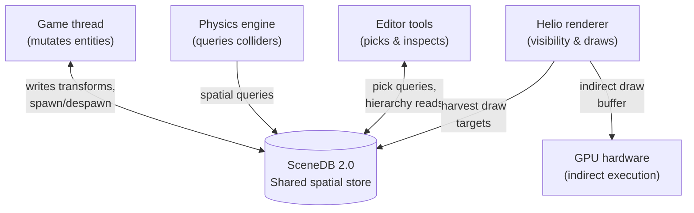

The arrows tell the story. SceneDB 2.0 is the hub. Every system that needs to know where things are goes through it. Helio is the one system with a direct line to the GPU.

### The frame in sequence

A single frame runs through five phases. Understanding the sequence is important because correctness guarantees depend on it.

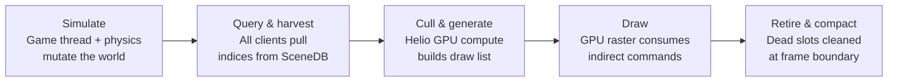

Notice that mutation (phase 1) is fully separated from reading (phase 2), which is fully separated from GPU execution (phases 3–4). This sequencing is what makes concurrent access safe without fine-grained locking.

### Key concepts glossary

| Term | What it means |
|---|---|
| **SoA** | Structure of Arrays — storing one array per property rather than one array of full structs |
| **Handle** | A 64-bit integer that identifies an entity; contains a slot index and a generation counter |
| **Generation** | A version number that increments when a slot is recycled, so stale handles are detectable |
| **Indirect draw** | A GPU draw command where the parameters live in a GPU buffer, not in CPU-issued API calls |
| **Hi-Z** | Hierarchical Z-buffer — a pyramid of depth values used for fast occlusion culling on the GPU |
| **Timeline semaphore** | A GPU synchronization primitive that lets the CPU know exactly when the GPU has finished a specific command |
| **SIMD** | Single Instruction Multiple Data — CPU instructions that operate on many values simultaneously |
| **SSBO** | Shader Storage Buffer Object — a large, GPU-readable buffer exposed to shaders |
| **AABB** | Axis-Aligned Bounding Box — a box aligned to world axes that wraps an object for fast spatial tests |
| **Bindless** | A rendering technique where shaders index into large resource arrays instead of switching bindings per draw |
| **Meshlet** | A fixed-size cluster of triangles (typically 64–128) that is the atomic unit of GPU-driven culling in virtual geometry pipelines |
| **Virtual geometry** | A rendering approach where geometry is stored as a DAG of meshlet clusters and the GPU selects the appropriate resolution per frame, eliminating discrete LOD transitions |
| **HLOD** | Hierarchical Level of Detail — a pre-baked, simplified proxy mesh representing an entire distant cell or group of objects as a single low-cost draw |
| **Mesh shader** | A GPU shader stage that replaces the traditional vertex pipeline and generates geometry directly from arbitrary structured data, enabling efficient per-meshlet dispatch |
| **Task shader** | The amplification stage preceding mesh shaders; determines which meshlets survive culling before any geometry is produced |

---

## Part I — Core Architecture

### 1. The Three-Layer Execution Model

The engine enforces a strict three-layer boundary. No data dependency may skip a layer. This constraint exists because each layer has a different concurrency profile, a different hardware consumer, and a different tolerance for latency.

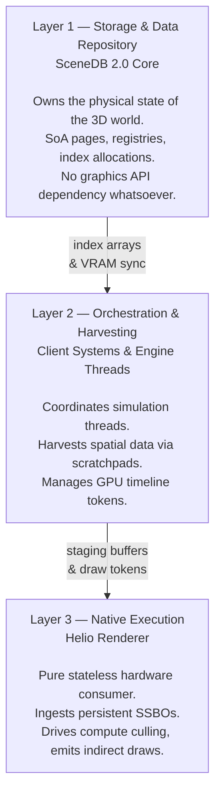

**Layer 1** knows nothing about graphics APIs, gameplay logic, or specific frame structure. It manages memory and answers queries.

**Layer 2** is the transactional bridge. It enforces the simulation-before-query ordering, coordinates timeline semaphores, and owns the scratchpad pools that prevent mid-frame heap allocation.

**Layer 3** operates under the assumption that everything it needs to draw the world is already in VRAM. Its runtime work is visibility evaluation and command generation — nothing more.

### 2. System Clients

Four distinct clients consume SceneDB 2.0 concurrently. Their access patterns differ significantly and the system must accommodate all of them.

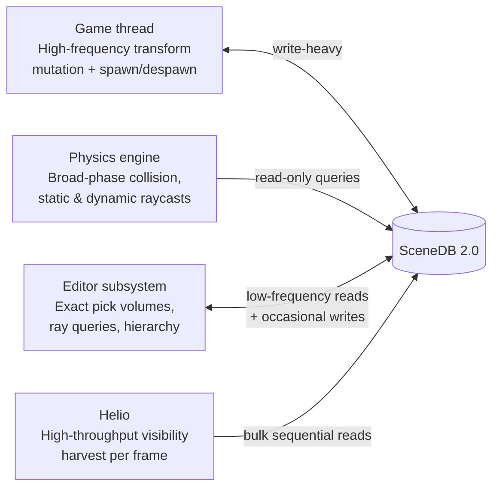

The access pattern asymmetry is intentional. Writes are serialized **per
sub-phase**, not globally: the simulation phase consists of an ordered sequence
of write windows — gameplay mutation (game thread), then physics solver
writeback (transforms and velocities only). Exactly one writer class is active
in any window, enforced by write-leases issued by Layer 2. All other clients
are readers during the harvest phase, and the strict phase separation means no
reader ever sees a partial write.

---

## Part II — Data Structures & Memory Architecture

### 3. Handle Semantics

All entities and assets are addressed through packed 64-bit unsigned integer handles. A handle is never a pointer. It is an opaque scalar that the registry can validate without touching the object it refers to.

#### 3.1 Bit layout

```
 63                                32  31                               0
 ┌──────────────────────────────────┬──────────────────────────────────┐
 │         Generation (32 bits)     │          Index (32 bits)         │
 └──────────────────────────────────┴──────────────────────────────────┘
```

**Index (bits 0–31):** A **stable slot ID**. Slot IDs are allocated from a free
pool and never change for the lifetime of an allocation. A slot ID is *not* a row
offset into the SoA page columns: pages store live elements densely, and
swap-and-pop compaction (Section 4.4) moves elements between rows. The registry
maintains a **slot→row indirection table** — one `u32` row index per slot,
updated during compaction — so dereferencing a handle is two O(1) array reads
(slot → row, then row → column data). Supports up to $2^{32} - 1$ concurrent
live slots per registry. The generation array and the slot→row table are both
indexed by slot ID; only column data is indexed by row.

**Generation (bits 32–63):** A 32-bit monotonically increasing version stamp. Every time a slot is retired and recycled, its generation increments. A client holding a stale handle will find that its stored generation does not match the live generation in the registry, and the access is rejected before any data is read.

#### 3.2 Sentinel values and slot retirement

Generation `0` is permanently reserved as `INVALID_HANDLE` across all subsystems. Active generation tracking begins at `1`. When a slot's generation reaches `u32::MAX`, that slot index is **permanently removed from circulation**. The cost of one permanently retired slot per approximately 4.3 billion uses of that specific index is acceptable and prevents generation wraparound collisions entirely.

#### 3.3 Validation flow

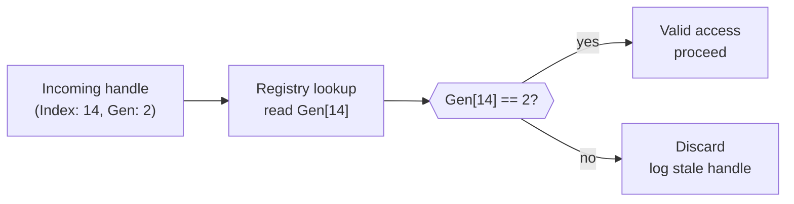

This check runs on both the CPU (during harvest) and the GPU (during culling). The GPU reads generation values from a VRAM-resident validation buffer that is updated at slot retirement time.

### 4. Monolithic Page-Aligned Structure of Arrays

#### 4.1 Layout philosophy

SceneDB 2.0 stores entity data in a Structure of Arrays layout rather than an Array of Structures. The distinction matters for cache behavior.

**Array of Structures (AoS) — what most engines do:**
```
[Entity0: {id, transform_idx, min_x, min_y, min_z, max_x, max_y, max_z, alive}]
[Entity1: {id, transform_idx, min_x, min_y, min_z, max_x, max_y, max_z, alive}]
...
```

A spatial query that only needs bounding box fields loads all the other fields into cache lines even though they are irrelevant. Cache is wasted.

**Structure of Arrays (SoA) — what SceneDB 2.0 does:**
```
[id_0,  id_1,  id_2,  ...]   ← one contiguous column
[ti_0,  ti_1,  ti_2,  ...]   ← transform indices, contiguous
[minx_0, minx_1, minx_2, ...] ← spatial bounds, contiguous
...
```

A spatial query loads only the bounds columns. The SIMD engine operates across 16 elements per instruction with zero wasted bandwidth.

#### 4.2 Memory block structure

Each `SceneDBCell` page allocates a single contiguous memory block with explicit column spans, each starting at a 64-byte cache-line boundary.

```
┌─────────────────────────────────────────────────────────────────────┐
│  PAGE HEADER                                                        │
│  length (u32) · capacity (u32) · column byte offsets (u32 × N)      │
├─────────────────────────────────────────────────────────────────────┤
│  ENTITY IDS          64-byte aligned    Array of u64 handles        │
├─────────────────────────────────────────────────────────────────────┤
│  ASSET IDS           64-byte aligned    Array of u64 handles        │
├─────────────────────────────────────────────────────────────────────┤
│  TRANSFORM INDICES   64-byte aligned    Array of u32 offsets        │
├─────────────────────────────────────────────────────────────────────┤
│  SPATIAL BOUNDS      64-byte aligned    f32: MinX, MaxX, MinY,      │
│                                         MaxY, MinZ, MaxZ (6 arrays) │
├─────────────────────────────────────────────────────────────────────┤
│  LIVENESS BITMASK    64-byte aligned    Array of u64 bit flags      │
│                                         (1 bit per element)         │
└─────────────────────────────────────────────────────────────────────┘
```

The page header stores byte offsets to each column start rather than hard-coded field offsets. This allows the column layout to vary by cell type (registered via the macro system described in Part III) while keeping the access pattern uniform.

#### 4.3 Page quantum and tuning

Each page has a logical capacity that must be chosen per-cell-type at registration time, with `256` as the recommended default and `1024` as the hard ceiling. The old blanket 1024 quantum has been removed — a cell type with many registered columns will have worse cache utilization per element, so smaller page sizes preserve the cache locality benefits of the SoA layout.

The relationship to validate before finalising a cell type's capacity:

$$\text{capacity} \times \text{stride\_per\_element} \leq \text{L2 cache size target}$$

A stride of 64 bytes per element with a 256-element page occupies 16 KB — comfortably within a typical 256–512 KB L2. A stride of 256 bytes with a 1024-element page occupies 256 KB, which may spill.

#### 4.4 Liveness bitmask and deferred compaction

Deletions during the simulation phase do not immediately restructure the page. The dead element's slot is marked in the liveness bitmask atomically. The physical swap-and-pop compaction is deferred to the **frame-boundary isolation phase**, which runs only after all client read-leases on that cell are confirmed closed.

> **Critical constraint:** Swap-and-pop changes which entity occupies a given
> *row*. Handle dereference is unaffected — the slot→row indirection table is
> updated atomically with the compaction (Section 3.1), so a valid handle always
> resolves to its entity's current row. However, **harvested index arrays contain
> raw row indices**, not handles, for GPU lockstep addressing. Clients must treat
> harvested row arrays as valid only for the frame in which they were issued.
> The client lease API (Section 9.2) enforces this by invalidating all
> outstanding scratch buffers at the frame-boundary phase.

### 5. Concentric Cell Streaming

The world is divided into a uniform grid of `SceneDBCell` instances. The streaming model classifies cells into three concentric processing domains relative to active observation boundaries (primary camera frustum plus any active shadow cameras).

A critical design point: **no domain has a fixed size relative to the others**. The inner core, active margin, and outer buffer are each independently configurable in world-space radius and are tuned based on target hardware, scene density, and observer velocity. On a high-end desktop with large VRAM budgets, the inner core may extend further than the active margin does on a constrained mobile target. Neither the inner core nor the active margin is required to be smaller than any other domain.

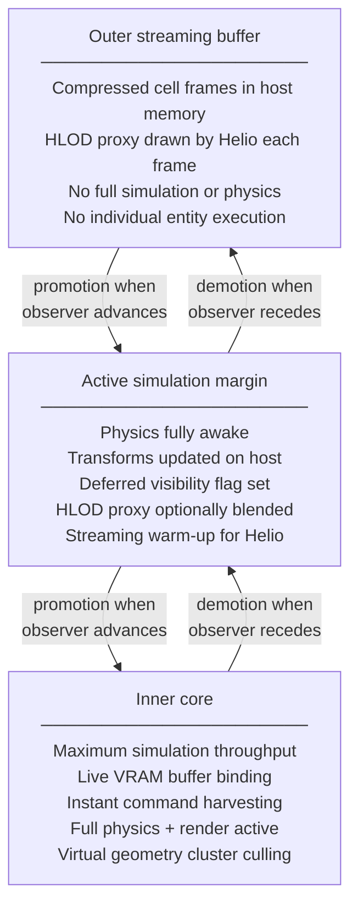

Promotion and demotion are orchestrated by Layer 2 during the frame-boundary phase. A cell never transitions domain mid-frame.

#### 5.1 HLOD proxy rendering for outer and margin cells

The original design locked outer buffer cells away from all execution passes entirely. This is incorrect for any scene with meaningful draw distances — cells beyond the active margin simply vanish, producing an abrupt horizon. The corrected model requires that every cell, regardless of domain, produces **at least one draw contribution per frame**.

Each cell is pre-baked with an **HLOD proxy asset**: a single, heavily decimated mesh that visually represents the cell's contents at a distance. The proxy is authored offline (or procedurally generated at build time) and is stored separately from the cell's full entity data. It has its own entry in the global mesh registry and its own material, which is typically an atlas-baked approximation of the cell's dominant surface appearance.

The proxy rendering contract per domain is:

| Domain | Full entity rendering | HLOD proxy rendering |
|---|---|---|
| Inner core | Yes — full virtual geometry pipeline | No — individual geometry supersedes the proxy |
| Active simulation margin | No — entities ready but deferred | Optional — proxy rendered during streaming warm-up; faded out as entities promote |
| Outer streaming buffer | No — full data locked from execution | **Yes — proxy always rendered** |

The HLOD proxy for a cell is stored as a standard mesh metadata entry in the global registry. Helio treats it identically to any other mesh — it participates in frustum culling, Hi-Z testing, and indirect command generation. The only distinction is that it is indexed via a cell-level handle rather than an entity-level handle, and it bypasses the cluster-level culling pipeline (Section 18) since it is already a coarse single-mesh representation.

#### 5.2 HLOD fade and domain transition blending

When a cell transitions from the outer buffer into the active simulation margin, its full entity geometry begins streaming into VRAM. During this transition window, both the HLOD proxy and the individual entity draws may be active simultaneously, which would produce z-fighting and overdraw. The transition is managed with a **cross-fade weight** stored per cell in the streaming state:

$$\alpha_{\text{cell}} \in [0, 1], \quad \alpha = 0 \Rightarrow \text{HLOD only}, \quad \alpha = 1 \Rightarrow \text{full geometry only}$$

Helio reads $\alpha_{\text{cell}}$ from a per-cell metadata buffer and applies dithered screen-space stippling to fade one representation out as the other fades in. The stippling pattern is based on a Bayer matrix tiled across the screen so that no additional overdraw occurs — at any given pixel, exactly one representation renders per frame during the transition.

The transition duration is expressed in world-space distance traversed by the observer, not in frames, so it remains perceptually consistent regardless of frame rate.

#### 5.3 Domain sizing and budget formulation

Because domain radii are configurable rather than fixed, the streaming budget must be validated at project configuration time against the following constraints:

$$R_{\text{HLOD\_VRAM}} = N_{\text{outer\_cells}} \times S_{\text{proxy\_mesh}} \leq \text{VRAM}_{\text{HLOD\_budget}}$$

$$R_{\text{entity\_VRAM}} = N_{\text{inner\_cells}} \times \bar{S}_{\text{entity\_geometry}} \leq \text{VRAM}_{\text{geometry\_budget}}$$

Where $\bar{S}_{\text{entity\_geometry}}$ is the mean geometry footprint per inner core cell. These constraints must be evaluated against the worst-case observer position — typically the point in the level where the maximum number of cells are simultaneously visible. A streaming budget tool that walks the configured domain radii through a set of designer-specified stress positions is a prerequisite before shipping a level.

#### 5.4 Multi-observer handling

Shadow cascade cameras, reflection probes, and stereo eye pairs each constitute separate observation boundaries. The effective inner core is the **union** of all observation AABBs across all active observers, not just the primary camera. The active simulation margin and outer buffer expand accordingly. HLOD proxies must be present for all cells visible to any observer, including shadow camera frusta, since an object that casts a shadow from the outer buffer must still have geometry to cast it with — the HLOD proxy serves this role.

#### 5.5 Domain transition hysteresis

Promotion and demotion boundaries are asymmetric to prevent oscillation when an
observer hovers on a cell boundary:

$$\text{PromotionBoundary} = \text{CellBounds} + \Delta_{\text{pad}}$$
$$\text{DemotionBoundary} = \text{CellBounds} + \Delta_{\text{pad}} + \delta_{\text{hysteresis}}$$

A promoted cell stays in its domain until the observer exits the cell bounds
plus a padding of 10% of the cell width. Sub-pixel camera jitter therefore
never triggers domain churn (Test 11).

### 6. Asset Registry and LOD Layout

Asset metadata is stored in a flat, tightly packed host-side registry mirroring the exact byte layout expected by the GPU mesh configurator SSBO. No conversion step occurs before upload; the host buffer is uploaded directly.

#### 6.1 Mesh metadata struct

| Bytes | Field | Type | Notes |
|---|---|---|---|
| 0–3 | `vertex_offset` | u32 | Byte offset into global vertex buffer |
| 4–7 | `index_offset` | u32 | Byte offset into global index buffer |
| 8–11 | `index_count` | u32 | Index count for base LOD (traditional pipeline only) |
| 12–15 | `base_vertex` | i32 | Signed vertex base for index rebasing |
| 16–19 | `material_index` | u32 | Index into global material registry |
| 20–23 | `lod_count` | u32 | Number of discrete LOD levels (0 if virtual geometry mesh) |
| 24–39 | `lod_distances` | f32 × 4 | World-space transition distances (unused for VG meshes) |
| 40–51 | `local_aabb_center` | f32 × 3 | Local-space bounding box center |
| 52–55 | `cluster_table_offset` | u32 | Byte offset into global cluster DAG buffer (0 if non-VG) |
| 56–67 | `local_aabb_extents` | f32 × 3 | Local-space bounding box half-extents |
| 68–71 | `meshlet_count` | u32 | Total meshlet count across all DAG levels (0 if non-VG) |

Total struct size: **72 bytes**. The `padding_0` and `padding_1` fields from the previous revision have been repurposed as `cluster_table_offset` and `meshlet_count` respectively. Both fields are zero for traditional discrete-LOD meshes, making the layout backwards-compatible. All fields are 4-byte aligned scalars. The struct is authored in WGSL as scalar
`f32`/`u32` fields only — never `vec3<f32>`, which carries 16-byte alignment in
WGSL and would shift every subsequent offset. `cluster_table_offset` at byte 52
and `meshlet_count` at byte 68 occupy the positions of the former padding
fields, so the 72-byte total size and every existing field offset are unchanged.

A mesh is either a **traditional LOD mesh** (non-zero `lod_count`, zero `cluster_table_offset`) or a **virtual geometry mesh** (zero `lod_count`, non-zero `cluster_table_offset`). Mixing both modes in a single mesh asset is not permitted and is caught by the asset validator at import time.

---

## Part III — Engine Interface & Type Contract

### 7. Compile-Time Type Registration

Engine subsystems register their required data columns using procedural macros at compile time. This keeps SceneDB 2.0 decoupled from concrete module types while preserving full type safety.

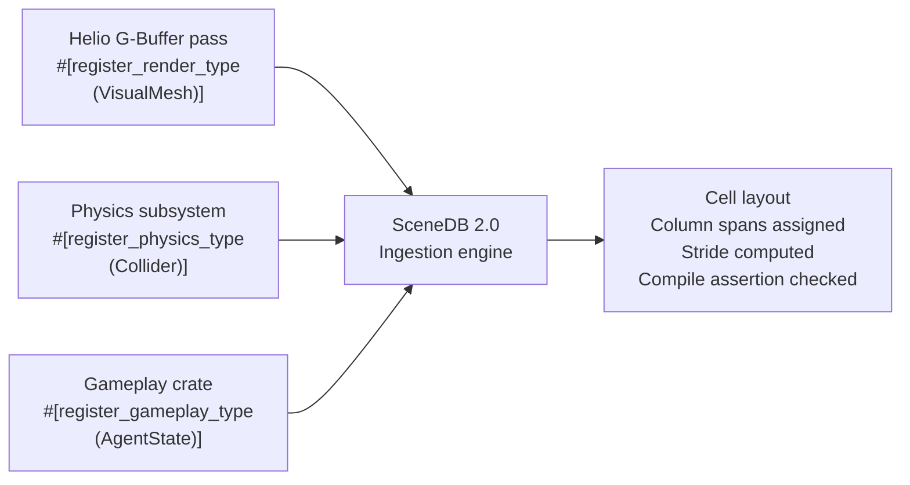

The macro system generates a unique compile-time type identifier (a `TypeToken`) for each registered type. SceneDB 2.0 uses these tokens to manage column storage without holding concrete code references to the registered modules.

#### 7.1 Stride guardrail

The ingestion engine computes the combined per-element stride across all column arrays requested by a given cell layout. If the combined stride exceeds **128 bytes per element**, a compile-time assertion fires.

The threshold is deliberately conservative. At 128 bytes × 256 elements (recommended page capacity), a single page's data columns occupy 32 KB — fitting within most L1 caches when access is sequential. At 128 bytes × 1024 elements, the page is 128 KB, which remains within L2. The old 256-byte limit allowed pathological layouts; this tighter ceiling forces developers to split logically separate data streams into separate parallel page domains, which is the correct architectural decision anyway.

When a stride limit violation occurs, the fix is always to register a new cell type rather than increase the limit.

The guardrail is evaluated **holistically per cell composition**, not per type
registration in isolation: the ingestion macro aggregates the cumulative
per-element byte size of *all* columns registered against a shared cell type.
Splitting one logical layout into many small registrations cannot bypass the
limit — the combined cross-component stride against any single cell type must
stay ≤ 128 bytes or compilation fails.

### 8. Spatial Queries and Index Output

#### 8.1 Query interface

A client initiates a query by providing two parameters:

1. **A `TypeToken`** — the compile-time identifier for the column layout it needs.
2. **A spatial range** — either an AABB (min/max world coordinates) or a view frustum (six planes).

SceneDB 2.0 returns results by writing into a **caller-provided scratch buffer**. It does not allocate memory during queries.

#### 8.2 SIMD scan inner loop

For each active page in the queried cell set, SceneDB 2.0 evaluates the following predicate across all elements simultaneously using SIMD vector registers:

$$\text{visible}_n = (\text{MinX}_n \le Q_{\text{maxX}}) \wedge (\text{MaxX}_n \ge Q_{\text{minX}}) \wedge (\text{MinY}_n \le Q_{\text{maxY}}) \wedge (\text{MaxY}_n \ge Q_{\text{minY}}) \wedge (\text{MinZ}_n \le Q_{\text{maxZ}}) \wedge (\text{MaxZ}_n \ge Q_{\text{minZ}}) \wedge \text{IsLive}_n$$

Where $Q$ is the query AABB and $\text{IsLive}_n$ is the corresponding liveness bitmask bit. With AVX-512, up to 16 single-precision comparisons execute per clock cycle, giving a throughput of 16 entities evaluated per cycle.

#### 8.3 Unified index token output

Results are written as a **unified struct-of-indices token array**. Every element position in the output corresponds to the same logical entity slot. If an element fails the spatial test or is marked dead, a null sentinel (`0xFFFF_FFFF`) is written to each channel of that position rather than omitting the entry.

This preserves positional alignment across output columns, which is essential for GPU bindless indexing where parallel shader lanes must read from the same logical position in multiple SSBOs simultaneously. A null sentinel value is never a valid index into any resource array and is trivially checked in shader code.

Production of the unified token array is a Layer 1 responsibility; all
*consumption-side* partitioning (LOD/VG/HLOD splits, DEI-driven dense
compaction, staging-buffer packing) belongs to Layer 2, as specified in
Section 18.

#### 8.4 Multi-view query

For shadow cascades, reflection probes, stereo renders, and any other scenario requiring multiple simultaneous spatial queries, the caller provides **one scratch buffer per view**. Queries over different views may run on separate threads simultaneously. SceneDB 2.0 makes no per-query allocations, so concurrent queries over the same cell pages are safe as long as no simulation writes are in progress (enforced by the phase ordering contract).

#### 8.5 Density Efficiency Index and dense compaction

Before uploading a harvested token array to VRAM, Layer 2 computes the
**Density Efficiency Index**:

$$\text{DEI} = \frac{\text{Count}(\text{valid tokens})}{\text{total token slots}}$$

If DEI < 25%, lockstep streaming of the sparse array is bypassed: a vectorized
host-side reduction (SIMD masked compress-store) strips null sentinels and
produces a dense, packed index payload plus a compact remap table. This bounds
the GPU bandwidth wasted on `0xFFFF_FFFF` tokens in sparse cells (Test 12).

### 9. Multi-Threaded Harvesting

#### 9.1 Thread-local scratchpad pools

Every worker thread maintains a persistent, thread-bound scratchpad pool. Scratchpads carry their allocated capacity across frame boundaries so that the query pipeline never touches the heap allocator during a frame.

Capacity is managed with a **decay policy**: if a scratchpad's peak usage over the last `N` frames falls below 50% of its allocated capacity, the allocation is halved at the next frame boundary. `N` defaults to 8 frames. This prevents a single burst query from permanently inflating memory across all worker threads.

#### 9.2 Read-lease tracking

Each client that initiates a spatial query acquires a **read lease** on the cells it queries. The lease is a lightweight token stored in a per-cell atomic bitmask — one bit
per **lease slot**. Lease slots are acquired from a fixed-size pool (default 64,
matching the bitmask width) at query start and released at query end; they are
not bound to thread identity, so dynamic thread pools, work-stealing schedulers,
and nested queries are all supported. Pool exhaustion blocks the requesting
query until a slot frees (a saturated pool indicates a leaked lease, surfaced by
Test 1).

#### 9.2.1 Lease timeout and revocation

The liveness bitmask and index-column registries are **double-buffered**: a
read-lease pins a snapshot of the current frame topology, not the live buffers.
If a lease is still held 2.0 ms into the frame-boundary isolation phase, Layer 2
forcibly revokes it: the holder's handle set is pushed to a secondary stale
validation lane (reads continue against the pinned snapshot; all results are
re-validated against live generations on use) and compaction proceeds on the
primary layout immediately. A revocation is logged; persistent revocations from
the same client are a bug in that client (Test 10). The frame-boundary isolation phase checks that all lease bits are cleared before executing swap-and-pop compaction on any cell page. A thread that holds a lease past the frame boundary is a programming error and is caught by the validation test suite (Test 1, see Part VI).

---

## Part IV — Helio Pipeline & Indirect Rendering

### 10. VRAM Data Contracts

Helio operates on four globally persistent SSBO regions. These are allocated once at engine startup and persist for the lifetime of the process. They are never reallocated; their capacity is set at initialization based on configured scene maximums.

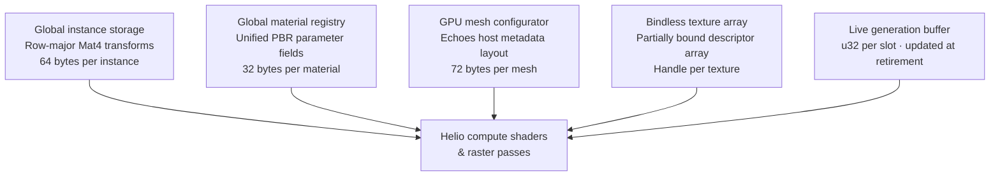

All shaders interacting with these SSBOs are authored in **WGSL**. WGSL storage
buffer layout rules are normative for every shared struct, with one project-wide
authoring constraint: **shared structs use scalar `f32`/`u32`/`i32` fields
exclusively** (no `vec3`, which has 16-byte alignment; no implicit padding).
Vector math inside shaders reconstructs vectors from scalars at load time.
The hardware alignment verification test (Test 3, Part VI) compares the byte
offset of every host Rust field against the offsets reported by naga reflection
of the compiled WGSL and fails on any single-byte difference.

### 11. World-Space AABB Transformation

Computing a correct world-space bounding box for an arbitrarily transformed mesh is not as simple as transforming the min and max corners. Transforming just those two points produces a box that can be too small when the transformation involves rotation or non-uniform scale. The correct approach uses the absolute-value of the rotation/scale sub-matrix.

Given a local bounding box defined by its minimum point $L_{\min}$ and maximum point $L_{\max}$, the local center and extents are:

$$C_{\text{local}} = \frac{L_{\max} + L_{\min}}{2}$$

$$E_{\text{local}} = \frac{L_{\max} - L_{\min}}{2}$$

The world-space center is obtained by transforming the local center through the full $4 \times 4$ model matrix $M$:

$$C_{\text{world}} = \left( M \cdot \begin{bmatrix} C_{\text{local}} \\ 1 \end{bmatrix} \right)_{xyz}$$

The world-space extents are computed using the **absolute value** of the upper-left $3 \times 3$ sub-matrix $M_{\text{mat3}}$:

$$E_{\text{world}} = |M_{\text{mat3}}| \cdot E_{\text{local}}$$

Where:

$$|M_{\text{mat3}}| = \begin{bmatrix} |M_{00}| & |M_{10}| & |M_{20}| \\ |M_{01}| & |M_{11}| & |M_{21}| \\ |M_{02}| & |M_{12}| & |M_{22}| \end{bmatrix}$$

This guarantees that the reconstructed AABB is the tightest axis-aligned box that fully encloses the transformed geometry regardless of rotation, non-uniform scale, or shear. The transformation persistence sweeps (Test 4, Part VI) validate this across extreme non-uniform scale values and frustum-edge rotations.

### 12. Near-Plane Clipping Guard

A common failure mode in GPU-driven culling is near-plane clipping: a large object whose bounding box straddles the camera near plane projects to negative homogeneous coordinates, which standard projection comparison incorrectly treats as outside the frustum.

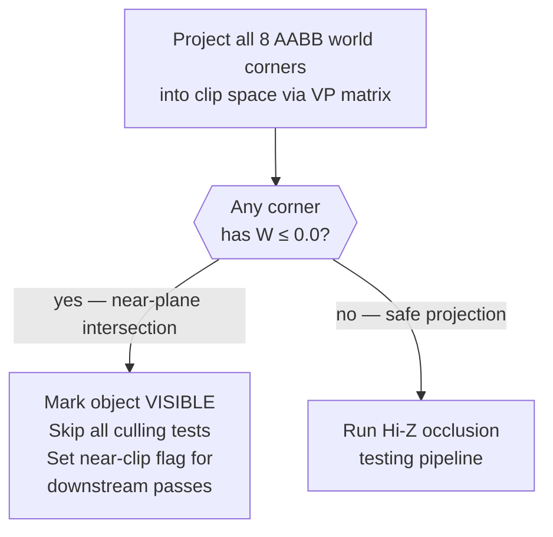

When the near-clip flag is set, downstream passes — shadow cascade assignment, screen-space effect coverage estimation, any pass that requires a valid projected rect — must handle the object as covering an indeterminate area rather than using the garbage projected rect. The flag is written into the per-instance indirect data alongside the draw command.

#### 12.1 Homogeneous coordinate safety rule

For each of the 8 AABB world corners $P_i$:

$$\tilde{P}_i = VP \cdot \begin{bmatrix} P_i \\ 1 \end{bmatrix}$$

If $\tilde{P}_i.w \le 0$ for **any** $i \in \{0 \dots 7\}$, the object intersects the near plane and the culling pipeline is bypassed for that object.

To keep the bypass population small, a **view-space pre-test** runs first: the
object's view-space AABB is tested against the near-plane slab. Only objects
whose view-space bounds actually straddle $z = -z_{\text{near}}$ enter the
W≤0 corner check; objects fully in front of the near plane proceed through the
normal culling pipeline even when large.

### 13. Hierarchical Z-Buffer Occlusion

Objects that pass frustum and near-plane checks are tested against the device-side Hi-Z pyramid. The Hi-Z map is a mipmap of the previous frame's depth buffer, where each texel stores the **maximum** (furthest) depth value in its footprint.

Two Hi-Z states exist per frame: the **previous-frame pyramid** (used by the
first cull pass of the frame) and the **intra-frame pyramid**, produced by an
explicit **Hi-Z rebuild pass** — a compute mip-chain reduction dispatched after
the traditional raster pass completes and before the VG object-level cull
begins. Any pass that claims same-frame occlusion benefit must consume the
intra-frame pyramid; consuming the raw depth buffer mid-frame is a contract
violation.

#### 13.1 Screen-space footprint and mip selection

Given the projected screen-space UV bounding rect $[\text{UV}_{\min}, \text{UV}_{\max}]$ of the object, the footprint dimensions in pixels are:

$$W_{\text{px}} = (\text{UV}_{\max.x} - \text{UV}_{\min.x}) \cdot \text{FrameWidth}$$
$$H_{\text{px}} = (\text{UV}_{\max.y} - \text{UV}_{\min.y}) \cdot \text{FrameHeight}$$

The appropriate mip level is selected using the larger dimension:

$$\text{MaxDim} = \max(W_{\text{px}},\ H_{\text{px}})$$

$$\text{MipLevel} = \text{clamp}\!\left(\lfloor \log_2(\text{MaxDim}) \rfloor,\ 0,\ \text{MaxMipLevel}\right)$$

Using the floor selects the finest mip whose $2 \times 2$ texel gather still
covers the projected footprint: one texel at level $\lfloor \log_2(\text{MaxDim})
\rfloor$ spans up to $\text{MaxDim}$ pixels, so a $2 \times 2$ gather spans up
to $2\,\text{MaxDim}$ — always at least the footprint. A conservative $2 \times 2$ texel gather at this mip level returns four depth samples, and the maximum is taken as the scene depth at this footprint. This guarantees the test never falsely occludes an object due to sub-pixel sampling gaps.

#### 13.2 Mip boundary blending

To prevent visibility flickering when an object's screen-space size hovers near a power-of-two pixel boundary, the shader monitors the distance from `MaxDim` to the nearest mip transition:

$$\delta = \text{MaxDim} - 2^{\lfloor \log_2(\text{MaxDim}) \rfloor}$$

If $\delta / 2^{\lfloor \log_2(\text{MaxDim}) \rfloor} < 0.05$ (within 5% of a mip boundary), the culling test runs at **both** `MipLevel` and `MipLevel + 1`, taking the maximum depth from both samples. An object is considered occluded only if both samples indicate occlusion. This eliminates flickering at the cost of two texture fetches for a small fraction of objects.

The dual-sample path is gated on screen-size delta, not on every object every frame. Its per-frame cost is proportional to how many objects happen to be near a mip transition threshold, which in practice is a small minority.

Additionally, if the projected extent spans more than two texels of the selected
mip along either screen axis (possible for elongated or diagonal footprints),
the shader expands the gather kernel from $2 \times 2$ to $3 \times 3$ or
$4 \times 4$ so the conservative-coverage guarantee holds for non-square
footprints.

### 14. Indirect Command Buffer Generation

#### 14.1 Command record structure

Each draw command written by the compute shader contains:

| Field | Type | Source |
|---|---|---|
| `index_count` | u32 | `mesh.index_count` for selected LOD |
| `instance_count` | u32 | Always `1` — no instance merging |
| `first_index` | u32 | `mesh.index_offset` |
| `vertex_offset` | i32 | `mesh.base_vertex` |
| `first_instance` | u32 | Command slot index (used for bindless instance data lookup) |

The `first_instance` field is reused as an indirect index into the per-instance SSBO rather than its literal GL meaning. This is the standard bindless indirect pattern and requires the hardware to support `gl_BaseInstance` / `gl_InstanceIndex` as shader inputs.

#### 14.2 Bounded atomic allocation

The compute shader allocates command slots using a global atomic counter. The allocation must be bounded to prevent buffer overflow:

```glsl
uint slot = atomicAdd(global_draw_counter, 1u);

if (slot < MAX_BUFFER_CAPACITY) {
    draw_commands[slot].index_count    = mesh.index_count;
    draw_commands[slot].instance_count = 1u;
    draw_commands[slot].first_index    = mesh.index_offset;
    draw_commands[slot].vertex_offset  = mesh.base_vertex;
    draw_commands[slot].first_instance = slot;
    visible_instance_ids[slot]         = entity_index;
} 
// Overflow: command is silently dropped. Counter is NOT clamped here.
// The CPU reads global_draw_counter after the compute pass and clamps
// the draw count passed to vkCmdDrawIndexedIndirectCount.
```

The previous design used `atomicExchange` to clamp the counter on overflow. This introduced a race: two threads that each passed the bounds check might both call `atomicExchange`, with the second resetting the counter to a value below what the first thread legitimately wrote. The corrected design lets overflowing threads drop their command silently and leaves counter clamping to the CPU after the compute pass completes, where it can be done safely.

#### 14.3 Per-view command buffers

Each rendering view (primary camera, shadow cascade $k$, reflection probe $j$, stereo eye) maintains a **separate** indirect command buffer and draw counter. Multi-view compute dispatches run concurrently and write into their respective buffers without contention. The CPU submits one `vkCmdDrawIndexedIndirectCount` call per view buffer.

---

## Part IVb — Virtual Geometry & Meshlet Pipeline

### 15. Overview and Motivation

Discrete LOD meshes work well when an artist can control the number of objects in view and bound the geometric complexity per object. They break down in two scenarios that matter for large-scale environments: first, large continuous surfaces (terrain, buildings, cliff faces) that are partially visible at many different distances simultaneously, where no single LOD level is correct for the whole object; second, dense hero assets where the visual difference between LOD transitions is noticeable regardless of how carefully the thresholds are tuned.

Virtual geometry solves both by eliminating the concept of a discrete LOD level entirely. A virtual geometry mesh is stored as a **directed acyclic graph of meshlet clusters**, where each level of the DAG is a progressively decimated version of the level below. The GPU selects which DAG nodes to render each frame based on screen-space error — using exactly enough geometric detail to stay below a target pixel error threshold, with no transitions and no pop.

This section specifies how Helio integrates virtual geometry alongside the traditional pipeline. The two paths coexist: assets opt into virtual geometry at import time via the `cluster_table_offset` field in the mesh metadata struct (Section 6.1), and Helio dispatches them through a separate compute + mesh shader pipeline.

### 16. Cluster DAG Structure

#### 16.1 Meshlet definition

A meshlet is a fixed-size, GPU-resident cluster of geometry. The engine standardizes on:

- **64 vertices** maximum per meshlet
- **124 triangles** maximum per meshlet (a multiple of 4 for alignment; 124 × 3 = 372 indices)
- A **local bounding sphere** stored per meshlet for cluster-level culling
- A **normal cone** stored per meshlet for backface culling at the cluster level without transforming any vertices

The meshlet counts are chosen to fill a single GPU wavefront on most hardware. Changing them invalidates all pre-built cluster data and requires a full asset reimport.

#### 16.2 DAG node layout

Each node in the cluster DAG is a `ClusterNode` struct:

| Bytes | Field | Type | Notes |
|---|---|---|---|
| 0–3 | `meshlet_offset` | u32 | Offset into global meshlet buffer |
| 4–7 | `meshlet_count` | u32 | Number of meshlets in this node |
| 8–11 | `parent_error` | f32 | Screen-space error of this node's parent group |
| 12–15 | `self_error` | f32 | Screen-space error if this node is rendered |
| 16–19 | `group_id` | u32 | Which parent group this node belongs to |
| 20–23 | `child_offset` | u32 | Offset into child node index list (0 if leaf) |
| 24–27 | `child_count` | u32 | Number of child nodes |
| 28–31 | `padding` | u32 | Reserved, must be zero |
| 32–47 | `bounding_sphere` | f32 × 4 | Center (xyz) + radius (w) in local space |

Total size: **48 bytes** per node. The `self_error` and `parent_error` fields encode a monotonicity guarantee: `self_error < parent_error` always holds, which is the invariant that makes the GPU selection criterion correct (see Section 16.3).

The cluster DAG buffer is a single globally persistent SSBO indexed by `cluster_table_offset` from the mesh metadata struct. All VG meshes share this buffer.

#### 16.3 Error-driven node selection

The GPU evaluates each cluster node against a **projected screen-space error** metric. Given the node's bounding sphere center $C$ and the camera position $P$, the view distance is:

$$d = \max\!\left(\|C_{\text{world}} - P\| - r_{\text{world}},\ z_{\text{near}}\right)$$

Where $r_{\text{world}}$ is the node's bounding-sphere radius. Subtracting the
radius uses the *nearest* point of the node rather than its center, which
prevents error underestimation at grazing angles and for large nodes close to
the camera.

The screen-space error in pixels is approximated as:

$$e_{\text{screen}} = \frac{e_{\text{world}} \cdot \text{FrameHeight}}{d \cdot \tan(\theta_{y}/2) \cdot 2}$$

Where $e_{\text{world}}$ is the node's `self_error` in world units and $\theta_y$ is the vertical field of view. A node is selected for rendering if and only if:

$$e_{\text{screen}}(\text{self}) \leq \epsilon_{\text{target}} \quad \text{AND} \quad e_{\text{screen}}(\text{parent}) > \epsilon_{\text{target}}$$

The target error $\epsilon_{\text{target}}$ is a configurable per-view threshold, defaulting to **1.0 pixels**. At this threshold, the rendered geometry is imperceptibly different from the full-resolution source. The threshold may be raised for shadow passes (coarser geometry is acceptable) or lowered for screenshot/cinematic captures.

The two-condition selection is the key correctness invariant: it guarantees that for any view distance, exactly one level of the DAG renders for each surface region — no gaps, no overlaps.

### 17. Meshlet Culling Pipeline

Virtual geometry meshes go through a two-stage GPU culling pipeline using task and mesh shaders. This replaces the object-level indirect draw used for traditional LOD meshes.

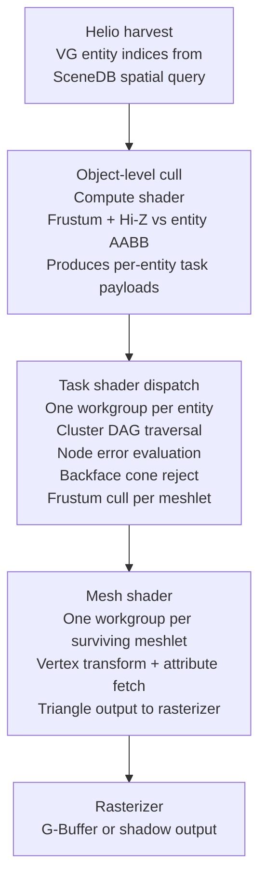

#### 17.1 Object-level culling (compute pass)

Before dispatching any task shaders, a preliminary compute pass culls VG entities at the object level using their entity AABB — identically to the traditional pipeline's frustum and Hi-Z tests. Entities that fail this coarse cull produce no task shader payload and incur no further cost.

Entities that pass produce a **task payload** written into a persistent payload buffer:

| Field | Type | Notes |
|---|---|---|
| `entity_index` | u32 | Index into global instance SSBO |
| `cluster_table_offset` | u32 | From mesh metadata, points into cluster DAG buffer |
| `node_count` | u32 | Total nodes in this mesh's DAG |
| `lod_error_threshold` | f32 | Per-entity override of $\epsilon_{\text{target}}$ (0 = use view default) |

#### 17.2 Task shader — cluster selection and per-meshlet culling

The task shader receives one workgroup per entity. Its responsibilities are:

1. **DAG traversal** — walk the cluster DAG and identify which nodes satisfy the error-driven selection criterion for this frame's view parameters.
2. **Backface cone culling** — for each selected node's meshlets, test the normal cone against the view direction. Meshlets whose entire triangle set is backfacing are discarded without dispatching a mesh shader.
3. **Per-meshlet frustum culling** — test each surviving meshlet's bounding sphere against the view frustum. Meshlets outside the frustum are discarded.
4. **Mesh shader amplification** — emit one mesh shader workgroup for each meshlet that survives all three tests.

The backface cone test for a meshlet with cone axis $\hat{A}$ and half-angle $\phi$ against view direction $\hat{V}$ is:

$$\hat{A} \cdot (-\hat{V}) \geq -\sin(\phi)$$

When this holds, the entire meshlet is backfacing and no rasterizable triangles can result. This test eliminates a significant fraction of meshlets on organic surfaces and closed meshes.

#### 17.3 Mesh shader — geometry output

Each surviving meshlet dispatches one mesh shader workgroup. The shader reads vertex data from the global vertex buffer at the offset encoded in the meshlet metadata, computes clip-space positions and vertex attributes, and outputs the triangle list to the rasterizer.

The mesh shader does not perform any culling — that is entirely the task shader's responsibility. Its only work is the transform and attribute computation that would otherwise happen in the vertex shader. This clean separation ensures the GPU's primitive assembly units receive a dense stream of triangles with no gaps from mid-pipeline culls.

### 18. VG Integration with the Traditional Pipeline

Helio dispatches VG and traditional-LOD objects in separate passes within the same frame, but they target the same G-Buffer and depth buffer.

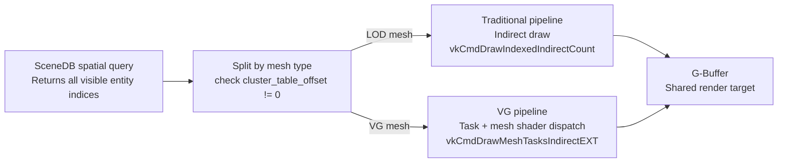

The split happens at the harvest phase: the SceneDB query returns a unified index list, and Layer 2 partitions it into two staging arrays — one for each pipeline path — before the GPU compute passes begin. Both arrays are produced in a single scan of the query output.

The depth buffer is shared between the two pipelines within a frame. The traditional pipeline runs first (it tends to cover large surfaces quickly; the Hi-Z rebuild pass defined in Section 13 then regenerates the pyramid from the partially populated depth buffer before the VG object-level cull dispatches), followed by the VG pipeline which benefits from the partially populated Hi-Z during its object-level cull.

#### 18.1 Hi-Z ordering note

Running VG after traditional draws for Hi-Z benefit is a heuristic, not a hard rule. Scenes that are predominantly VG assets gain little from this ordering. The ordering is configurable per project; the default is traditional-first.

### 19. VRAM Budget Additions for Virtual Geometry

The SSBO layout from Section 10 gains two additional persistent buffers:

| Buffer | Contents | Size estimate |
|---|---|---|
| Global cluster DAG buffer | All `ClusterNode` structs for all VG meshes | Proportional to total VG meshlet count × 48 bytes |
| Global meshlet buffer | Per-meshlet vertex/index offset metadata + bounding sphere + cone | Proportional to total meshlets × 32 bytes |

Both buffers are allocated at engine startup alongside the existing four SSBOs. Their capacities are configured at init time based on project-level VG asset budgets and do not resize at runtime.

The task shader payload buffer is sized at `MAX_VG_ENTITIES_PER_FRAME × 16 bytes` and is reused each frame. It does not need to persist across frames.

---

## Part V — Multi-Timeline Synchronization & Slot Retirement

### 20. The Token-Driven Retirement Model

Modifying or recycling an allocation slot while it may still be referenced by in-flight GPU commands causes use-after-free corruption that is nearly impossible to debug post-hoc. SceneDB 2.0 prevents this by binding every retirement decision to an explicit hardware synchronization token.

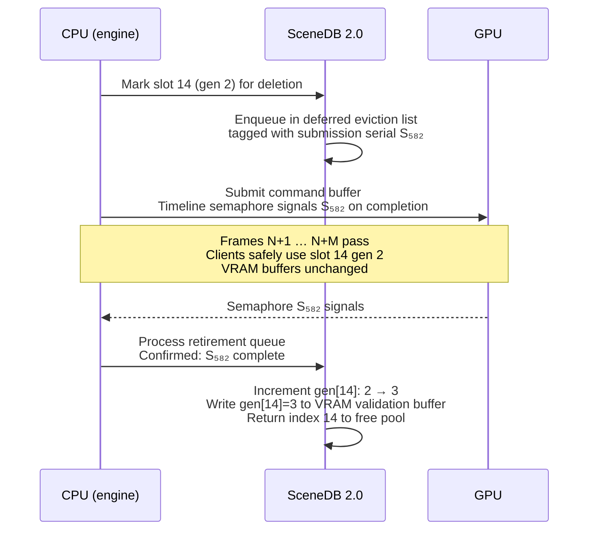

#### 20.1 Why frame counters are insufficient

A naive implementation might retire a slot `N` frames after deletion on the assumption that the GPU is never more than 2 frames behind. This assumption breaks under stutters, device loss recovery, and variable-rate scheduling. The hardware timeline semaphore signal is the only reliable indicator that the GPU has finished consuming a specific submission. SceneDB 2.0 requires this signal and will not retire a slot based on frame counter arithmetic alone.

#### 20.2 VRAM generation buffer

When a slot is retired and its generation is incremented, the new generation value is written to a VRAM-side validation buffer before the slot is returned to the free pool. Helio's culling compute shader reads from this buffer to validate handles before emitting draw commands. The sequence is:

1. CPU writes new generation to host-side registry.
2. CPU schedules a transfer of the updated generation value to the VRAM validation buffer.
3. The transfer is submitted before any new frame that might reuse the slot.
4. The GPU culling shader reads the VRAM generation buffer — never the host registry directly.

This ensures the GPU always validates against a consistent generation state even when the CPU has already advanced.

---

## Part VI — Verification & Test Contracts

### 21. Structural Test Suite

Six core structural tests validate the correctness contracts of SceneDB 2.0 and the traditional rendering pipeline. Two additional tests cover the virtual geometry and HLOD extensions.

```mermaid
flowchart TD
    T1["Test 1\nMulti-threaded contention\nGame thread writes while\nPhysics + Helio read\n→ zero data races"]
    T2["Test 2\nStale handle rejection\nInject Gen 1 handle\nagainst live Gen 2 slot\n→ rejected before draw"]
    T3["Test 3\nHost–shader alignment\nByte offsets in compiled\nbinary == shader binding\n→ down to the byte"]
    T4["Test 4\nTransformation sweeps\nExtreme scale + edge\nfrustum rotations\n→ zero pop artifacts"]
    T5["Test 5\nOverflow clamping\n5,000 draw requests\nagainst 4,096 limit\n→ clean clamp, no overwrite"]
    T6["Test 6\nTimeline recovery\nDrop to 10 FPS during\nheavy alloc/dealloc\n→ zero use-after-free"]
    T7["Test 7\nHLOD continuity\nOuter buffer cells\nalways draw a proxy\n→ no visible horizon gap"]
    T8["Test 8\nVG error invariant\nDAG traversal at\nvariable distances\n→ no overlaps or gaps"]
```

#### Test 1 — Multi-threaded contention validation

Simulates peak thread contention by forcing the game thread to mutate transforms at the maximum scheduled rate while physics and Helio issue high-frequency spatial queries across overlapping cells. The test measures:

- Zero data races detected by the thread sanitizer.
- No blocking synchronization deadlocks over a minimum 60-second run.
- Query throughput within 5% of single-threaded baseline (verifying that the phase separation imposes no significant overhead).

#### Test 2 — Stale handle rejection pipeline

Allocates a slot, retires it (advancing its generation), and immediately injects the old handle into the culling compute shader's input stream. The shader must detect the generation mismatch against the VRAM validation buffer and discard the command without writing a draw record. The test verifies:

- No draw command is emitted for the stale handle.
- The global draw counter is not incremented for the rejected slot.
- No GPU validation error or out-of-bounds write occurs.

#### Test 3 — Host–shader alignment verification

A static analysis pass that compiles both the host Rust struct definitions and the GLSL struct declarations and compares the byte offset of every field in both. The test fails if any field offset or struct size differs by even a single byte. This test must pass on all target platforms (Windows/Vulkan, Linux/Vulkan, Android/Vulkan) independently, as compiler padding behavior may differ.

#### Test 4 — Transformation persistence sweeps

Applies the following transformation stress sequence to a set of meshes distributed along frustum edges and corners:

- Non-uniform scale: (0.001, 1000.0, 0.001)
- Rotation: incremented by 1° per frame through 360°
- Translation: positioned exactly at the near-plane boundary

The reconstructed world-space AABBs are compared against reference AABBs computed via brute-force vertex transformation. The test fails if any reconstructed AABB produces a false negative cull (object incorrectly removed from view) or a false positive cull artifact visible in the output image.

#### Test 5 — Overflow capacity protection

Generates exactly `MAX_BUFFER_CAPACITY + N` visible objects (where `N` varies per run between 1 and 10,000). The test verifies:

- The global draw counter does not exceed `MAX_BUFFER_CAPACITY` after the compute pass.
- The indirect draw buffer contains no writes past its allocated memory range (validated via a sentinel pattern written past the buffer's end before the compute dispatch).
- The GPU device does not enter a fault state.

#### Test 6 — Timeline recovery under stutter

Simulates severe frame-rate instability (10 FPS burst with irregular spacing) during a scene that continuously allocates and retires assets. The test verifies:

- No slot is returned to the free pool before its associated timeline semaphore has signaled.
- No use-after-free condition is detectable via the VRAM generation validation buffer.
- After the stutter window resolves, normal frame pacing resumes without lingering corruption.

#### Test 7 — HLOD proxy continuity

Constructs a scene where the observer is stationary and a set of cells sits in the outer streaming buffer domain. The test verifies:

- Every outer buffer cell that intersects the view frustum produces at least one draw command per frame via its HLOD proxy.
- No cell in the outer buffer produces draw commands for individual entity geometry (those paths are locked for outer buffer cells).
- Moving the observer so that an outer buffer cell transitions to the active margin triggers the cross-fade weight $\alpha_{\text{cell}}$ to animate from 0 to 1 without visible discontinuity in the rendered output, validated by pixel-level comparison against a reference sequence.

#### Test 8 — Virtual geometry DAG error invariant

Loads a VG mesh and renders it from a sweep of camera distances ranging from near-clip to maximum draw distance. At each step the test verifies:

- For every surface region of the mesh, exactly one DAG level renders — no regions produce output from two nodes simultaneously (overlap) and no regions produce no output (gap).
- The screen-space error of the rendered output does not exceed $\epsilon_{\text{target}} + 0.5$ pixels at any tested distance (a half-pixel tolerance accounts for floating-point imprecision in the error metric calculation).
- Transitioning between DAG levels as the camera moves produces no visible popping in the rendered sequence.

#### Test 10 — Editor lease stall compliance
Opens a persistent entity selection lease in Layer 2, then forces immediate
frame-isolation compaction in Layer 1. Pass: execution continues with zero
lockups; the lease is revoked per §9.2.1 and the holder's reads complete
against the pinned snapshot.

#### Test 11 — Grid boundary oscillation compliance
Jitters camera parameters along a cell grid boundary at 60 Hz. Pass: zero
redundant domain transitions, host-to-device allocations, or buffer
recreation requests (hysteresis per §5.5 absorbs the jitter).

#### Test 12 — Sparse cell compaction compliance
Populates a cell with 10,000 logic-only entities and 5 meshes, then harvests.
Pass: DEI < 25% triggers dense compaction per §8.5; the VRAM payload contains
no null-token cascades.

---

## Part VII — End-to-End Execution Flow

### 22. Full Frame Lifecycle

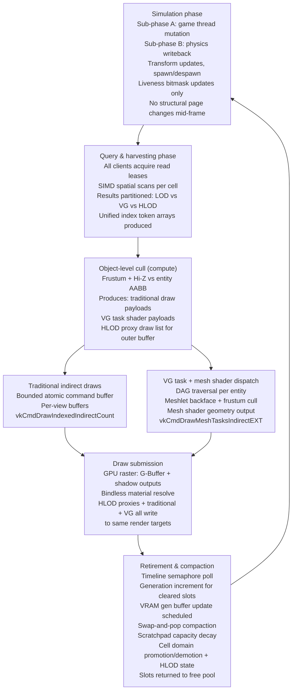

The cycle repeats. The invariant that makes it correct is the strict ordering: no client reads from a page that the game thread is currently writing, no GPU command is generated for a handle that hasn't been validated, and no slot is recycled until the GPU has confirmed it is no longer in use.

---

## Appendix A — Design Decision Log

| Decision | Rationale |
|---|---|
| 64-bit packed handles over pointers | Pointer chasing defeats hardware prefetchers and creates cache misses. Index-based access into contiguous arrays is predictably fast. |
| Deferred compaction over immediate reuse | Immediate structural changes mid-frame require read–write synchronization on every page access. Deferral to frame boundary removes this entirely. |
| Per-view command buffers over view tags | A single shared buffer with view ID tags requires post-sort or atomic partitioning. Separate buffers allow fully concurrent compute dispatches. |
| Absolute-matrix AABB method | Cheaper than transforming all vertices and still produces the tightest correct result. The error of naively transforming only two corners is unbounded under rotation. |
| Floor operator in mip selection | A 2×2 gather at the floored level always covers the projected footprint; ceil would over-coarsen and inflate false occlusion. |
| Hardware timeline semaphore for retirement | Frame counter arithmetic breaks under stutter and variable scheduling. The semaphore is the only CPU-observable signal with a guaranteed relationship to GPU execution order. |
| Compile-time stride guardrail | Cache locality is a correctness property for performance SLAs, not merely a preference. Making violations a build error prevents them from silently accumulating. |
| HLOD proxy for all outer buffer cells | Locking outer buffer cells away from all rendering produces a hard visual horizon. Every cell must produce at least one draw contribution per frame regardless of domain. |
| Flexible domain radii | Fixed domain sizes produce incorrect streaming budgets when target hardware changes. Configurable radii validated at project configuration time prevent silent budget overruns. |
| Traditional-first draw ordering within a frame | Traditional draws populate the Hi-Z before VG dispatch, improving cluster-level cull efficiency in mixed scenes. This is a heuristic configurable per project. |
| Repurposing padding fields for VG metadata | The mesh metadata struct is already constrained to 72 bytes by the SSBO layout. Repurposing fields that were padding preserves the layout without changing VRAM usage or alignment. |
| Separate cluster DAG SSBO | Inlining DAG data into the mesh metadata struct would blow the per-element stride budget for any scene with significant VG coverage. A separate SSBO keeps the primary mesh configurator compact. |

## Appendix B — Known Limitations and Open Work

- **Streaming budget formulation.** The constraints in Section 5.3 establish the shape of the budget problem but do not specify a tool for evaluating it across a full level. A streaming budget profiler that walks configured domain radii through designer-specified stress positions is a prerequisite before shipping a level.
- **Split-screen and portal rendering.** Multiple simultaneous primary camera views expand the effective inner core. The multi-observer union rule in Section 5.4 covers this conceptually but the budgeting implications need a dedicated analysis pass.
- **Dynamic light visibility.** Shadow cascade query volumes are mentioned in several sections but the exact integration between per-light AABB queries, HLOD proxy shadow casting, and per-view command buffer allocation is deferred to the lighting subsystem specification.
- **Asset streaming priorities.** The outer buffer → active margin promotion policy does not yet account for asset I/O latency. An object can be promoted before its GPU mesh data has finished uploading. An `upload_ready` flag in the mesh metadata struct is the planned mitigation; until set, the HLOD proxy continues to render in place of the individual entity geometry even within the active margin.
- **VG asset pipeline.** This specification defines the runtime data formats and GPU execution contracts for virtual geometry. The offline build pipeline that processes source meshes into cluster DAGs, computes per-node screen-space error bounds, and produces the `ClusterNode` buffer is specified separately by the asset pipeline team.
- **HLOD proxy generation.** The specification requires that every cell has a pre-baked HLOD proxy but does not specify how those proxies are generated. Automatic decimation, atlas baking, and imposter generation are all viable approaches and are left to the art pipeline specification.
- **Skinned and deformable meshes.** Both the traditional indirect pipeline and the VG pipeline described here assume static geometry. Skinned meshes require the transform to be applied before culling bounding volumes are valid. The integration path for skinned VG meshes in particular is an open design question.

## Appendix C — wgpu Implementation Mapping (Normative)

The reference implementation targets wgpu (custom Far-Beyond-Pulsar fork) with
WGSL shaders. The following mappings are normative; spec text using Vulkan
terminology is to be read through this table.

| Spec mechanism | wgpu implementation |
|---|---|
| Timeline semaphore retirement tokens (§20) | Monotonic host-side submission serial per queue submit; `Queue::on_submitted_work_done` callback marks the serial complete. The retirement queue drains only entries whose serial is marked complete. Frame-counter arithmetic remains forbidden. |
| Task/mesh shader VG pipeline (§17) | Compute-shader cluster cull (DAG traversal + cone/frustum tests) emitting per-meshlet `DrawIndexedIndirect` records with `instance_count ∈ {0, 1}`; drawn via `multi_draw_indexed_indirect`. One cull dispatch + one indirect draw per view. |
| `vkCmdDrawIndexedIndirectCount` (§14) | GPU writes the atomic draw counter; the CPU clamps host-side after the compute pass (§14.2 already specifies CPU-side clamping). Where readback latency is unacceptable, the full command buffer is submitted with overflowed slots holding `instance_count = 0`. |
| `vkCmdDrawMeshTasksIndirectEXT` (§18) | `multi_draw_indexed_indirect` over the VG pipeline's per-meshlet command buffer. |
| GLSL + scalar block layout (§10) | WGSL with the scalar-fields-only authoring rule (§10). Verified by naga reflection (Test 3). |
| Bindless descriptor arrays (§10) | `binding_array` / partially-bound texture arrays as exposed by the fork; capability-gated with a bound-array fallback. |
| AVX-512 SIMD scans (§8.2) | Portable SIMD with runtime dispatch: AVX-512 → AVX2 → NEON → scalar. The scalar path is the reference implementation; property tests assert bit-identical results across paths. Throughput targets are validated by benchmark, not assumed from instruction width. |