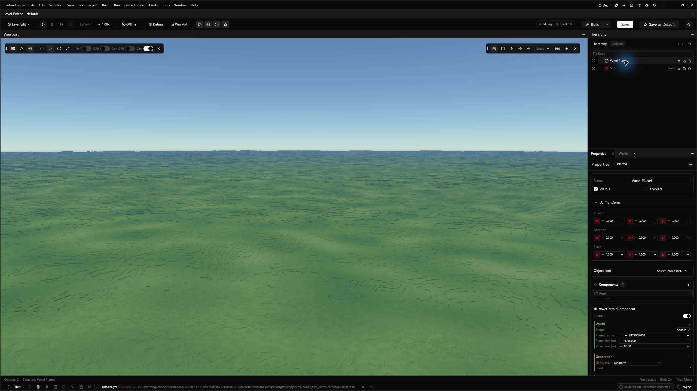
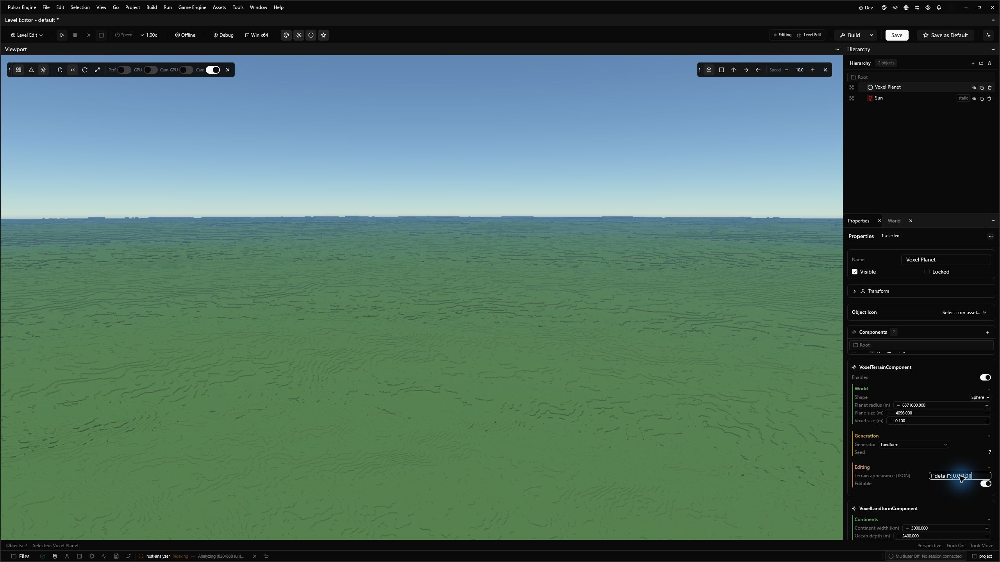
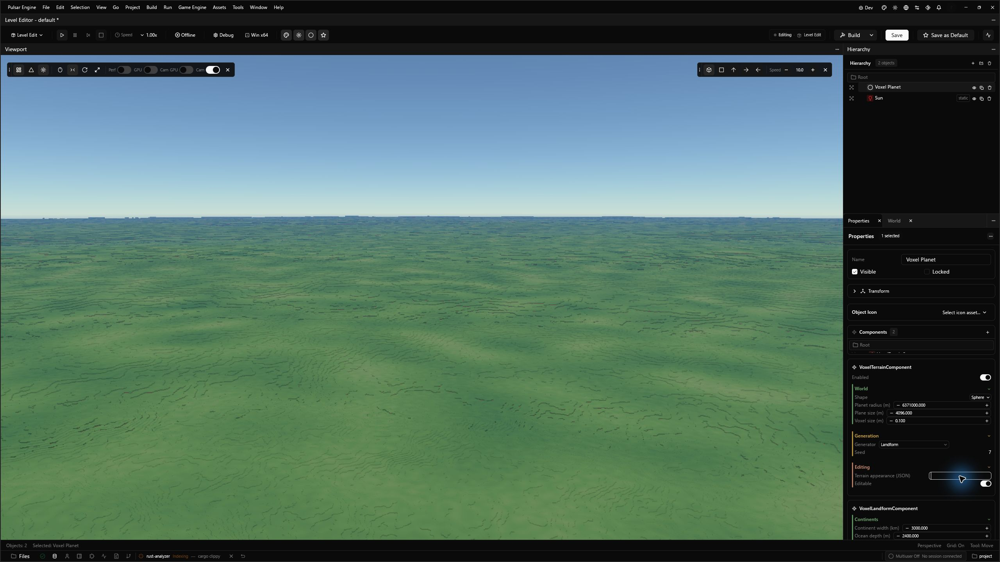

# Native voxel flight — draft evidence, 2026-10-01

Companion: [Helio #314](https://github.com/Far-Beyond-Pulsar/Helio/pull/314).
Windows, RTX 3060, copied `voxel_project`, 0.1 m authored voxels.

Release engine built successfully with the appearance-history and temporal-quality
fixes (runtime code at Pulsar eeb426361 / Helio 9a4f9dd4; the pinned Helio
f238eef8 adds only audit/report changes after that runtime commit).
Final focused release tests passed: voxel backend 12, component schema 5,
camera frame 3, native-route admission/cancellation 2. An earlier broader
voxel suite passed 20 (backend plus SceneDB projection/publication tests).
The copied game's optional startup `cargo check` was stopped to reach the
editor viewport. This does not qualify the game build or Play-in-Editor.

## Final native route

The opt-in driver ran in the normal native renderer/SceneDB path at 1196x704.
It logged start at 06:05:31.832818 UTC and completion at 06:05:58.844081 UTC:
ascent to 300 km, orbital hold, descent, 18 km cruise at 3 km/s, and arrival
at the starting clearance. Full eye/forward/up and viewport were logged.

Pending columns peaked at 350,813. The last half-second route sample still
had 10,727 pending; a subsequent arrival observation showed zero, with
525,326 resident columns. Sparse sampling does not establish the exact time
between stopping and settlement. Failed/overflow counters were sampled at
zero. The route ends about 525.5 m above local ground, so it does not qualify
near-ground arrival or arrival at arbitrary speed.

53 delayed graph-GPU samples: p50 5.30 ms, p95 7.56 ms, maximum 7.78 ms.
These are half-second samples, not whole-frame or presentation percentiles,
and cannot be compared directly to the 5 ms terrain-stage target. CPU tests
and editor indexing ran concurrently; UI captures below were taken after
the route. Two pre-route frames took 2.61 s and 0.96 s. Quiet native
performance remains unqualified.
[Native route sample summary](native-route-summary.json).

## Resize and live appearance

Maximizing changed the viewport from 1196x704 to 2156x1242 and crossed the
backend's Native-to-Quality temporal threshold. The corrected runtime graph
reconstruction completed and the terrain reappeared. It retained existing
columns and generated the expanded view's additional columns, settling at
792,904 with zero pending. The first reconstruction frame spiked to 960 ms
and showed a transient black viewport; resize hitch-free presentation is
not qualified by this check.

Default arrival appearance after resize:

In the live inspector, `{"detail":[0,0,0,0]}` immediately removed patch and
pigment variation. Clearing the field restored the default variation.
Resident count stayed 792,904, pending/jobs stayed zero, and the camera did
not move. The backend resets temporal history only when appearance changes,
so one idle editor frame no longer blends back the old material indefinitely.
The graph regression also checks one-frame palette edits and restoration.

The editor is left open on this copied project, with the default appearance
restored. The original project was not edited. These captures verify native
controls and current output, not production art acceptance.

## Unmet acceptance gates

Coarse distance geometry still exposes level transitions and omits small
distant edits. Canonical base geometry and full destructibility at every
distance are requirements the current coarse field does not meet. Sampled
near-field and representative shadow disagreements, quiet native frame tails,
resize/startup hitches, memory/stress across routes, and finished terrain,
vegetation, water/weather art remain open. The offscreen results in the
companion do not replace native acceptance. Keep both PRs drafts.
