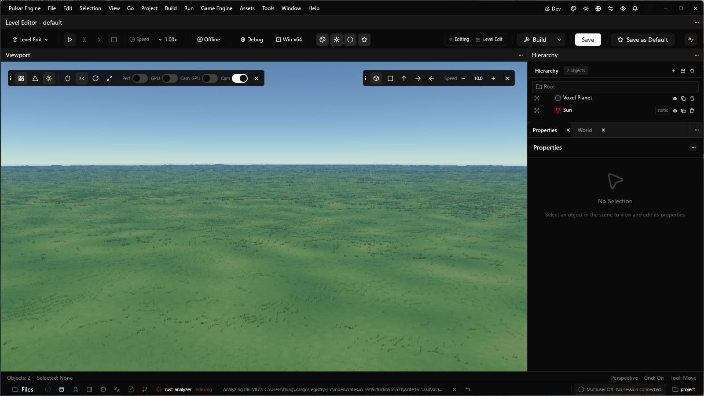

# Voxel shading performance correction

Pulsar pins Helio 7f9b1135, including the shading regression correction in
[Helio #314](https://github.com/Far-Beyond-Pulsar/Helio/pull/314).
Fine hits reuse resident canonical column tops, colours are converted on CPU
upload, and distant climate queries are resolved before material shading.
Landform skips a query only when its bounds prove that the canonical height
cannot change the material. Ambiguous boundaries and custom generators retain
the full query. The public appearance JSON stays sRGB and roughness stays linear.

## Renderer measurement

Paired offscreen release flights on Windows / RTX 3060, 1920x1080 Quality
(1440x810 internal), 0.1 m voxels and sunlight enabled, with the editor closed
and no concurrent compilation/computer-use capture:

| Metric | Before | Corrected |
|---|---:|---:|
| Terrain GPU p95, movement + warm | 7.552 ms | 5.776 ms |
| Ground material/climate p95 | 4.192 ms | 1.000 ms |
| Ground terrain GPU p95 | 7.229 ms | 4.346 ms |
| Warm graph completion interval p95 | 9.285 ms | 6.467 ms |
| Movement completion interval p99 | 17.552 ms | 14.451 ms |
| Logical terrain GPU memory | 541.119 MiB | 544.681 MiB |

The strict 5 ms target still fails. Mountain-flight and orbit costs did not
improve materially. The older pre-appearance baseline was 5.143 ms overall;
not all of that baseline is recovered. These are renderer measurements, not
native presentation percentiles. Full paired reports, per-frame records,
clocks and captures are in
[Helio's report](https://github.com/Far-Beyond-Pulsar/Helio/blob/codex/voxel-flight-visuals/docs/voxel-performance-2026-10-01/README.md).

Release Helio validation: 33 CPU tests passed / 2 ignored, 18 GPU tests passed,
4 graph tests passed. The bounded-query regression compares 65,919 GPU surface
records byte-for-byte against full queries across seven lowland/alpine views,
including odd viewport edges: zero differences. Snow visibility and authored
sRGB round-trip regressions pass.

## Native release validation

The pinned release engine built successfully in 31m 35s. The copied test
project completed the 27.004 s native route at 1196x704: ascent to 300 km,
orbit, descent, 18 km cruise at 3 km/s and arrival. The final route sample
had zero pending columns, 509,444 resident columns and 525.9 m clearance;
sampled failed/overflow counters were zero. Pending columns peaked at 353,845.
This does not establish near-ground or arbitrary-speed arrival.

54 delayed graph-GPU samples had p50 4.838 ms, p95 6.341 ms and maximum
6.964 ms. These are half-second samples, not whole-frame or presentation
percentiles, and cannot be compared directly to the terrain-stage 5 ms gate.
No engine rebuild or computer-use capture ran during the route; editor
indexing was active. The copied game's optional startup cargo check exited
before the viewport appeared; its exit status was not captured, so the game
build and Play-in-Editor remain unqualified.
[Native sample summary](voxel-performance-2026-10-01/native-route-summary.json).

The post-route viewport renders terrain and the integrated sky. The engine
is left open on the copied project. This capture does not qualify finished
art or remove the remaining visible geometry transitions.

## Remaining gates

The full flight still reports 26 / 168,561 exact sampled cell disagreements;
representative sunlight agreement remains open. Canonical far geometry and
small-edit coverage, geometric level transitions, arbitrary-speed near-ground
arrival, frame tails, startup/resize hitches, memory/stress and finished art
remain unqualified. Keep [Pulsar #994](https://github.com/Far-Beyond-Pulsar/Pulsar-Native/pull/994)
and its companion as drafts.
