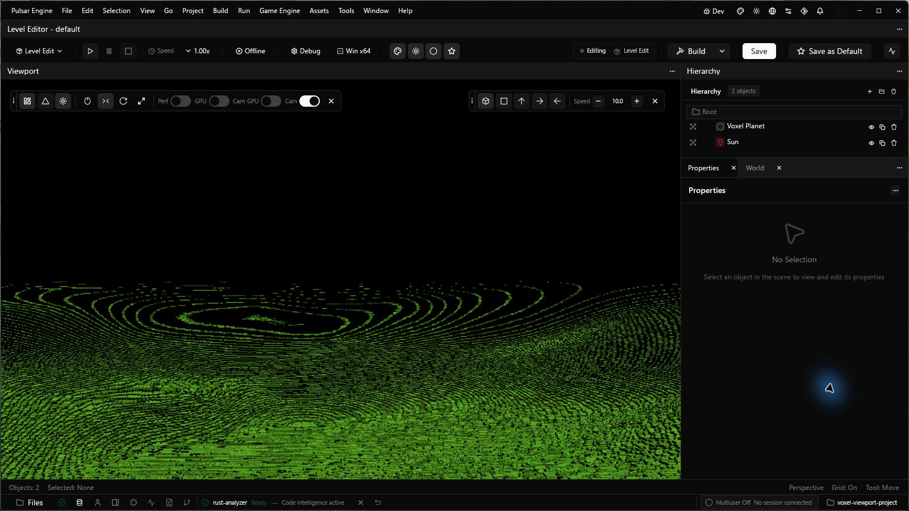

# Voxel data boundary

SceneDB owns authored voxel configuration and live canonical chunk payloads.
`VoxelComponent` describes a bounded object; `VoxelTerrainComponent` describes a
terrain source. Both expose the same opaque payload store, material-ID palette,
and revisioned data contract. The components do not hold GPU buffers or choose
a drawing method.

`helio-voxel-data` is the CPU-only shared contract. It defines signed chunk
keys, 8³ material samples, bounded publication batches, revision checks,
immutable snapshots, editing, and generator worker APIs. `VoxelSourceWriter`
publishes to a component-owned store. `VoxelSourceSession` in Pulsar resolves a
typed SceneDB row and owns its publication and edit workers. The caller owns
any durable export or import policy; component serialization contains authored
configuration, not live payload bytes.

Pulsar maps enabled SceneDB rows to `VoxelSceneEntry` values. A voxel
backend registers a stable renderer ID, a pass factory, and a frame publisher.
The default Helio deferred graph inserts those registered passes after geometry
and before decals and lighting. A row may name its renderer explicitly or leave
the ID empty for unique capability matching. An unknown or ambiguous backend is
reported as an error. Each backend validates its own source format, chunk size,
LOD, domain, and generator requirements; the generic component does not impose
one terrain representation. GPU residency remains transient and rebuildable.

The first registered backend, `helio.tiny-voxel`, renders a procedural 10 cm
planet. It consumes `helio.tiny-voxel.default` generator revision 5 and an
optional versioned JSON recipe in `generator_parameters`. Its authored edits
are part of that recipe. It currently accepts one planet source at a time and
rejects live chunk payloads that it cannot interpret. The generic API still
stores those payloads for other registered backends. No raw-chunk renderer is
registered for `VoxelComponent` yet.

Open [`assets/examples/voxel_planet.level`](../assets/examples/voxel_planet.level)
in Pulsar to see the backend through a normal `VoxelTerrainComponent`. The
editor camera stores its position as `f64` so the voxel pass can build an exact
nearby cell origin at planetary distance. Ordinary mesh transforms and editor
pick tools still use `f32`; their precision at that scale is separate work.
The backend keeps an idle viewport rendering while its bounded brick jobs are
pending and releases its GPU residency when the source is removed.

The image is a live viewport capture of the example after its first residency
cut completed. It demonstrates the component-to-backend path, not a terrain
quality or frame-time qualification.

The graph capture test runs with `HELIO_VOXEL_CAPTURE` set to an output PNG path:
`cargo test -p helio-default-graphs --test voxel_pass_graph` from the Helio
submodule. The capture validates pass ordering, attachment formats, and visible
terrain. It is not a whole-editor performance qualification.

See [the source API example](voxel-component-api-example.md) for batch
publication and snapshot export.
